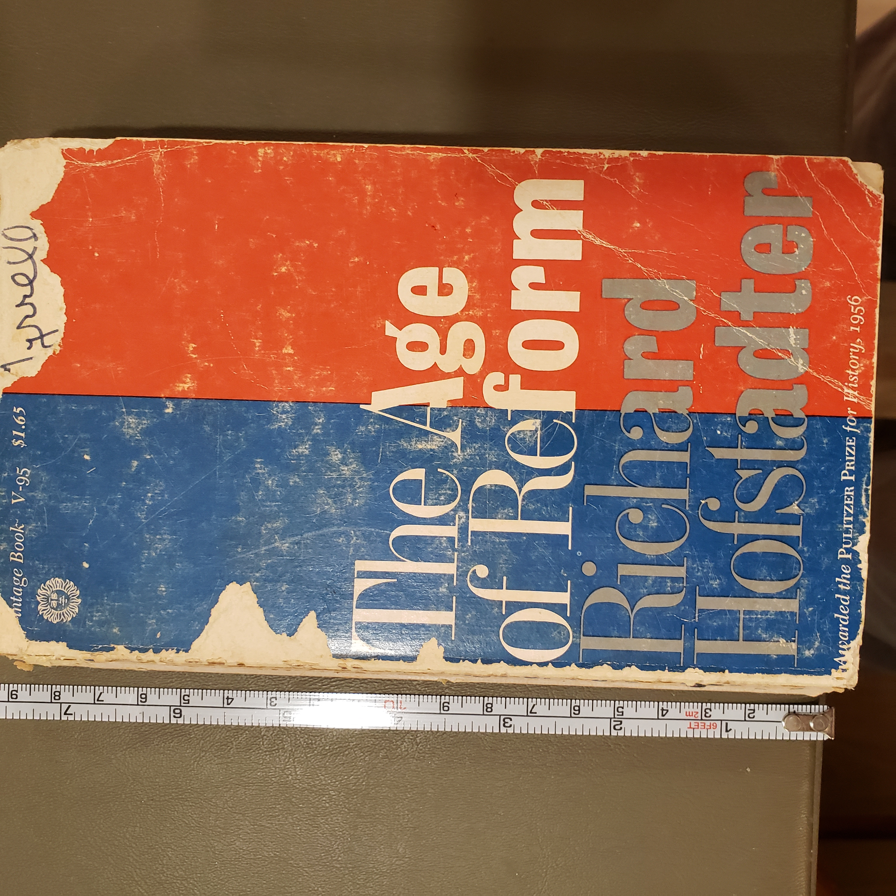
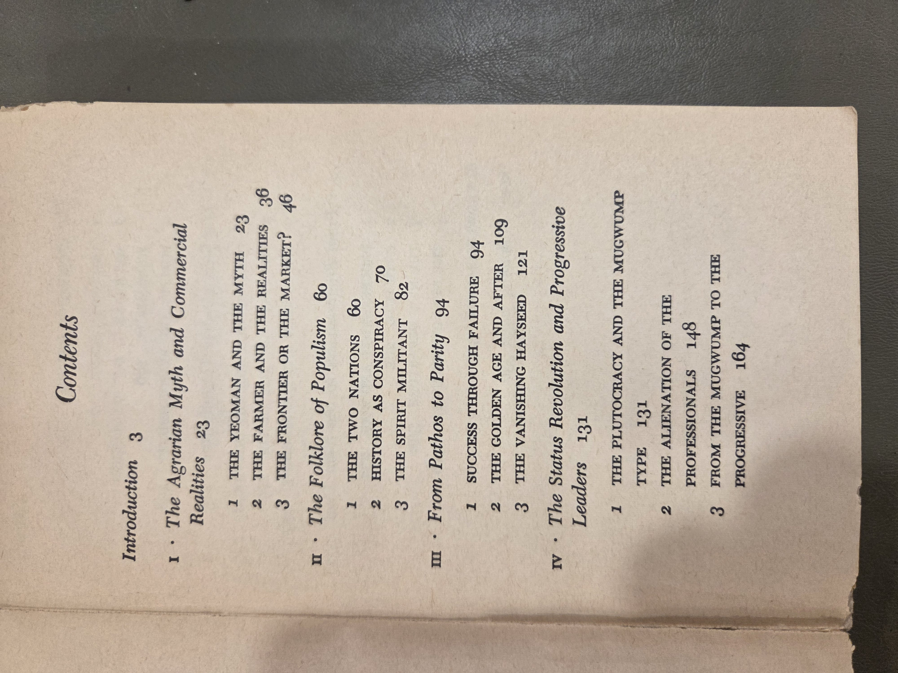
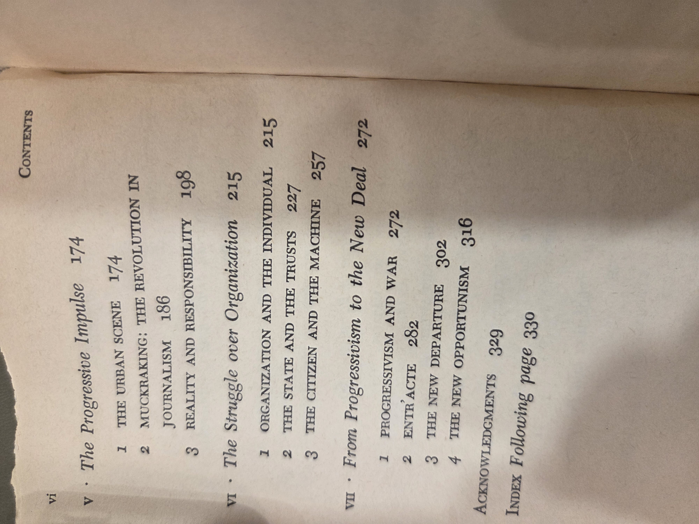
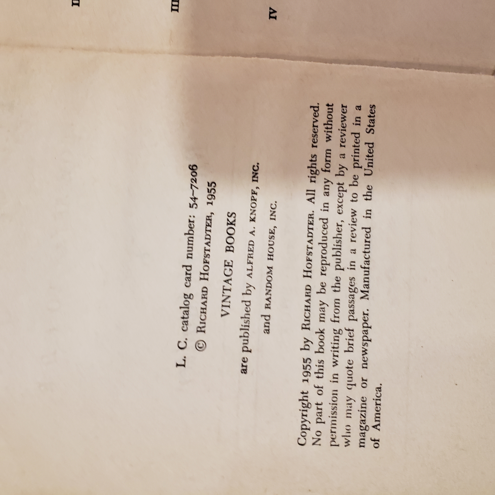

# Re-run: write updated Markdown for AgeOfReform_Hofstadter.md

md = """# The Age of Reform — Richard Hofstadter (1955)

*(Vintage Books, early paperback edition — pre-ISBN)*

## Why read this
A single, elegant volume that tries to explain **how three reform surges—Populism, Progressivism, and the New Deal—fit together**. Even when you disagree, Hofstadter gives you a sharp framework for thinking about American politics from the 1890s to World War II.

## What it’s about (concise overview)
Hofstadter links farm Populism of the 1890s, middle-class Progressivism of the early 1900s, and the crisis politics of the 1930s. He argues these movements were shaped by **status anxieties**, shifts in the economy, and nostalgia for a disappearing producer ethic. The book proceeds thematically—ideas, leaders, constituencies—while tracing how reform impulses moved from anti-monopoly agrarianism to technocratic national government.

## Table of contents (from this copy)
*(Chapters transcribed for searchability; see scans below for layout.)*

- **Introduction**, p. 3

**I • The Agrarian Myth and Commercial Realities**, p. 23  
1. *The Yeoman and the Myth*, p. 23  
2. *The Farmer and the Realities*, p. 36  
3. *The Frontier or the Market?*, p. 46

**II • The Folklore of Populism**, p. 60  
1. *The Two Nations*, p. 60  
2. *History as Conspiracy*, p. 70  
3. *The Spirit Militant*, p. 82

**III • From Pathos to Parity**, p. 94  
1. *Success through Failure*, p. 94  
2. *The Golden Age and After*, p. 109  
3. *The Vanishing Hayseed*, p. 121

**IV • The Status Revolution and Progressive Leaders**, p. 131  
1. *The Plutocracy and the Mugwump Type*, p. 131  
2. *The Alienation of the Professionals*, p. 148  
3. *From the Mugwump to the Progressive*, p. 164

**V • The Progressive Impulse**, p. 174  
1. *The Urban Scene*, p. 174  
2. *Muckraking: The Revolution in Journalism*, p. 186  
3. *Reality and Responsibility*, p. 198

**VI • The Struggle over Organization**, p. 215  
1. *Organization and the Individual*, p. 215  
2. *The State and the Trusts*, p. 227  
3. *The Citizen and the Machine*, p. 257

**VII • From Progressivism to the New Deal**, p. 272  
1. *Progressivism and War*, p. 272  
2. *Entr’acte*, p. 282  
3. *The New Departure*, p. 302  
4. *The New Opportunism*, p. 316

- **Acknowledgments**, p. 329  
- **Index**, following p. 330

Show original TOC scans (optional)

  

## Author & perspective
Richard Hofstadter (1916–1970) was a leading mid-20th-century historian associated with the “consensus” school. Expect **interpretive essays** rather than archival case studies: broad synthesis, psychological motives, and political culture. Later scholars have revised parts of his thesis (especially on Populism and class/race), but the frame remains a touchstone.

## UDC subject classification (for search)
- **Primary:** `94(73)"1890/1945"` — U.S. history from the Gilded Age through the New Deal  
- **Secondary:** `329` — Political parties & movements; `32` — Politics / political ideas  
- **Tags:** Populism • Progressivism • New Deal • status anxiety • political culture • Bryan • Roosevelt • FDR

## Publication details (this copy)
Vintage Books (New York), **1955**. *LC catalog card no.* **54-72086**. Copyright © 1955 by **Richard Hofstadter**. Vintage Books published by Alfred A. Knopf, Inc., and Random House, Inc. *Manufactured in the United States of America.*

Show copyright / CIP page (scan)

## Related volumes on this shelf
- *The River of Doubt* (Millard) — TR’s 1913–14 expedition  
- *The Big Burn* (Egan) — Progressive conservation & the 1910 fire  
- *Freedom From Fear* (Kennedy) — The New Deal and WWII

"""

output_path = "/mnt/data/AgeOfReform_Hofstadter.md"
with open(output_path, "w", encoding="utf-8") as f:
    f.write(md)

output_path
