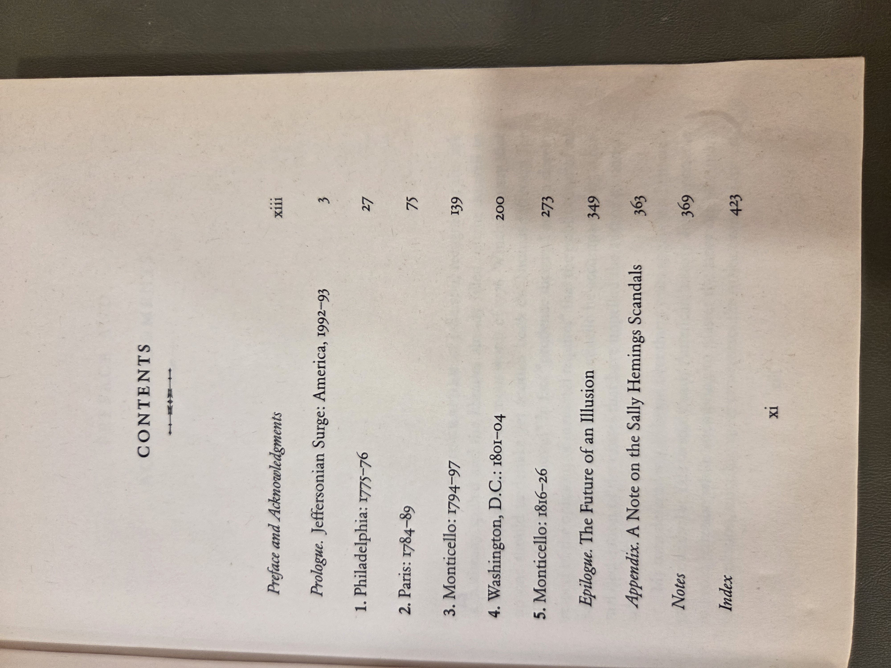

# American Sphinx: The Character of Thomas Jefferson — Joseph J. Ellis (1998)

### Why read this
Thomas Jefferson can feel remote: philosopher, revolutionary, slaveholder, president. Ellis cuts through the marble to ask a deceptively simple question—**what kind of person was Jefferson?** The result is a brisk, provocative portrait that invites admiration and discomfort in equal measure.

### What it’s about (concise overview)
Rather than a cradle-to-grave chronicle, this is a **character study** built around decisive moments: the Declaration, Paris and the ambassadorial years, the first party system, the presidency, and retirement at Monticello. Ellis emphasizes Jefferson’s idealism and rhetorical brilliance, his talent for avoiding open conflict, and the gap between universal principles and enslaved reality at home. The through-line is paradox: a statesman who distrusted power, a public visionary who practiced private compartmentalization, an optimist who presided over war fears and partisan rancor.

---

## Table of contents

<strong>Show original TOC scans (optional)</strong>

[  

## Related volumes on this shelf
- [Declaration of Independence](DeclarationOfIndependence.md)
- [John Adams (McCullough)](JohnAdams_McCullough.md)
- [Undaunted Courage (Ambrose)](UndauntedCourage_Ambrose.md)

[← Back to Shelf 01 index](index.md)

### Author & perspective
Joseph J. Ellis is a historian of the American founding known for accessible prose and close reading of correspondence. His stance here is **interpretive** more than documentary—he weighs testimony, context, and Jefferson’s own strategic silences to assess motives and temperament. The book neither prosecutes nor excuses; it frames Jefferson as a man of ideals and evasions, letting tensions stand where evidence is inconclusive.

### Reception & impact
A national bestseller and **winner of the National Book Award** (1997, hardcover), the book helped reignite popular debate about Jefferson’s contradictions and legacy. It has remained a widely assigned and discussed single-volume interpretation of Jefferson’s character.

### Scope & style
- **Scope:** Jefferson’s public life from the 1770s–1820s, with thematic chapters anchored to key episodes.  
- **Method/style:** Interpretive essay stitched to narrative; brisk pacing; generous quotation; careful about evidentiary limits.  
- **Reader experience:** Clear and compact; suited to general readers who want analysis without footnote thickets.

### Publication & readership
- **Type:** Trade **paperback** (First Vintage Edition, 1998; originally Knopf 1997).  
- **Audience:** General readers, book clubs, undergraduates; useful as a counterpoint to celebratory or purely critical treatments.  
- **Apparatus:** Notes and bibliography typical of trade history; some editions include illustrations.

### UDC subject classification (searchable)
- **Primary:** `929` — Biography.  
- **Secondary:** `94(73)` — United States history; `32` — Politics.  
- **Notes:** Focus on the political actor’s character and decision-making within the early U.S. republic.

### At-a-glance facts
- Year: **1998** | Pages: **TBD** | Format: **PB** | ISBN: **0-679-76441-0**  
- Dimensions (mm): H **TBD** × W **TBD** × T **TBD**  
- Shelf location: **BookCase01 › Shelf 1 › Section  › Pos 3**

### Related items in this library
- **BC01-S01-002** — *John Adams* (McCullough)  
- **BC01-S01-009** — *We Are Lincoln Men* (Donald)  
- **BC01-S01-015** — *Freedom From Fear* (Kennedy)

### Notes
First Vintage Edition (April 1998); originally published by Knopf in 1997.
