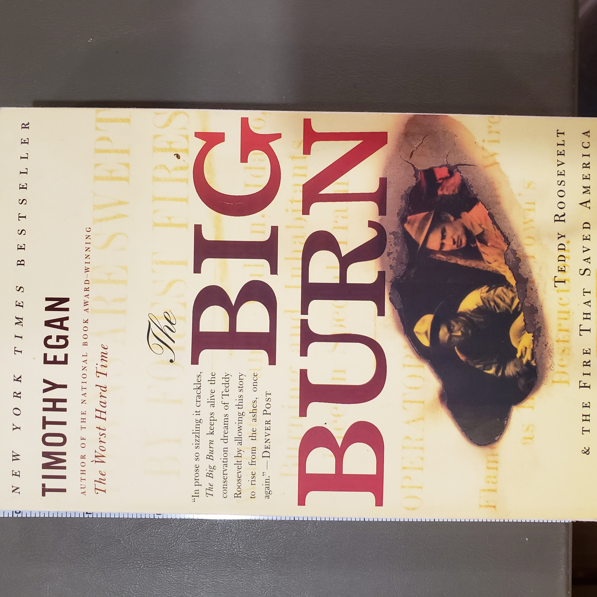
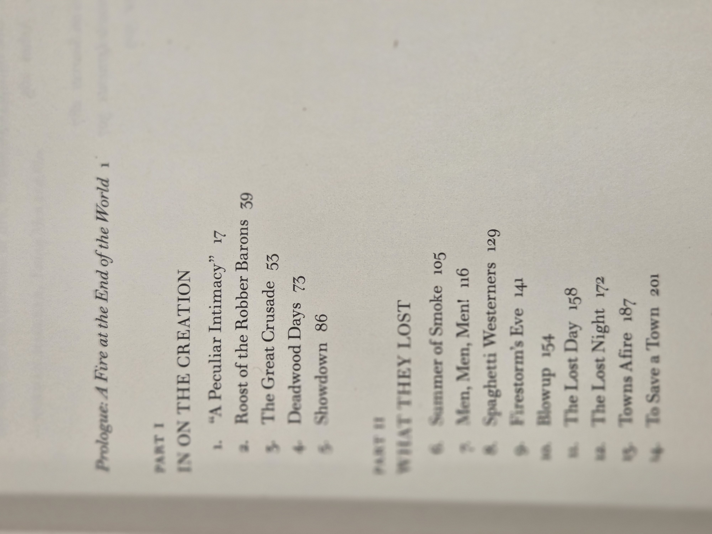
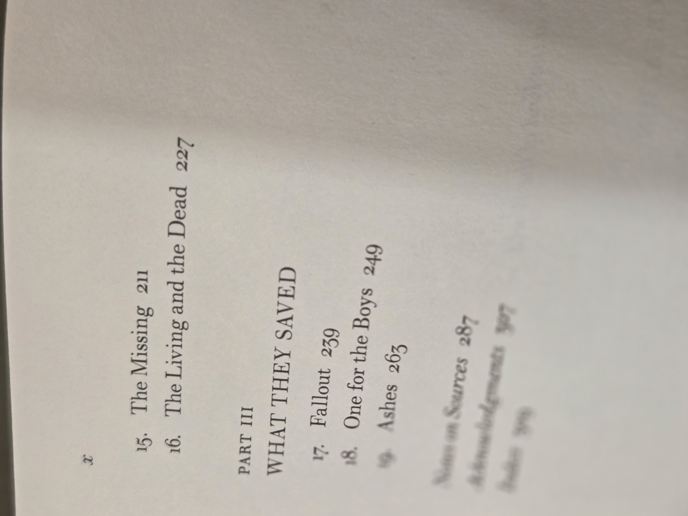
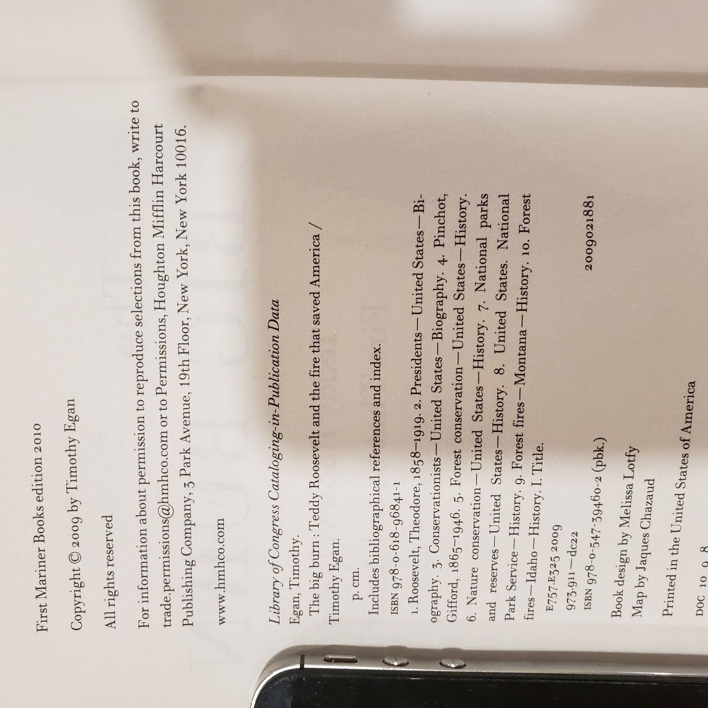

# The Big Burn — Timothy Egan  
*Theodore Roosevelt & the Fire That Saved America*

## Why read this
A gripping narrative of the **Great Fire of 1910** in Idaho and Montana—and the political fight that forged American conservation. Egan ties wildfire, **Theodore Roosevelt**, **Gifford Pinchot**, and the early **U.S. Forest Service** into one page-turner of disaster and reform.

## What it’s about (concise overview)
Two threads drive the book: the Forest Service’s struggle to survive in Washington, and the bone-dry summer that set the Northern Rockies ablaze. When hurricane-force winds arrive, towns and crews face firestorms; the aftermath reshapes federal wildfire policy and the idea of **public land**.

## Table of contents (from this copy)

*Prologue* — **A Fire at the End of the World**, p. 1

**Part I — In on the Creation**  
1. “A Peculiar Intimacy”, p. 17  
2. Roost of the Robber Barons, p. 39  
3. The Great Crusade, p. 53  
4. Deadwood Days, p. 73  
5. Showdown, p. 86  

**Part II — What They Lost**  
6. Summer of Smoke, p. 105  
7. Men, Men, Men!, p. 116  
8. Spaghetti Westerners, p. 129  
9. Firestorm’s Eve, p. 141  
10. Blowup, p. 154  
11. The Lost Day, p. 158  
12. The Lost Night, p. 172  
13. Towns Afire, p. 187  
14. To Save a Town, p. 201  
15. The Missing, p. 211  
16. The Living and the Dead, p. 227  

**Part III — What They Saved**  
17. Fallout, p. 239  
18. One for the Boys, p. 249  
19. Ashes, p. 263  

**Back matter**  
Notes on Sources, p. 287 • Acknowledgments, p. 307 • Index, p. 309

::: details Show original TOC scans (optional)
  

:::

## Author & perspective
Pulitzer-winning journalist **Timothy Egan** blends scene-driven storytelling with clear political context. Sympathetic to Roosevelt/Pinchot’s conservation project, he still foregrounds labor, class, and Western boomtown realities.

## UDC subject classification (for search)
- **Primary:** `634.9` — Forestry / Forest conservation  
- **Secondary:** `94(73)` — U.S. history; `363.37` — Disasters (wildfires)  
- **Tags:** Great Fire of 1910 • U.S. Forest Service • Pinchot • public lands • conservation politics

## Publication details (this copy)
Mariner Books (Houghton Mifflin Harcourt), **First Mariner Books edition 2010** (orig. 2009).  
CIP page lists **ISBN 978-0-618-96841-1** and **978-0-547-39460-2 (pbk.)** — record the one printed on your back cover as primary.  
Book design by Melissa Lotfy. Map by Jacques Chazaud.

::: details Show copyright/CIP page (scan)

:::

## Related volumes on this shelf
- *The River of Doubt* (Millard) — Roosevelt in the Amazon  
- *The Age of Reform* (Hofstadter) — Progressive Era backdrop  
- *Freedom From Fear* (Kennedy) — U.S. political history context  
- *We Are Lincoln Men* (Donald) — presidential friendships & politics
