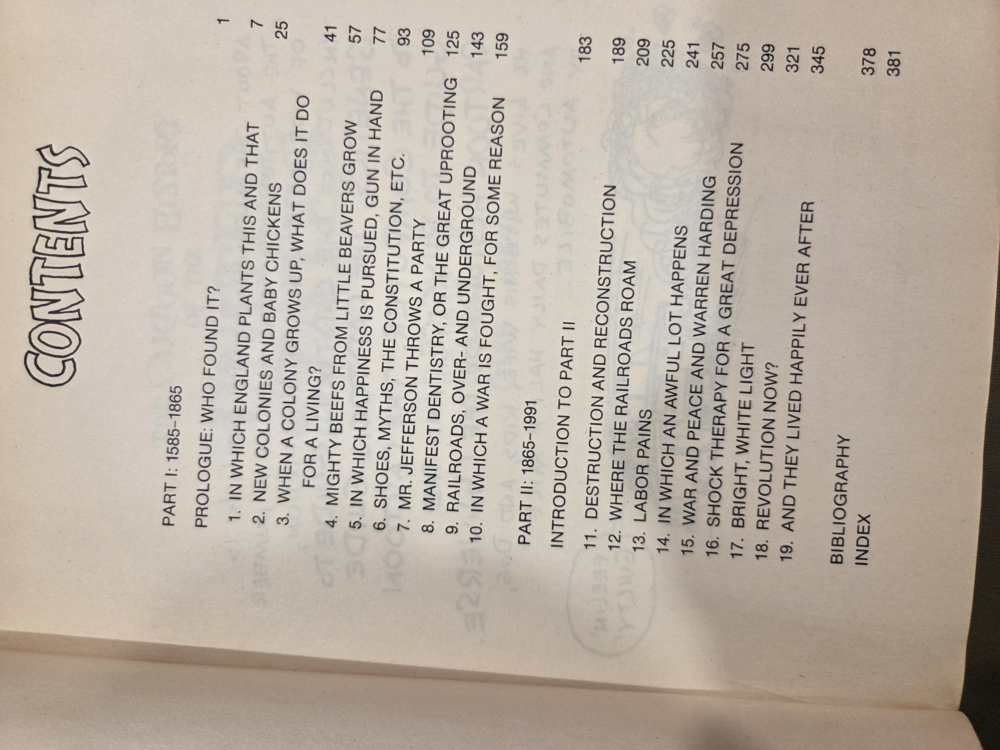
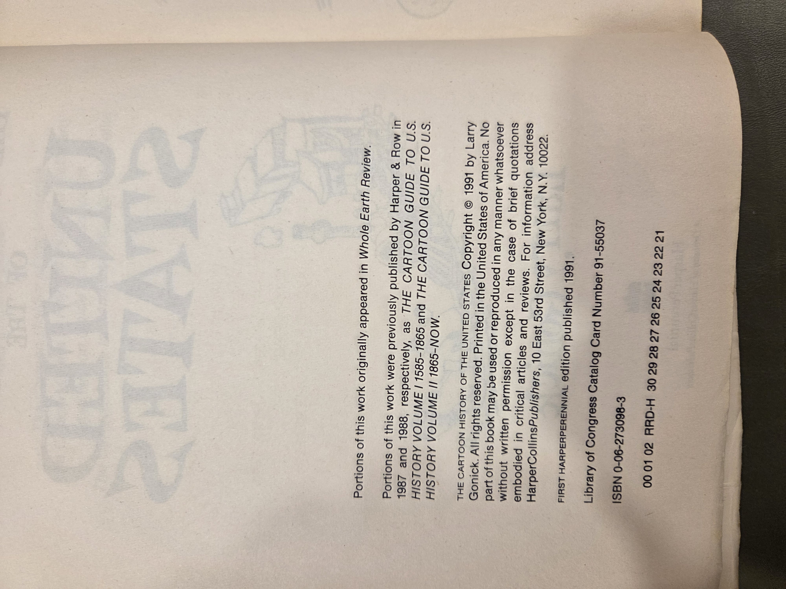

# *The Cartoon History of the United States* — **Larry Gonick**

## Why read this
A lively, visual sweep of U.S. history by a veteran cartoonist–explainer. Great for quick refreshers, motivated teens, and adults who like learning via pictures without sacrificing factual backbone.

## What it's about (concise overview)
From England’s first footholds to the early 1990s, Gonick sketches politics, economics, social change, and everyday life in panels that mix jokes with clear explanations. This omnibus adapts and updates material from two earlier volumes (to 1865; 1865–now).

## Table of contents (from this copy)
**Prologue:** *Who Found It?*, p. **1**

**Part I — 1585–1865**  
1. *In Which England Plants This and That*, p. **7**  
2. *New Colonies and Baby Chickens*, p. **25**  
3. *When a Colony Grows Up, What Does It Do for a Living?*, p. **41**  
4. *Mighty Beefs from Little Beavers Grow*, p. **57**  
5. *In Which Happiness Is Pursued, Gun in Hand*, p. **77**  
6. *Shoes, Myths, the Constitution, etc.*, p. **93**  
7. *Mr. Jefferson Throws a Party*, p. **109**  
8. *Manifest Dentistry, or the Great Uprooting*, p. **125**  
9. *Railroads, Over- and Underground*, p. **143**  
10. *In Which a War Is Fought, for Some Reason*, p. **159**

**Part II — 1865–1991**  
*Introduction to Part II*, p. **183**  
11. *Destruction and Reconstruction*, p. **189**  
12. *Where the Railroads Roam*, p. **209**  
13. *Labor Pains*, p. **225**  
14. *In Which an Awful Lot Happens*, p. **241**  
15. *War and Peace and Warren Harding*, p. **257**  
16. *Shock Therapy for a Great Depression*, p. **275**  
17. *Bright, White Light*, p. **299**  
18. *Revolution Now?*, p. **321**  
19. *And They Lived Happily Ever After*, p. **345**

**Back matter** — *Bibliography*, p. **378** • *Index*, p. **381**

<strong>Show original TOC scans (optional)</strong>

  

??? details "Show original TOC scan (optional)"
    

## Author & perspective
**Larry Gonick** (b. 1946) is a cartoonist known for the *Cartoon Guide* series. His tone is witty and skeptical; perspective is broadly progressive and science-friendly, aimed at demystifying complex topics for general readers.

## UDC subject classification (for search)
- **Primary:** 973 — United States (general history)  
- **Secondary:** 741.5 — Graphic narratives, comics

## Publication details (this copy)
- **Publisher & imprint:** HarperPerennial (HarperCollinsPublishers), **1991**; trade paperback.  
- **ISBN:** 0-06-273098-3.  
- **Notes:** Portions previously appeared in *Whole Earth Review* and in two earlier Harper & Row paperbacks (1987, 1988).

<strong>Show copyright / CIP page (scan)</strong>

## Related volumes on this shelf
- *(stub)* Add neighbors and thematic links once other entries on Shelf 1 are finalized.
