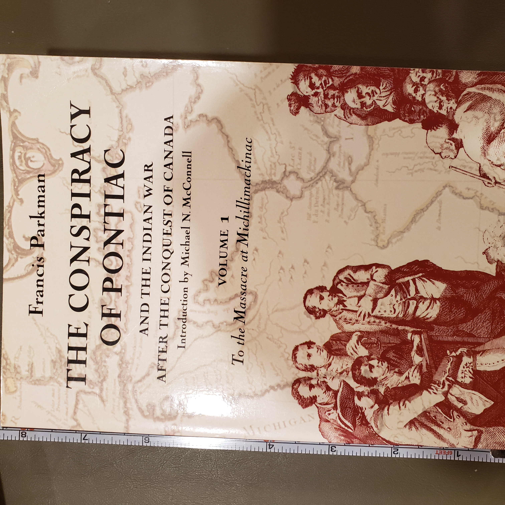
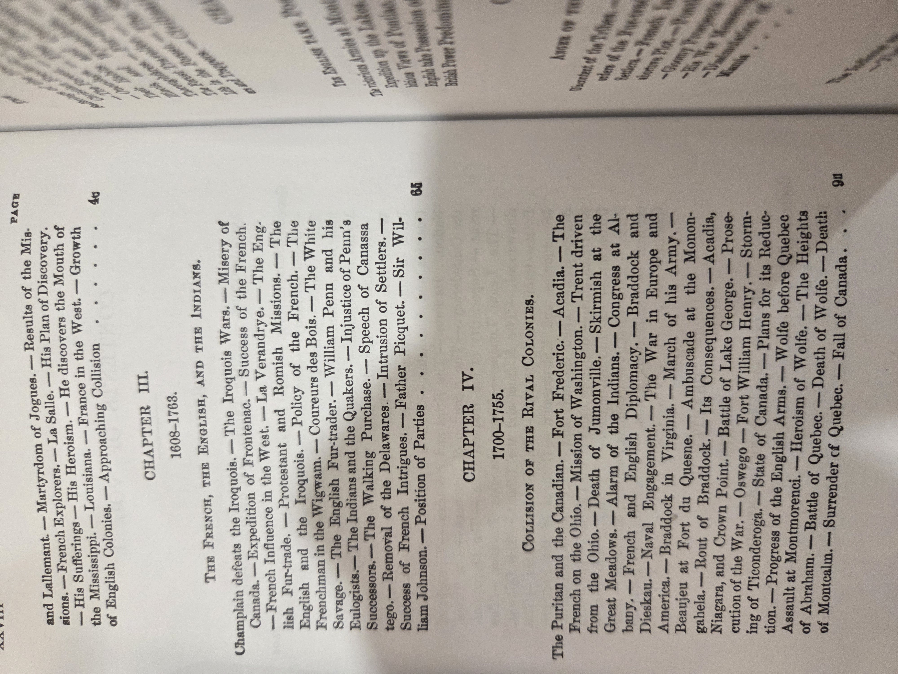
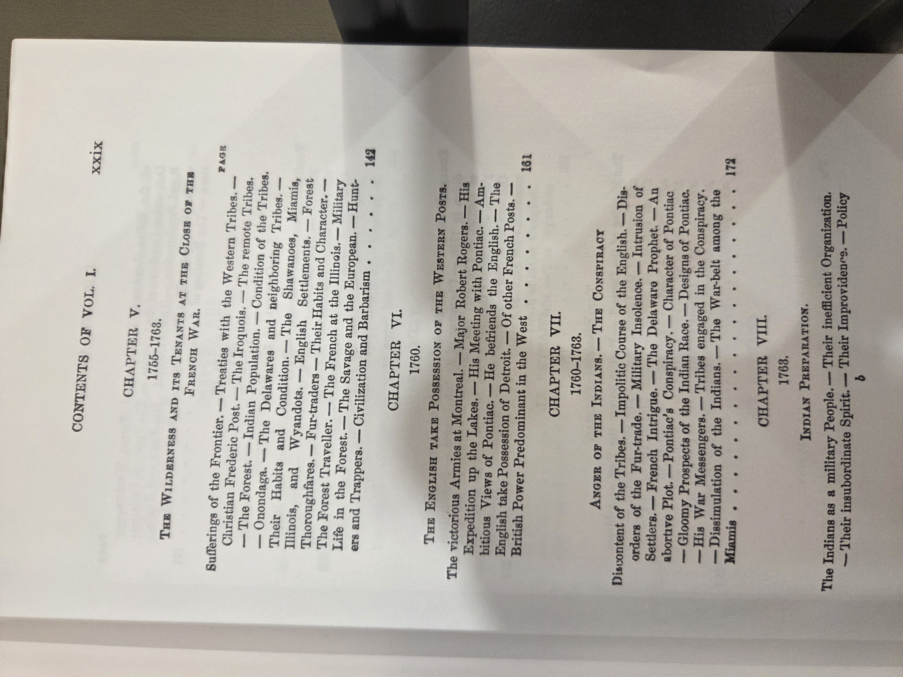
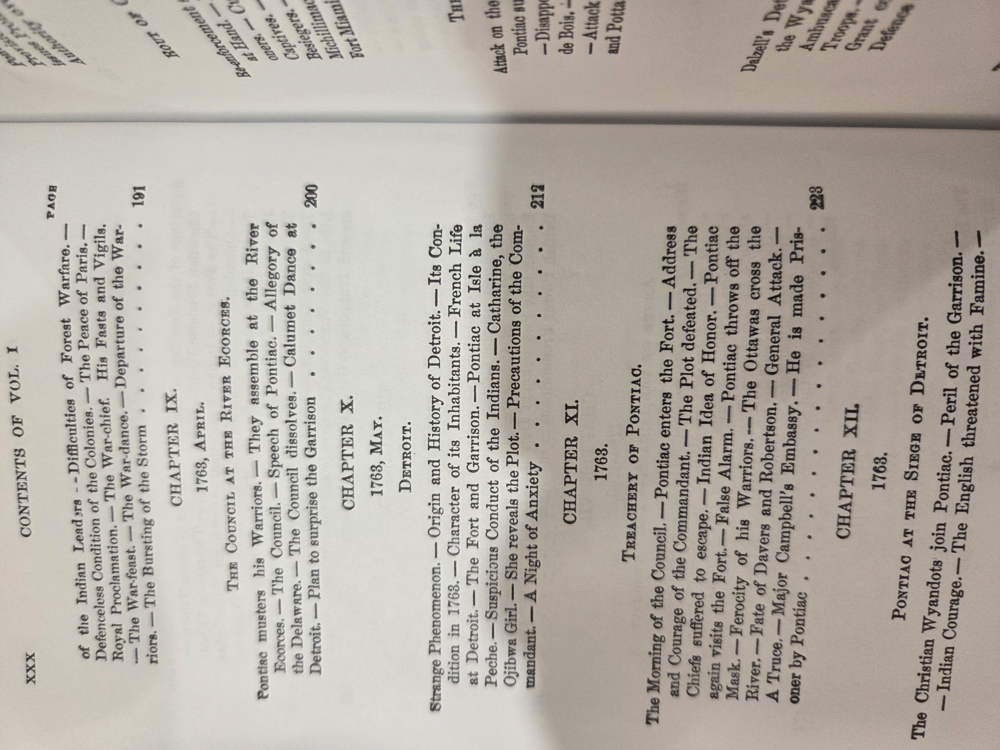
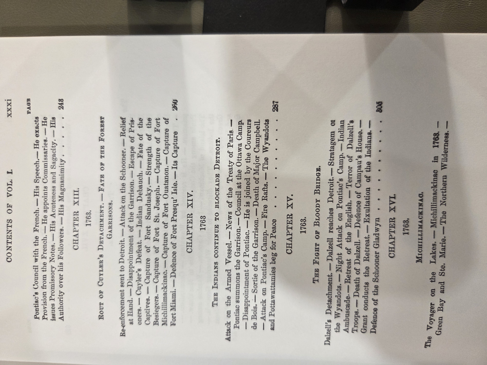
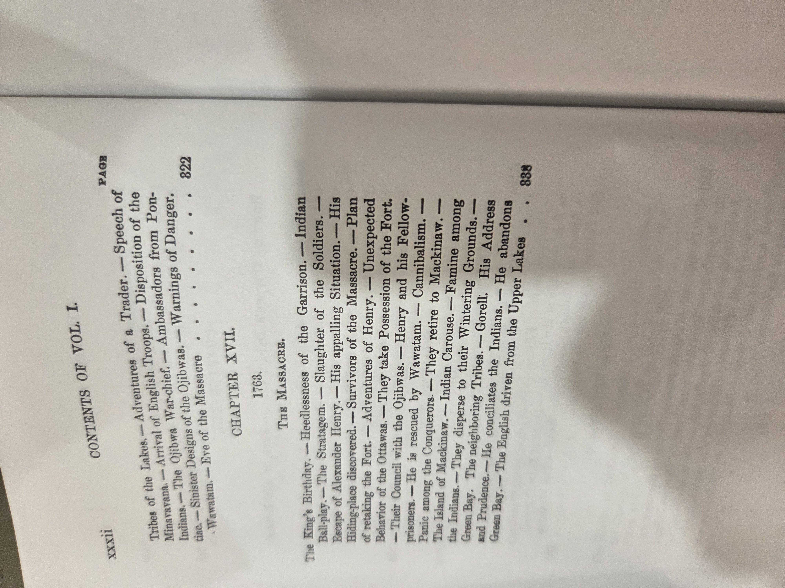
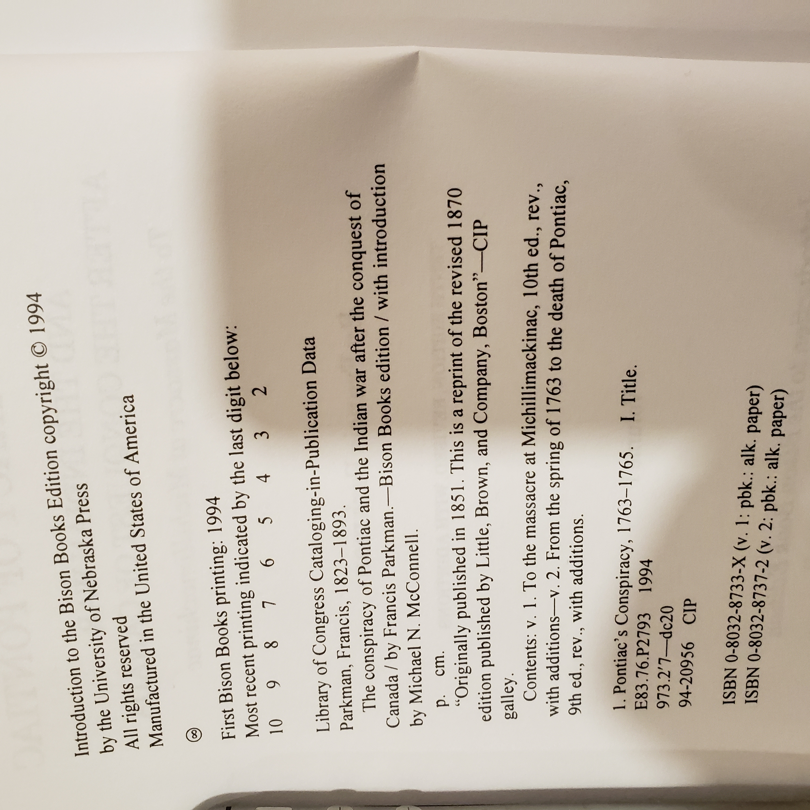

# *The Conspiracy of Pontiac* — Francis Parkman  
*(Bison Books ed., Vol. 1)*

## Why read this
Parkman’s classic narrative history of the 1763 Great Lakes–Ohio Valley uprising led by **Pontiac** reveals the messy transition from French to British rule after the Seven Years’ War: diplomacy, sieges (Detroit, Michilimackinac), and frontier entanglements among Native nations, the British Empire, and colonial settlers. It’s vivid, source-rich 19th-century storytelling that shaped generations of U.S. frontier history.

## What it’s about (concise overview)
**Volume 1** traces the **background (1608–1763)**, the **transfer of forts (1760)**, the **formation of the confederacy (1760–1763)**, preparations for war, and the early campaign of **1763**—including Pontiac’s siege of Detroit and the **Michilimackinac** disaster—told through journals, official papers, and oral testimony. (Readers should also be aware of Parkman’s period biases and language when describing Native peoples.)

## Table of contents (from this copy)

> Chapter titles and dates are transcribed for searchability; consult the scans below for page details where needed.

1. **Introductory — Indian Tribes East of the Mississippi**, p. 1 *(see scan)*
2. **1663–1763 — France and England in America**, p. 46 *(scan)*
3. **1608–1763 — The French, the English, and the Indians**, p. 65 *(scan)*
4. **1700–1755 — Collision of the Rival Colonies**, p. 91 *(scan)*
5. **1755–1763 — The Wilderness and its Tenants at the Close of the French War**, p. 142 *(scan)*
6. **1763 — The English take Possession of the Western Posts**, p. 161 *(scan)*
7. **1760–1763 — Anger of the Indians. The Conspiracy**, p. 172 *(scan)*
8. **1763 — Indian Preparation**, p. *(see scan)*
9. **1763 (April) — The Council at the River Ecorces**, p. *(see scan)*
10. **1763 (May) — [Chapter title per scan]**, p. *(see scan)*
11. **1763 — Treachery of Pontiac**, p. *(see scan)*
12. **1763 — Pontiac at the Siege of Detroit**, p. *(see scan)*
13. **1763 — Rout of Cuyler’s Detachment. Fate of the Forest Garrisons**, p. *(see scan)*
14. **1763 — The Indians Continue to Blockade Detroit**, p. *(see scan)*
15. **1763 — The Fight of Bloody Bridge**, p. *(see scan)*
16. **1763 — Michillimackinac**, p. *(see scan)*
17. **1763 — The Massacre**, p. *(see scan)*

<strong>Show original TOC scans (optional)</strong>

  
  
  
  
  

## Author & perspective
**Francis Parkman (1823–1893)**, Boston-born historian, wrote this work first in **1851** (revised **1870**). His prose is gripping, but his depictions reflect 19th-century racial attitudes. Use alongside modern scholarship for balance.

## UDC subject classification (for search)

- **Primary:** 94(73) — U.S. history (18th century; Pontiac’s War)
- **Secondary:** 355 — Military history; 39 — Ethnology / Indigenous studies
- **Tags:** Pontiac • Great Lakes • Detroit • Michilimackinac • British Empire • French colonial legacy • Native diplomacy

## Publication details (this copy)
**Bison Books** (University of Nebraska Press) paperback reprint, **1994** — a reissue of the **1870** revised text (original **1851**).  
Introduction: **Michael N. McConnell**.  
**ISBNs:** Vol. 1 **0-8032-8733-X** (pbk); Vol. 2 **0-8032-8737-2** (pbk).  
*(See CIP/copyright scan for full block.)*

<strong>Show copyright / CIP page (scan)</strong>

## Related volumes on this shelf
- [**Great Wagon Road** (Rouse)](GreatWagonRoad.md)
- [**John Adams** (McCullough)](JohnAdams_McCullough.md)
- [**American Sphinx** (Ellis)](AmericanSphinx_Ellis.md)
- [**Journals of Lewis & Clark**](JournalsOfLewisClark.md)
- [**Undaunted Courage** (Ambrose)](UndauntedCourage_Ambrose.md)
- [**Declaration of Independence** (Great Books Foundation)](./Shelf01/DeclarationOfIndependence.md)
