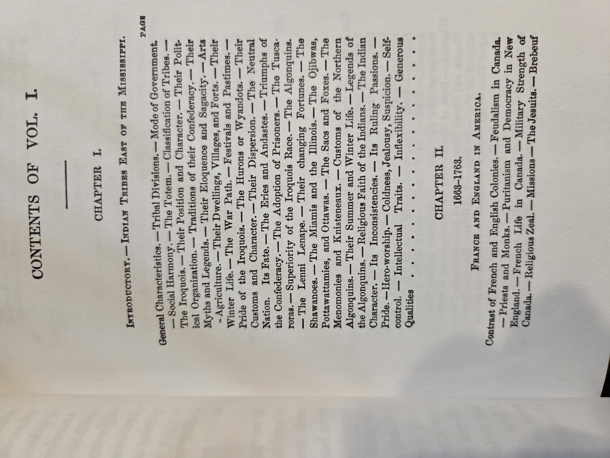

# *The Conspiracy of Pontiac* — Francis Parkman (Bison Books ed., Vol. 1)

## Why read this

Parkman’s classic narrative history of the 1763 Great Lakes–Ohio Valley uprising led by **Pontiac** reveals the messy transition from French to British rule after the Seven Years’ War: diplomacy, sieges (Detroit, Michilimackinac), and frontier entanglements among Native nations, the British Empire, and colonial settlers. It’s vivid, source-rich 19th-century storytelling that shaped generations of U.S. frontier history.

## What it’s about (concise overview)

Volume 1 traces the **background (1608–1763)**, the **transfer of forts (1760)**, the **formation of the confederacy (1760–1763)**, preparations for war, and the early campaign of **1763**—including **Pontiac’s siege of Detroit** and the **Michilimackinac** disaster—told through journals, official papers, and oral testimony. (Readers should also be aware of Parkman’s period biases and language when describing Native peoples.)

## Table of contents (from this copy)

> Chapter titles and date spans are transcribed for searchability; consult the scans below for Parkman’s detailed sub-head bullet lists.

**Introductory** — *Indian Tribes East of the Mississippi*
**Ch. II (1663–1763)** — *France and England in America*
**Ch. III (1608–1763)** — *The French, the English, and the Indians*
**Ch. IV (1700–1755)** — *Collision of the Rival Colonies*
**Ch. V (1755–1763)** — *The Wilderness and its Tenants at the Close of the French War*
**Ch. VI (1760)** — *The English take Possession of the Western Posts*
**Ch. VII (1760–1763)** — *Anger of the Indians — The Conspiracy*
**Ch. VIII (1763)** — *Indian Preparation*
**Ch. IX (April 1763)** — *The Council at the River Ecorces*
**Ch. X (May 1763)** — *Treachery of Pontiac*
**Ch. XI (1763)** — *A Night of Anxiety*
**Ch. XII (1763)** — *Pontiac at the Siege of Detroit*
**Ch. XIII (1763)** — *Rout of Cuyler’s Detachment — Fate of the Forest Garrisons*
**Ch. XIV (1763)** — *The Indians continue to Blockade Detroit*
**Ch. XV (1763)** — *The Fight of Bloody Bridge*
**Ch. XVI (1763)** — *Michillimackinac*
**Ch. XVII (1763)** — *The Massacre*

::: details Show original TOC scans (optional)

   
   
   
   
   
  

:::

## Author & perspective

**Francis Parkman (1823–1893)**, Boston-born historian, wrote this work first in **1851** (revised **1870**). His prose is gripping, but his depictions reflect 19th-century racial attitudes. Use alongside modern scholarship for balance.

## UDC subject classification (for search)

* **Primary:** 94(73) — U.S. history (18th century; Pontiac’s War)
* **Secondary:** 355 — Military history; 39 — Ethnology / Indigenous studies
* **Tags:** Pontiac • Great Lakes • Detroit • Michilimackinac • British Empire • French colonial legacy • Native diplomacy

## Publication details (this copy)

Bison Books (University of Nebraska Press) paperback reprint, **1994** — a reissue of the **1870** revised text (original **1851**). **Introduction:** Michael N. McConnell.
**ISBN:** Vol. 1 **0-8032-8733-X** (pbk., alk. paper); Vol. 2 **0-8032-8737-2**.
*(See scan for full CIP block.)*

::: details Show copyright / CIP page (scan)

  

:::

## Related volumes on this shelf

* [Great Wagon Road (Rouse)](GreatWagonRoad.md)
* [Undaunted Courage (Ambrose)](UndauntedCourage_Ambrose.md)
* [Journals of Lewis & Clark](JournalsOfLewisClark.md)
* [Sacagawea (Clark & Edmonds)](Sacagawea.md)

