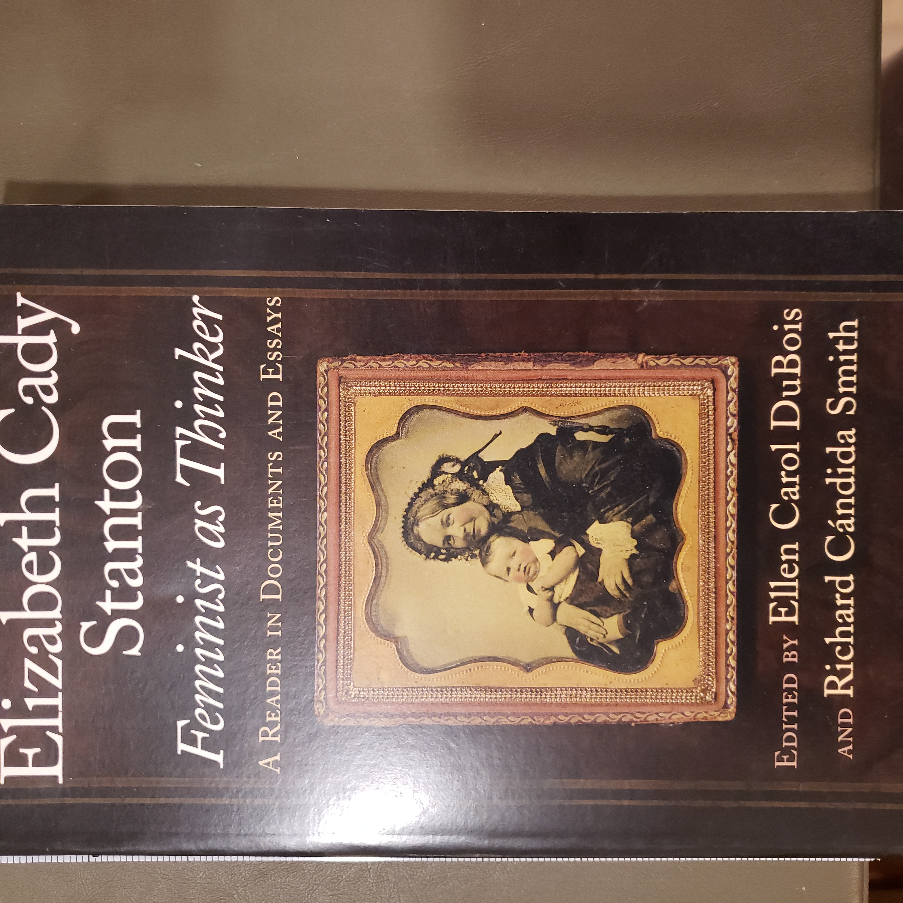
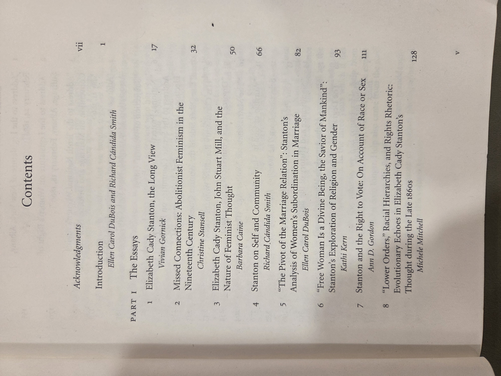
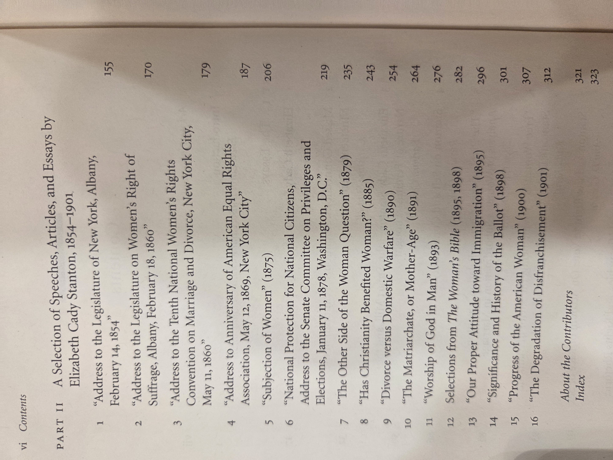
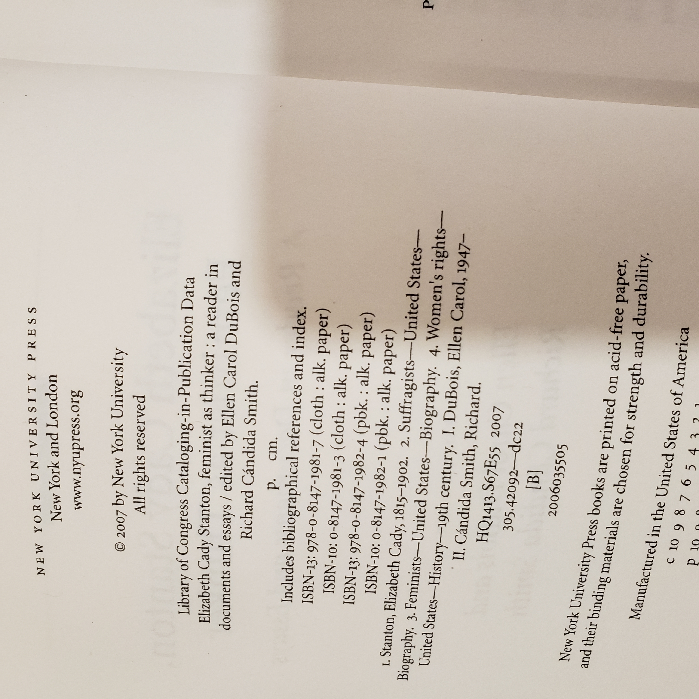

# *Elizabeth Cady Stanton, Feminist as Thinker* — DuBois & Cándida Smith, eds. (2007)

## Why read this
Stanton is usually remembered for Seneca Falls and suffrage. This reader shows her as a **theorist**—a combative, witty mind wrestling with marriage law, religion, race, and citizenship. It’s a compact way to meet Stanton’s voice directly, framed by scholars who explain why her arguments still matter.

## What it’s about (concise overview)
A curated selection of Stanton’s speeches, essays, and letters—paired with concise headnotes and interpretive essays—that trace her thinking from the 1848 *Declaration of Sentiments* through later campaigns for civil and marital reform. Themes include legal equality, women’s autonomy, religion and gender, and strategic/ideological rifts within the movement.

## Table of contents (from this copy)

*Front matter* — **Acknowledgments**, p. vii • **Introduction** (DuBois & Cándida Smith), p. 1

**Part I — The Essays**
1. *Elizabeth Cady Stanton, the Long View* — Vivian Gornick, p. 17  
2. *Missed Connections: Abolitionist Feminism in the Nineteenth Century* — Christine Stansell, p. 32  
3. *Elizabeth Cady Stanton, John Stuart Mill, and the Nature of Feminist Thought* — Barbara Caine, p. 50  
4. *Stanton on Self and Community* — Richard Cándida Smith, p. 66  
5. *“The Pivot of the Marriage Relation”: Stanton’s Analysis of Women’s Subordination in Marriage* — Ellen Carol DuBois, p. 82  
6. *“Free Woman Is a Divine Being, the Savior of Mankind”: Stanton’s Exploration of Religion and Gender* — Kathi Kern, p. 93  
7. *Stanton and the Right to Vote: On Account of Race or Sex* — Ann D. Gordon, p. 111  
8. *“Lower Orders,” Racial Hierarchies, and Rights Rhetoric: Evolutionary Echoes in Elizabeth Cady Stanton’s Thought during the Late 1860s* — Michele Mitchell, p. 128  

**Part II — A Selection of Speeches, Articles, and Essays by Elizabeth Cady Stanton, 1854–1901**
1. “Address to the Legislature of New York, Albany, February 14, 1854,” p. 155  
2. “Address to the Legislature on Women’s Right of Suffrage, Albany, February 18, 1860,” p. 170  
3. “Address to the Tenth National Women’s Rights Convention on Marriage and Divorce, New York City, May 11, 1860,” p. 179  
4. “Address to Anniversary of American Equal Rights Association, May 12, 1869, New York City,” p. 187  
5. “Subjection of Women” (1875), p. 206  
6. *National Protection for National Citizens*, Address to the Senate Committee on Privileges and Elections, January 11, 1878, Washington, D.C., p. 219  
7. “The Other Side of the Woman Question” (1879), p. 235  
8. “Has Christianity Benefited Woman?” (1885), p. 243  
9. “Divorce versus Domestic Warfare” (1890), p. 254  
10. “The Matriarchate, or Mother-Age” (1891), p. 264  
11. “Worship of God in Man” (1893), p. 276  
12. *Selections from* **The Woman’s Bible** (1895, 1898), p. 282  
13. “Our Proper Attitude toward Immigration” (1895), p. 296  
14. “Significance and History of the Ballot” (1898), p. 301  
15. “Progress of the American Woman” (1900), p. 307  
16. “The Degradation of Disfranchisement” (1901), p. 312  

*Back matter* — **About the Contributors**, p. 321 • **Index**, p. 323

Show original TOC scans (optional)

- [Table of contents — page 1](ElizabethCadyStanton_TOC.jpg)  
- [Table of contents — page 2](ElizabethCadyStanton_TOC2.jpg)

<!-- If you prefer inline images when expanded, uncomment these lines:

-->

## Author & perspective
- **Editors:** Ellen Carol DuBois (women’s suffrage historian) and Richard Cándida Smith (American intellectual/cultural history).  
- **Perspective:** Scholarly but accessible: each document is contextualized; the essays spotlight where Stanton was pioneering and where her 19th-century assumptions show.

## UDC subject classification (for search)
- **Primary:** `305-055.2` — Women as a social group / women’s studies  
- **Secondary:** `94(73)` — U.S. history; `323` — Civil/political rights. :contentReference[oaicite:1]{index=1}

## Publication details (this copy)
New York University Press, 2007 (New York; London). Paperback.  
**ISBN-13 (pbk.):** 978-0-8147-1982-4 • **ISBN-10 (pbk.):** 0-8147-1982-1  
**ISBN-13 (cloth):** 978-0-8147-1981-7 • **ISBN-10 (cloth):** 0-8147-1981-3  
Printed on acid-free paper; manufactured in the U.S.A.

Show copyright / CIP page (scan)

- [Copyright/CIP page — NYU Press](ElizabethCadyStanton_CopyRight.jpg)

<!-- Uncomment to render the scan inline:

-->

## Related volumes on this shelf
- American Sphinx (Ellis)  
- John Adams (McCullough)  
- Undaunted Courage (Ambrose)  
- Journals of Lewis & Clark  
- Sacagawea (Clark & Edmonds)  
- The Great Wagon Road (Rouse)  
- River of Doubt (Millard)  
- The Conspiracy of Pontiac (Parkman)  
- Hiroshima to Glasnost (Nitze)  
- Camelot’s Court (Dallek)  
- Freedom From Fear (Kennedy)  
- The Age of Reform (Hofstadter)  
- Declaration of Independence (Great Books Foundation)
