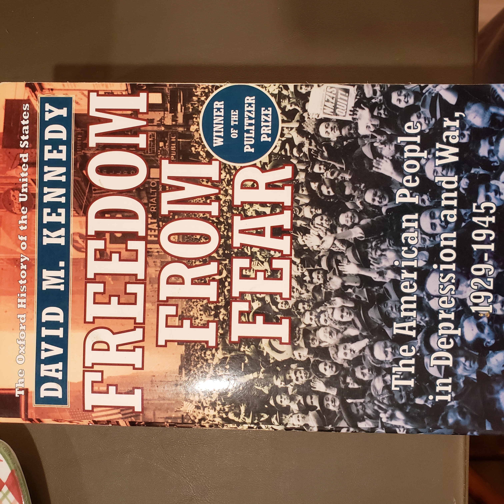
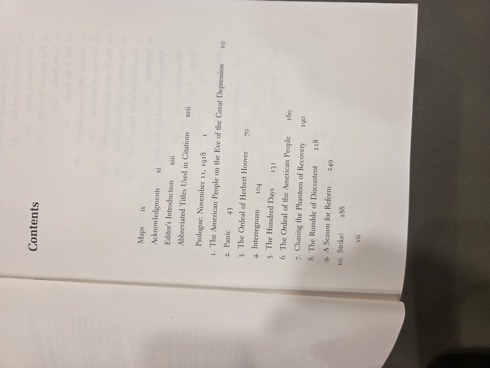
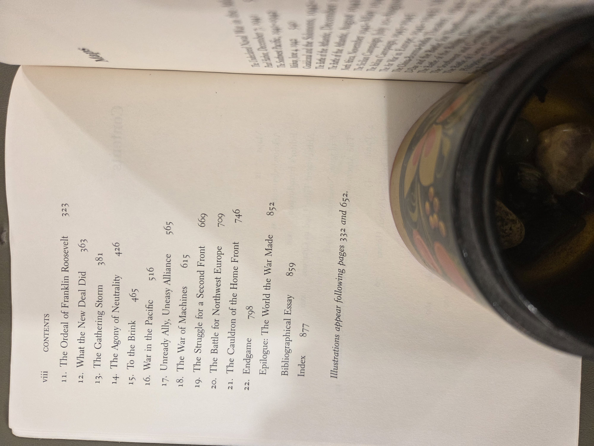
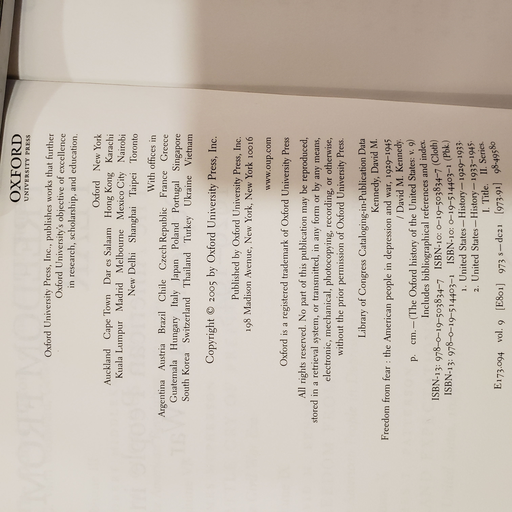

  *Freedom From Fear* — David M. Kennedy
 
 *(The Oxford History of the United States, paperback ed., 2005)*
 
 

 
 ## Why read this
 A sweeping, authoritative narrative of how the United States weathered the **Great Depression** and fought **World War II**, tracing everyday lives alongside high policy. If you want one volume that explains how the New Deal and the war remade the nation, this is the modern classic.
 
 ## What it’s about (concise overview)
 Kennedy moves from the 1929 crash and **Hoover**’s responses to **Franklin Roosevelt**’s New Deal experiments, the 1937–38 slump, and America’s cautious path from neutrality to total war. The second half covers strategy and production, the home front (race, labor, gender), and the global campaigns that culminate in 1945. Throughout, the book ties **state capacity**, **economic recovery**, and **social change** to the pressures of depression and mobilization.
 
 ## Table of contents (from this copy)
 
 Front matter  
 - Maps, p. ix  
 - Acknowledgments, p. xi  
 - Editor’s Introduction, p. xiii  
 - Abbreviated Titles Used in Citations, p. xvii  
 - **Prologue:** *November 11, 1918*, p. 1
 
 **Ch. 1** — *The American People on the Eve of the Great Depression*, p. 10  
 **Ch. 2** — *Panic*, p. 43  
 **Ch. 3** — *The Ordeal of Herbert Hoover*, p. 70  
 **Ch. 4** — *Interregnum*, p. 104  
 **Ch. 5** — *The Hundred Days*, p. 131  
 **Ch. 6** — *The Ordeal of the American People*, p. 160  
 **Ch. 7** — *Chasing the Phantom of Recovery*, p. 190  
 **Ch. 8** — *The Rumble of Discontent*, p. 218  
 **Ch. 9** — *A Season for Reform*, p. 249  
 **Ch. 10** — *Strike!*, p. 288  
 **Ch. 11** — *The Ordeal of Franklin Roosevelt*, p. 323  
 **Ch. 12** — *What the New Deal Did*, p. 363  
 **Ch. 13** — *The Gathering Storm*, p. 381  
 **Ch. 14** — *The Agony of Neutrality*, p. 426  
 **Ch. 15** — *To the Brink*, p. 465  
 **Ch. 16** — *War in the Pacific*, p. 516  
 **Ch. 17** — *Unready Ally, Uneasy Alliance*, p. 565  
 **Ch. 18** — *The War of Machines*, p. 615  
 **Ch. 19** — *The Struggle for a Second Front*, p. 669  
 **Ch. 20** — *The Battle for Northwest Europe*, p. 709  
 **Ch. 21** — *The Cauldron of the Home Front*, p. 746  
 **Ch. 22** — *Endgame*, p. 798  
 
 Back matter  
 - **Epilogue:** *The World the War Made*, p. 852  
 - **Bibliographical Essay**, p. 859  
 - **Index**, p. 877  
 
 > *Illustrations appear following pages 332 and 652.*
 
 

 
Show original TOC scans (optional)

 
   
 
 
 

 
 ## Author & perspective
 Historian **David M. Kennedy** writes a balanced synthesis grounded in economic data, policy archives, and social history. Perspective is analytical yet accessible—showing both the limits and achievements of the New Deal, and how wartime mobilization accelerated long‑term transformations.
 
 ## UDC subject classification (for search)
 - **Primary:** `94(73)"1929/1945"` — U.S. history from the Depression through WWII.  
 - **Secondary:** `338(73)` — U.S. economic history; `355/359` — Military history; `323` — Political life & civil rights.  
 - **Tags:** New Deal • FDR • Depression • WWII • home front • mobilization
 
 ## Publication details (this copy)
 - **Publisher & edition:** Oxford University Press, **paperback (2005)**.  
 - **Series:** *The Oxford History of the United States*.  
 - **ISBN (pbk., from CIP):** 978‑0‑19‑514403‑1 (ISBN‑10: 0‑19‑514403‑1). *Confirm against the back cover of your copy.*  
 - **Copyright/CIP page scan:** see below.  
 
 
 
 ## Related volumes on this shelf
 - *The Worst Hard Time* — Timothy Egan (Dust Bowl; complements early‑1930s chapters).  
 - *The Big Burn* — Timothy Egan (Progressive Era conservation state building).  
 