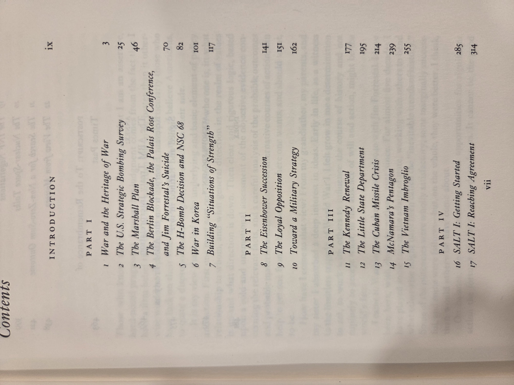
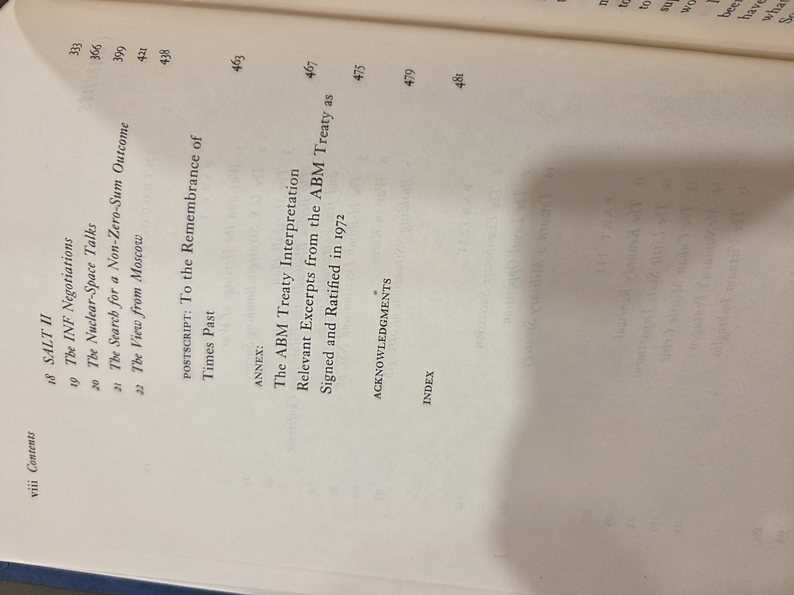
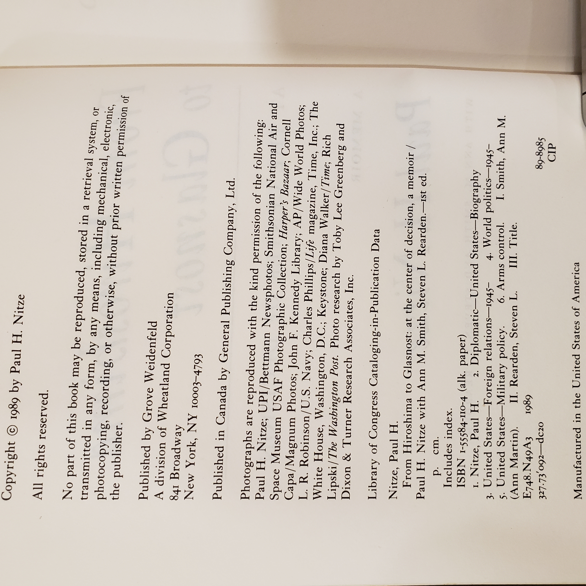

# *From Hiroshima to Glasnost* — Paul H. Nitze  
*At the Center of Decision — A Memoir* (Grove Weidenfeld, 1989)

## Why read this
A front‑row account of U.S. strategy from the dawn of the nuclear age to the endgame of the Cold War. Nitze helped shape **NSC‑68**, served as **Secretary of the Navy** and **Deputy Secretary of Defense**, and later negotiated arms‑control deals. If you want to see how big choices were argued inside Washington, this is indispensable.

## What it’s about (concise overview)
Nitze narrates his career from WWII planning and the aftermath of **Hiroshima**, through containment strategy, the **Cuban Missile Crisis**, Vietnam‑era defense debates, détente, and the 1980s **INF** negotiations (including the “walk in the woods”). Through‑line: how the U.S. tried to balance deterrence, alliance management, and arms control while technology and geopolitics kept shifting.

## Table of contents (from this copy)
*(Chapter titles and start pages are transcribed for searchability; consult the scans below for exact typography.)*

**Introduction**, p. ix

**I • Part I**  
1. **War and the Heritage of War**, p. 3  
2. **The U.S. Strategic Bombing Survey**, p. 25  
3. **The Marshall Plan**, p. 46  
4. **The Berlin Blockade, the Palais Rose Conference, and Jim Forrestal’s Suicide**, p. 70  
5. **The H‑Bomb Decision and NSC 68**, p. 82  
6. **War in Korea**, p. 101  
7. **Building “Situations of Strength”**, p. 117  

**II • Part II**  
8. **The Eisenhower Succession**, p. 141  
9. **The Loyal Opposition**, p. 151  
10. **Toward a Military Strategy**, p. 162  

**III • Part III**  
11. **The Kennedy Renewal**, p. 177  
12. **The Little State Department**, p. 195  
13. **The Cuban Missile Crisis**, p. 214  
14. **McNamara’s Pentagon**, p. 239  
15. **The Vietnam Imbroglio**, p. 255  

**IV • Part IV**  
16. **SALT I: Getting Started**, p. 285  
17. **SALT I: Reaching Agreement**, p. 314  
18. **SALT II**, p. 333  
19. **The INF Negotiations**, p. 366  
20. **The Nuclear‑Space Talks**, p. 399  
21. **The Search for a Non‑Zero‑Sum Outcome**, p. 421  
22. **The View from Moscow**, p. 438  

**Postscript:** *To the Remembrance of Times Past*, p. 463  
**Annex:** *The ABM Treaty Interpretation — Relevant Excerpts from the ABM Treaty as Signed and Ratified in 1972*, p. 475  

**Back matter**  
**Acknowledgments**, p. 481  
**Index**

::: details Show original TOC scans (optional)
  

:::

## Author & perspective
**Paul H. Nitze (1907–2004)** was a central architect of Cold War policy and later namesake of Johns Hopkins SAIS. Perspective: **participant‑observer**—analytic, sometimes blunt, often arguing for strength plus verifiable arms limits. Coauthors **Ann M. Smith** and **Steven L. Rearden** help stitch documents and memory into clear narrative.

## UDC subject classification (for search)
- **Primary:** `327(73)"1945/1991"` — U.S. foreign relations (Cold War).  
- **Secondary:** `341.67` — Arms control & disarmament; `355/359` — Military affairs/defense.  
- **Tags:** NSC‑68 • INF Treaty • NATO • deterrence • arms negotiations • containment • SAIS

## Publication details (this copy)
Grove Weidenfeld (New York), **1989**. Hardcover. **ISBN 1‑55584‑110‑4** (alk. paper). *See the verso scan for full CIP block.*

## Related volumes on this shelf
- [Age of Reform (Hofstadter)](AgeOfReform_Hofstadter.md)  
- [The Big Burn (Egan)](BigBurn_Egan.md)  
- [River of Doubt (Millard)](RiverOfDoubt_Millard.md)  
- [Freedom from Fear (Kennedy)](FreedomFromFear_Kennedy.md)  
- [We Are Lincoln Men (Donald)](WeAreLincolnMen.md)
