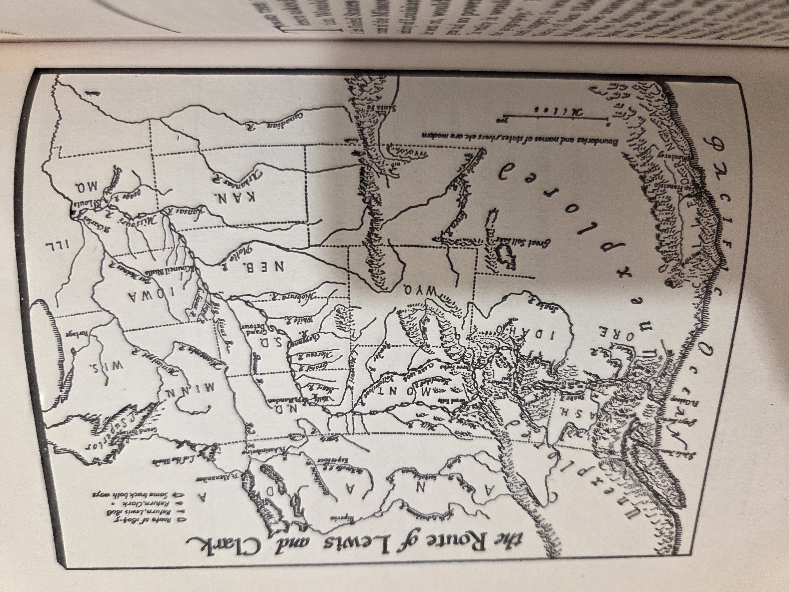

# The Journals of Lewis and Clark — Edited by Bernard DeVoto (Houghton Mifflin)

### Why read this
Few adventure stories are as real—or as consequential—as the trek from the Mississippi to the Pacific and back (1804–1806). These journals put you in the canoe, on the portage, and at council fires, recording landscapes before settlement and first-contact diplomacy in the explorers’ own words.

### What it’s about (concise overview)
A highly readable one-volume selection of the daily journals of **Meriwether Lewis** and **William Clark**, shaped by literary editor **Bernard DeVoto** from the classic Thwaites edition. Brief bridges keep the narrative moving while **Erwin Raisz** maps help track distance, season, and terrain.

---

## Table of contents
*(from the book; page numbers are from this printing)*

**Front matter** — *Introduction*, p. 13 • *Acknowledgments*, p. 17

**Chapters**  
1. **Youth 1774–1792**, p. 19  
2. **Planter 1792–1794**, p. 30  
3. **Soldier 1794–1800**, p. 38  
4. **Thomas Jefferson’s America 1801**, p. 51  
5. **The President’s Secretary 1801–1802**, p. 58  
6. **The Origins of the Expedition 1750–1802**, p. 68  
7. **Preparing for the Expedition** *(Jan–Jun 1803)*, p. 80  
8. **Washington to Pittsburgh** *(Jun–Aug 1803)*, p. 93  
9. **Down the Ohio** *(Sep–Nov 1803)*, p. 108  
10. **Up the Mississippi to Winter Camp** *(Nov 1803–Mar 1804)*, p. 121  
11. **Ready to Depart** *(Apr–21 May 1804)*, p. 133  
12. **Up the Missouri** *(May–Jul 1804)*, p. 140  
13. **Entering Indian Country** *(Aug 1804)*, p. 152  
14. **Encounter with the Sioux** *(Sep 1804)*, p. 165  
15. **To the Mandans** *(Fall 1804)*, p. 176  
16. **Winter at Fort Mandan** *(Dec 21, 1804–Mar 21, 1805)*, p. 191  
17. **Report from Fort Mandan** *(Mar 22–Apr 6, 1805)*, p. 202  
18. **From Fort Mandan to Marias River** *(Apr 7–Jun 2, 1805)*, p. 211  
19. **From Marias River to the Great Falls** *(Jun 3–20, 1805)*, p. 230  
20. **The Great Portage** *(Jun 16–Jul 14, 1805)*, p. 241  
21. **Looking for the Shoshones** *(Jul 15–Aug 12, 1805)*, p. 251  
22. **Over the Continental Divide** *(Aug 13–31, 1805)*, p. 268  
23. **Lewis as Ethnographer: The Shoshones**, p. 284  
24. **Over the Bitterroots** *(Sep 1–Oct 6, 1805)*, p. 289  
25. **Down the Columbia** *(Oct 8–Dec 7, 1805)*, p. 302  
26. **Fort Clatsop** *(Dec 8, 1805–Mar 23, 1806)*, p. 318  
27. **Lewis as Ethnographer: The Clatsops and the Chinooks**, p. 337  
28. **Jefferson and the West** *(1804–1806)*, p. 342  
29. **Return to the Nez Percé** *(Mar 23–Jun 9, 1806)*, p. 353  
30. **The Lolo Trail** *(Jun 10–Jul 2, 1806)*, p. 369  
31. **The Marias Exploration** *(Jul 3–28, 1806)*, p. 379  
32. **The Last Leg** *(Jul 29–Sep 22, 1806)*, p. 395  
33. **Reporting to the President** *(Sep 23–Dec 31, 1806)*, p. 406  
34. **Washington** *(Jan–Mar 1807)*, p. 422  
35. **Philadelphia** *(Apr–Jul 1807)*, p. 431  
36. **Virginia** *(Aug 1806–Mar 1807)*, p. 439  
37. **St. Louis** *(Mar–Dec 1808)*, p. 445  
38. **St. Louis** *(Jan–Aug 1809)*, p. 460  
39. **Last Voyage** *(Sep 3–Oct 11, 1809)*, p. 471  
40. **Aftermath**, p. 476

**Back matter** — *Notes*, p. 485 • *Bibliography*, p. 503 • *Index*, p. 507

<strong>Show original TOC scans (optional)</strong>

  
  

---

## List of maps (from front matter)
**The Route of Lewis and Clark**  
I. *May 14–Sep 15, 1804; and Sep 1–23, 1806*, p. 2  
II. *Sep 15, 1804–Apr 7, 1805; and Aug 12–Sep 1, 1806*, p. 27  
III. *Apr 7–Jun 21, 1805*, p. 100  
IV. *Jun 21–Oct 8, 1805*, p. 156  
V. *Oct 10, 1805–May 3, 1806*, p. 247  
VI. *Jul 3–Aug 12, 1806*, p. 416

## Map (from front matter)

---

## Author & perspective
- **Primary voices:** Captains **Lewis** and **Clark** (field journals, 1804–06).  
- **Editor:** **Bernard DeVoto** (abridgment/bridges); maps by **Erwin Raisz**.  
- **Perspective/bias:** U.S. government exploration of the early republic; immediate and practical entries reflecting their moment.

## UDC subject classification (for search)
- **Primary:** `910.4(73)` — Travel & exploration accounts concerning the United States  
- **Secondary:** `94(73)`, `929` — U.S. history; biographical/joint authorship

## Related volumes on this shelf
- [Undaunted Courage (Ambrose)](UndauntedCourage_Ambrose.md)  
- [Sacagawea of the Lewis & Clark Expedition (Clark & Edmonds)](Sacagawea.md)  
- [The Conspiracy of Pontiac (Parkman)](ConspiracyOfPontiac_Parkman.md)  
- [The River of Doubt (Millard)](RiverOfDoubt_Millard.md)
