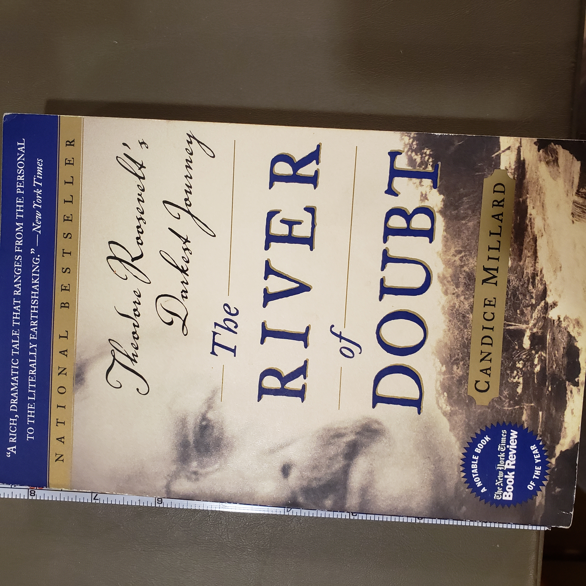
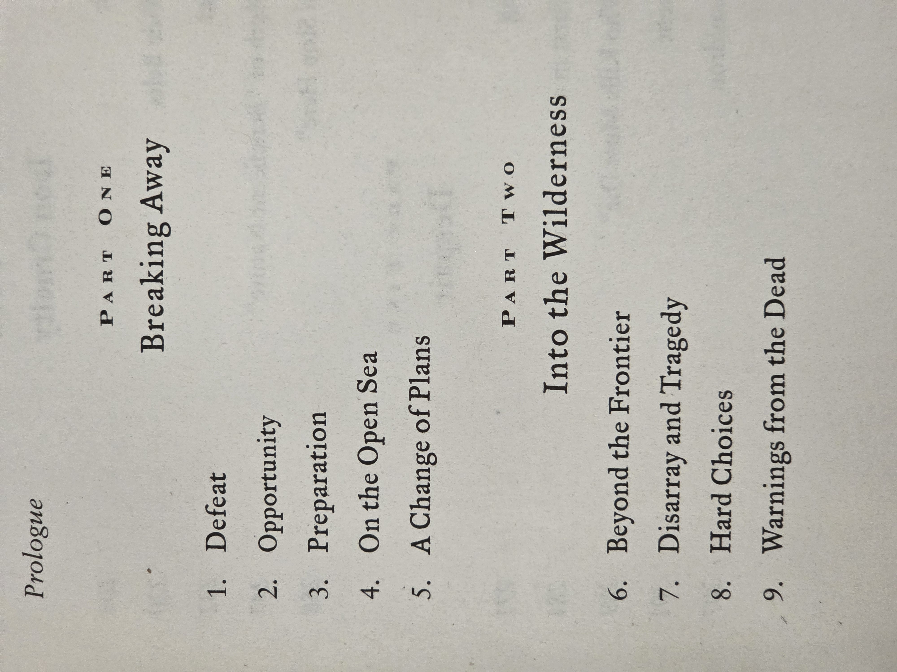
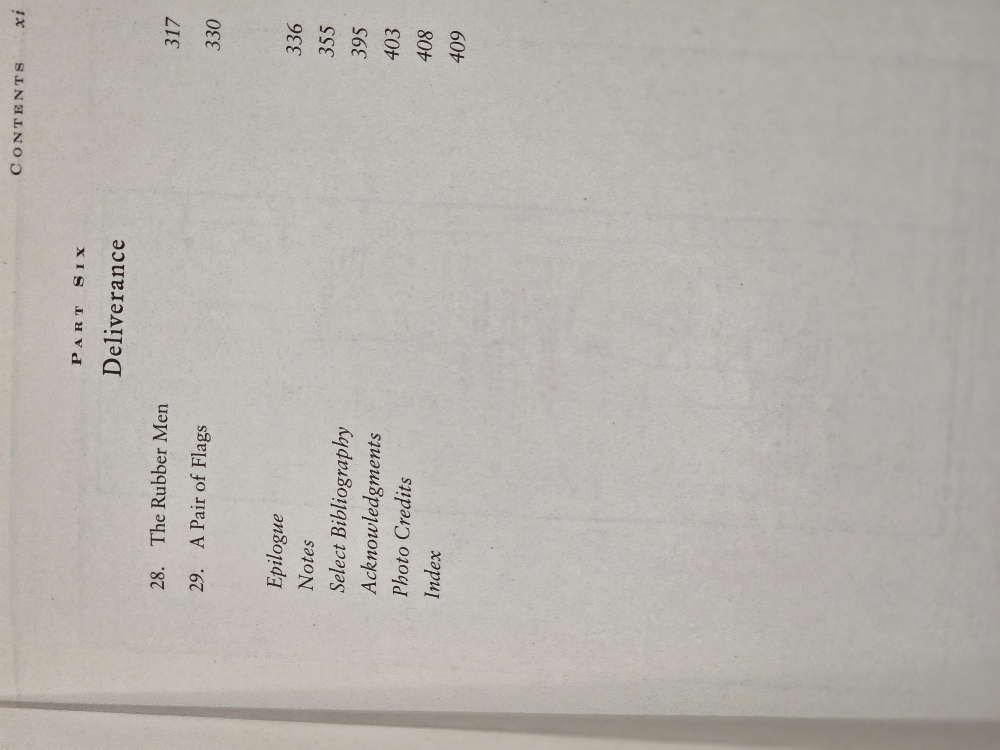
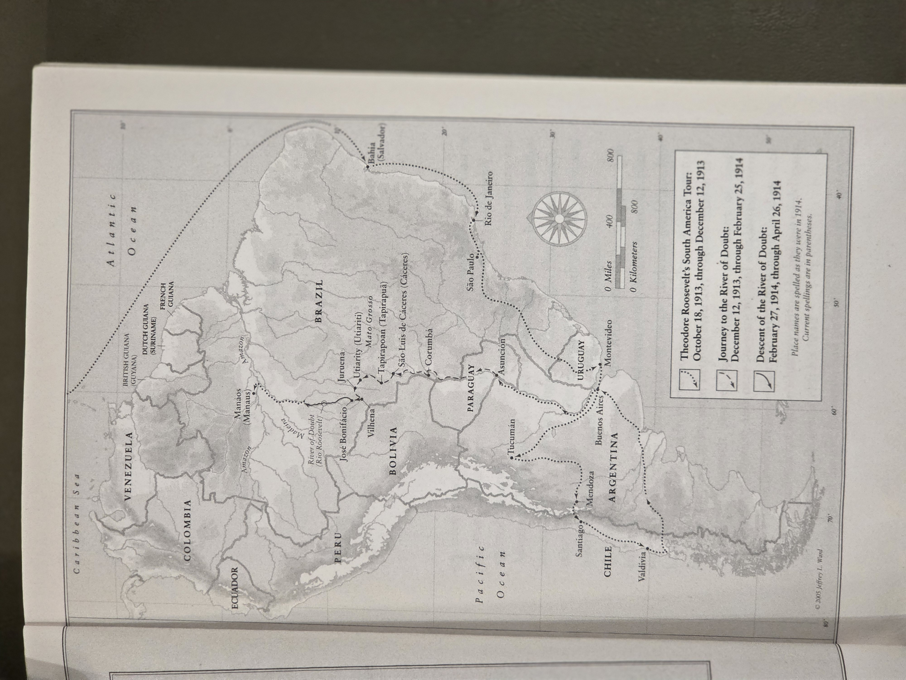

---
# BC01 › Shelf 01 › Position 11
# (metadata in shelf index; see note at bottom)
---

# *The River of Doubt* — Candice Millard  
*(First Anchor Books/Broadway Books edition, 2006; ©2005)*

## Why read this
Weeks after losing his third-party presidential run, Theodore Roosevelt plunged into Brazil’s unmapped interior with Cândido Rondon, his son Kermit, and a lean party of paddlers and scientists. The descent of the **Rio da Dúvida** nearly killed him. This is gripping survival nonfiction that doubles as a study in leadership under extreme stress.

## What it’s about (concise overview)
Millard reconstructs the 1913–14 expedition down a then-unknown Amazon tributary: rapids, disease, starvation, and mutiny risk turned a mapping mission into a fight to live. The book balances scene-driven narrative with context (Indigenous territories, rubber economy, early 20th-century science) and follows the afterlives of Roosevelt, Rondon, and the river that now bears Roosevelt’s name.

## Table of contents (from this copy)
*(Chapter titles are transcribed for search; page numbers shown where visible in your photos. I left earlier-section page numbers blank pending a clearer scan and can fill them in later.)*

**Prologue**

**Part One — Breaking Away**  
1. Defeat — p. —  
2. Opportunity — p. —  
3. Preparation — p. —  
4. On the Open Sea — p. —  
5. A Change of Plans — p. —

**Part Two — Into the Wilderness**  
6. Beyond the Frontier — p. —  
7. Disarray and Tragedy — p. —  
8. Hard Choices — p. —  
9. Warnings from the Dead — p. —

**Part Six — Deliverance**  
28. The Rubber Men — p. 317  
29. A Pair of Flags — p. 330  

**Back matter**  
Epilogue — p. 336 • Notes — p. 355 • Select Bibliography — p. 395 • Acknowledgments — p. 403 • Photo Credits — p. 408 • Index — p. 409

::: details Show original TOC scans (optional)
  

:::

## Maps (from this copy)

## Author & perspective
Candice Millard writes narrative history with a reporter’s sense for scene and momentum. Her treatment is sympathetic to Roosevelt but gives full due to **Cândido Rondon** and Brazilian leadership/ethics. The perspective blends adventure writing with cultural and environmental context.

## UDC subject classification (for search)
- **Primary:** `910.4(81)` — Travel/exploration accounts concerning **Brazil**  
- **Secondary:** `929` — Biography • `94(73)` — U.S. history (context for Roosevelt)  
- **Tags:** Amazon • Rio da Dúvida / Roosevelt River • Cândido Rondon • expedition logistics • tropical disease

## Publication details (this copy)
Anchor Books (Broadway Books) paperback, 2006 (Doubleday hardcover, 2005). ISBN **978-0-7679-1373-7**. Includes maps, notes, bibliography, and index. *(Key shelf metadata confirmed against your catalog entry.)* :contentReference[oaicite:0]{index=0}

## Related volumes on this shelf
- **Big Burn (Egan)** — U.S. conservation & Forest Service (Roosevelt era)
- **We Are Lincoln Men (Donald)** — friendship & leadership (presidential studies)

---

*Catalog note:* Shelf record **BC01-S01-011** lists edition, publisher, and ISBN for this copy; keep that YAML as the source of truth for search. :contentReference[oaicite:1]{index=1}
