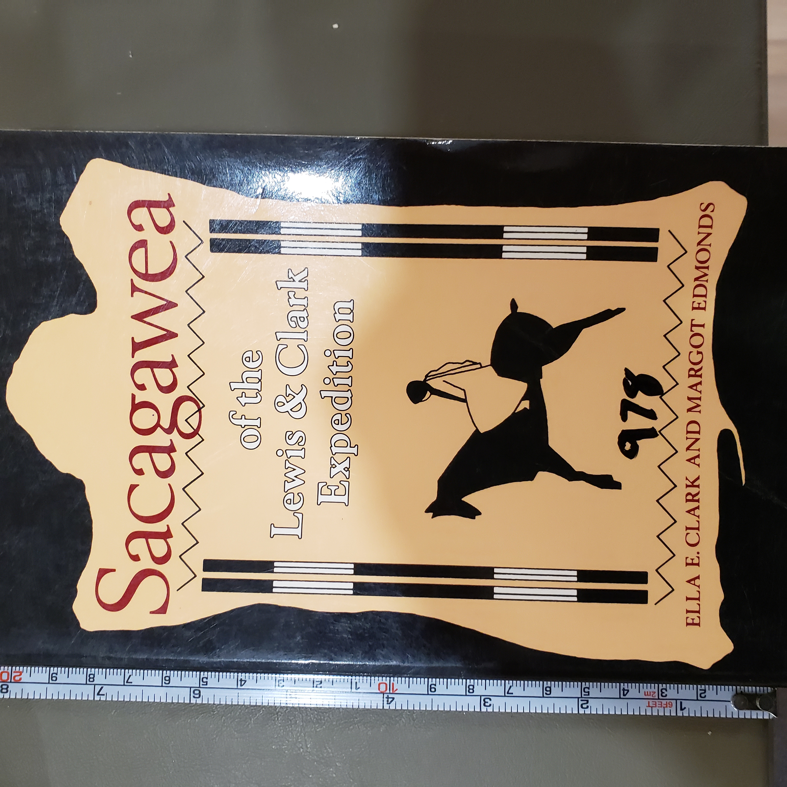
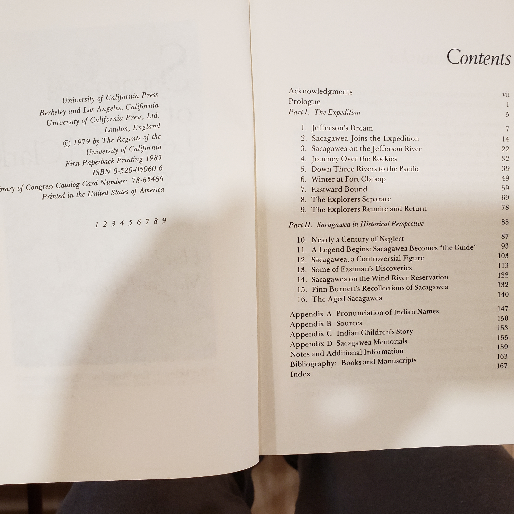

# Sacagawea of the Lewis & Clark Expedition — Ella E. Clark & Margot Edmonds (1979/1983)

### Why read this
Behind the names on maps and monuments is a young Shoshone woman whose presence shaped the Corps of Discovery. This book asks what we **really** know about Sacagawea—and how a person became a legend—by placing her within the expedition and then tracing the century of stories that followed.

### What it’s about (concise overview)
Clark and Edmonds combine narrative and documentary material to follow Sacagawea from her entry into the Lewis & Clark party through the journey to the Pacific and back. The first half presents the expedition episodes where she is clearly in the record—interpretation, recognition scenes, crisis moments, and the return. The second half is a historical inquiry into the **making of the legend**: conflicting testimonies, late recollections, reservation-era stories, and the afterlife of her image in American memory.

---

## Table of contents (from this copy)

### Table of contents (from this copy)

  
Show original TOC scan (optional)

  

**Part I — The Expedition**  
1. Jefferson’s Dream  
2. Sacagawea Joins the Expedition  
3. Sacagawea on the Jefferson River  
4. Journey Over the Rockies  
5. Down Three Rivers to the Pacific  
6. Winter at Fort Clatsop  
7. Eastward Bound  
8. The Explorers Separate  
9. The Explorers Reunite and Return

**Part II — Sacagawea in Historical Perspective**  
10. Nearly a Century of Neglect  
11. A Legend Begins: Sacagawea Becomes “the Guide”  
12. Sacagawea, a Controversial Figure  
13. Some of Eastman’s Discoveries  
14. Sacagawea on the Wind River Reservation  
15. Finn Burnett’s Recollections of Sacagawea  
16. The Aged Sacagawea

**Appendices & back matter**  
A. Pronunciation of Indian Names • B. Sources • C. Indian Children’s Story • D. Sacagawea Memorials • Notes & Additional Information • Bibliography • Index

---

### Author & perspective
Ella E. Clark (folklorist/educator) and Margot Edmonds examine both **primary expedition sources** and later oral/printed traditions. Their perspective is evaluative—clearly separating **evidence vs. tradition** to show where the record is firm and where it is not.

### UDC subject classification (for search)
- **Primary:** `929` — Biography (individual)  
- **Secondary:** `94(73)` — U.S. history; `910.4(73)` — Exploration/travel accounts about the U.S.  
- **Tags:** Shoshone • Corps of Discovery • women in exploration • historical memory

### Publication details (this copy)
University of California Press, first paperback printing **1983** (orig. ©1979). ISBN on verso appears as **0-520-05066-6** (confirm against your copy).
Shelf location: **BookCase 01 → Shelf 1** (pos. 7). :contentReference[oaicite:0]{index=0}

### CopyRight (from this copy)

  
Show original TOC scan (optional)

  [Verso (copyright & CIP)](Sacagawea_CopyRight.jpg)

---

## Related volumes on this shelf
- **Undaunted Courage** — Stephen E. Ambrose → [link](./UndauntedCourage_Ambrose.md)  
- **The Journals of Lewis & Clark** — Bernard DeVoto, ed. → [link](./JournalsOfLewisClark.md)  
- **American Sphinx** — Joseph J. Ellis (Jefferson biography/context) → [link](./AmericanSphinx_Ellis.md)
