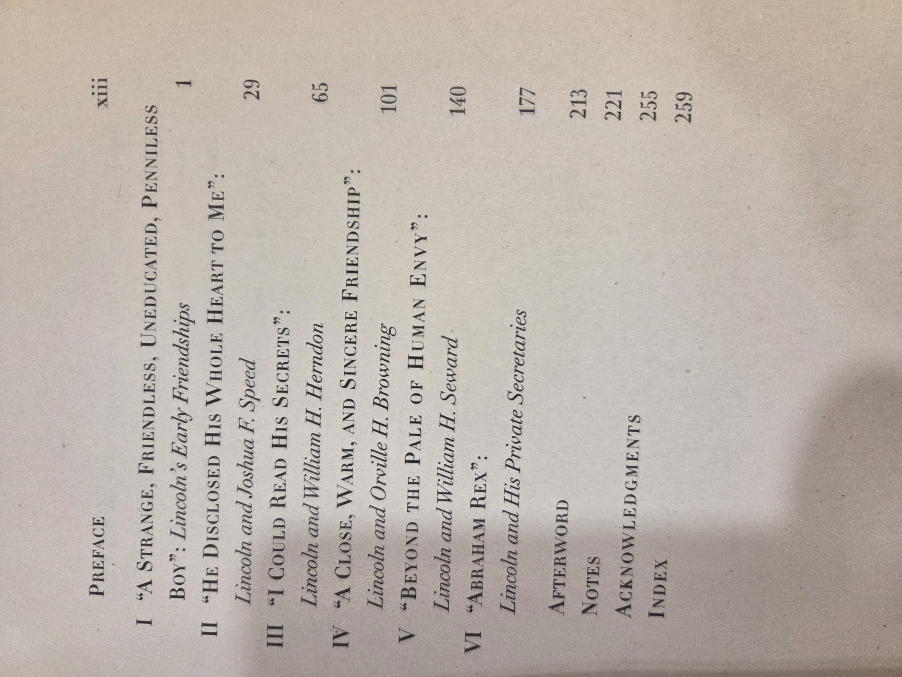

# *We Are Lincoln Men: Abraham Lincoln and His Friends* — David Herbert Donald

### Why read this
Pulitzer-Prize–winning historian **David Herbert Donald** (author of *Lincoln*) explores how a famously private president relied on a small circle of **trusted friends and confidants**. If you’re curious about the **human networks** behind Lincoln’s rise and leadership, this is an engaging, character-driven window into the era.

### What it’s about (concise overview)
Donald traces Lincoln’s friendships from **Springfield** through the **presidency**, showing how ties with figures such as politicians, law partners, neighbors, and military advisers shaped his **political judgment**, **emotional life**, and **governing style**. Rather than a cradle-to-grave narrative, the book is organized around **relationships**, arguing that Lincoln’s effectiveness came from a selective but durable reliance on a few people he trusted.

## Table of contents

**Front matter** — *Preface*, p. xiii

- **I.** “A Strange, Friendless, Uneducated, Penniless Boy”: *Lincoln’s Early Friendships*, p. 1  
- **II.** “He Disclosed His Whole Heart to Me”: *Lincoln and Joshua F. Speed*, p. 29  
- **III.** “I Could Read His Secrets”: *Lincoln and William H. Herndon*, p. 65  
- **IV.** “A Close, Warm, and Sincere Friendship”: *Lincoln and Orville H. Browning*, p. 101  
- **V.** “Beyond the Pale of Human Envy”: *Lincoln and William H. Seward*, p. 140  
- **VI.** “Abraham Rex”: *Lincoln and His Private Secretaries*, p. 177  

**Back matter**  
- *Afterword*, p. 213  
- *Notes*, p. 221  
- *Acknowledgments*, p. 255  
- *Index*, p. 259  

<strong>Show original TOC scan (optional)</strong>

### Author & perspective
Donald writes as a **scholarly biographer** with a measured, archival approach. His perspective emphasizes **documented correspondence** and contemporaneous testimony, resisting mythologizing while still portraying Lincoln’s emotional reticence and strategic use of friendship.

### Reception & impact
Well-received as a **fresh angle** on a well-studied life, praised for its lucid prose and judicious treatment of sources. It’s often recommended alongside broader Lincoln biographies to illuminate the **social and political networks** that underpinned his leadership.

### Scope & style
- **Scope:** Primarily **1840s–1865**, from Illinois law practice to the Civil War presidency.  
- **Focus:** Friendship as political capital; how personal bonds informed decisions on **patronage, policy, and war**.  
- **Style:** Accessible narrative synthesis with scholarly notes; portraits of key figures rather than dense campaign chronology.

### Publication & readership
Trade **paperback** aimed at **general readers**, students of **U.S. political history**, and **Lincoln enthusiasts**. Suitable for course adoption or book-club use; stands alone or as a complement to full-scale biographies.

### UDC subject classification (for search)
- **Primary:** `94(73)"1850/1865"` — U.S. history, mid-19th century  
- **Secondary:** `929 Lincoln` — Biography; `316.6` — Social relations / friendship  
- **Auxiliary tags:** *Springfield Bar; cabinet; patronage; Civil War; personal networks; leadership*

### At-a-glance
- Shelf location: **BookCase01 › Shelf 1 › Pos 9**  
- Format: **PB** | Year: **2004 (pbk.)** | ISBN: **see front matter**  
- Dimensions (mm): **TBD**

### Related items in this library
- **BC01-S01-015 — *Freedom From Fear* (Kennedy)** for broader U.S. political culture (later era).  
- Add cross-links to any Lincoln biographies you catalog on other shelves.

### Notes
Your verso shows **First Simon & Schuster paperback edition 2004** and multiple ISBNs.  
Please **confirm which ISBN(s)** are printed on your copy’s back cover and update the `isbn` array above.
