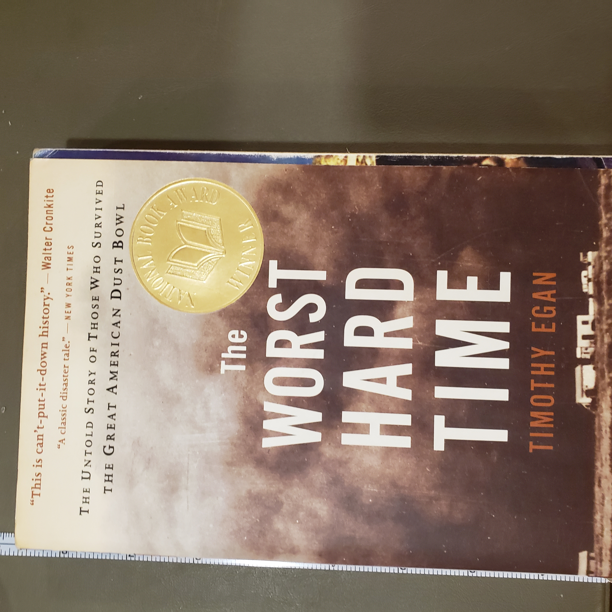
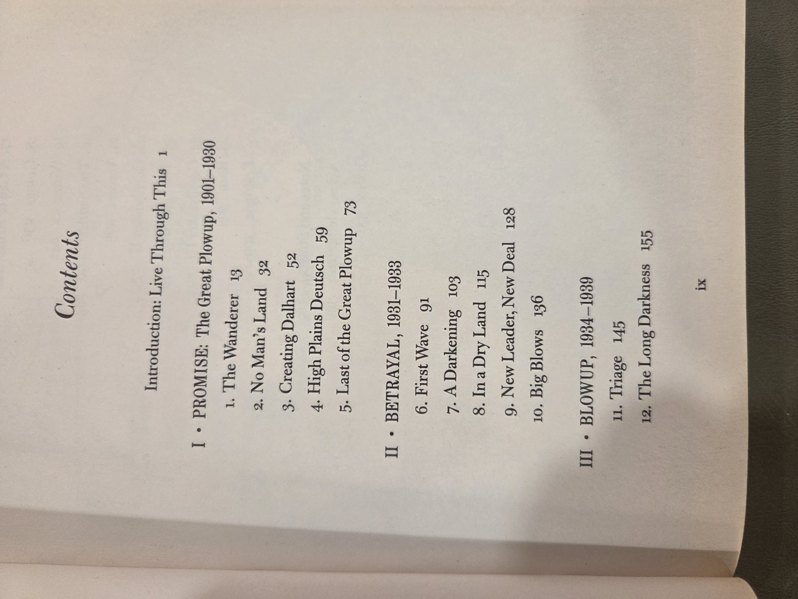
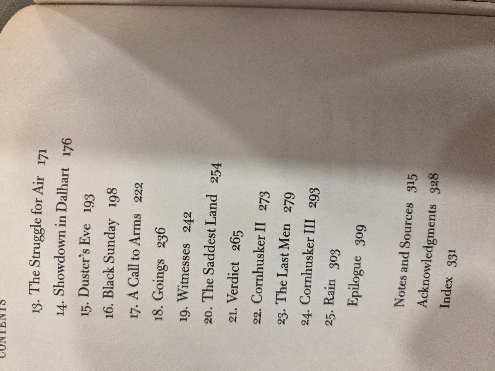
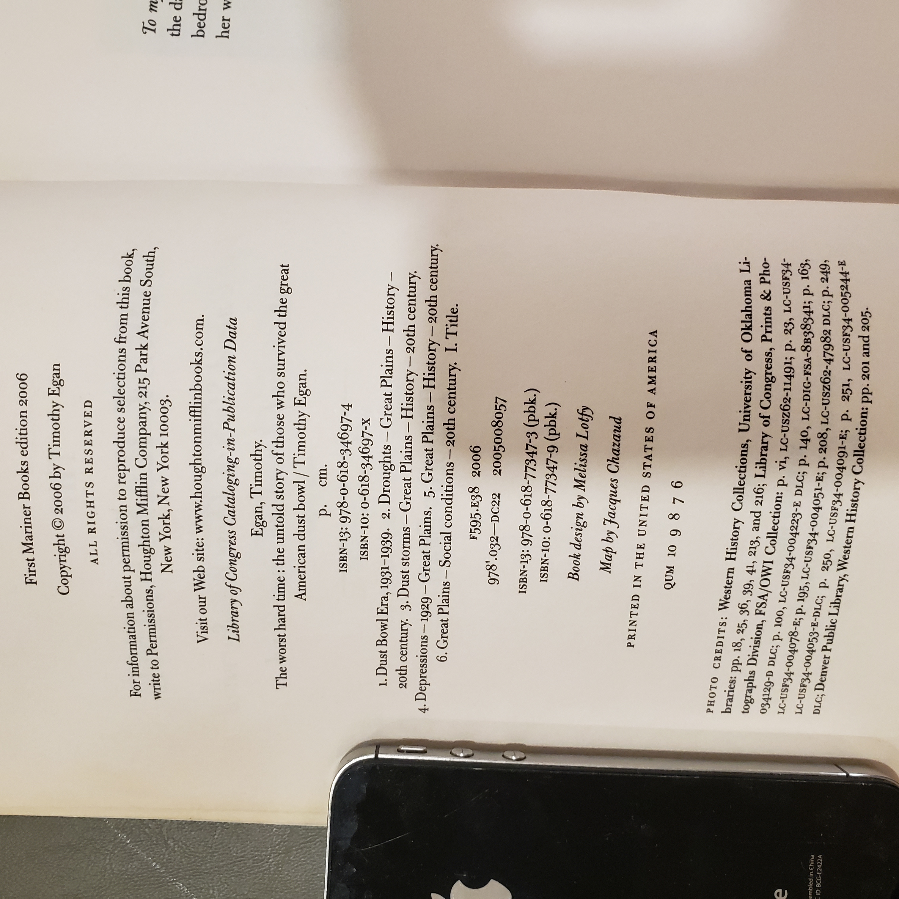

# *The Worst Hard Time* — Timothy Egan
*(The Untold Story of Those Who Survived the Great American Dust Bowl — Mariner Books/First Mariner Books ed., 2006)*

## Why read this
If you want to know what the **Great Depression** felt like on the High Plains, this is the human story—neighbors, towns, and families who endured the **Dust Bowl** from the inside. It’s vivid narrative history that makes climate, economics, and policy choices legible through lived experience.

## What it’s about (concise overview)
Egan follows Great Plains communities (Texas/Oklahoma Panhandle, Colorado, Kansas) through the **wheat boom**, land speculation and mechanized plowing, then the ecological collapse of the 1930s: black blizzards, dust pneumonia, foreclosure, and out‑migration. He weaves survivor testimony with science and policy, from homesteading laws and boosterism to the New Deal’s soil‑conservation response.

## Table of contents (from this copy)
*Chapter titles and page starts are transcribed for searchability; see scans below for book design details.*

**Introduction** — *Live Through This*, p. 1

**I • PROMISE: The Great Plowup, 1901–1930**  
1. The Wanderer, p. 13  
2. No Man’s Land, p. 32  
3. Creating Dalhart, p. 52  
4. High Plains Deutsch, p. 59  
5. Last of the Great Plowup, p. 73

**II • BETRAYAL, 1931–1933**  
6. First Wave, p. 91  
7. A Darkening, p. 103  
8. In a Dry Land, p. 115  
9. New Leader, New Deal, p. 128  
10. Big Blows, p. 136

**III • BLOWUP, 1934–1939**  
11. Triage, p. 145  
12. The Long Darkness, p. 155  
13. The Struggle for Air, p. 171  
14. Showdown in Dalhart, p. 176  
15. Duster’s Eve, p. 193  
16. Black Sunday, p. 198  
17. A Call to Arms, p. 222  
18. Goings, p. 236  
19. Witnesses, p. 242  
20. The Saddest Land, p. 254  
21. Verdict, p. 265  
22. Cornhusker II, p. 273  
23. The Last Men, p. 279  
24. Cornhusker III, p. 293  
25. Rain, p. 303

**Back matter**  
Epilogue, p. 309 • Notes and Sources, p. 315 • Acknowledgments, p. 328 • Index, p. 331

???+ details "Show original TOC scans (optional)"
    
    

## Author & perspective
Journalist‑historian **Timothy Egan** writes with a strong narrative drive and a clear explanatory through‑line. The perspective is empathetic to settlers while attentive to structural causes—federal land policy, commodity markets, and environmental mismanagement. Expect brisk chapters and memorable portraits.

## UDC subject classification (for search)
- **Primary:** `94(73)"1929/1939"` — U.S. history, Great Depression era  
- **Secondary:** `551.5` — Meteorology/climatology (dust storms); `630` — Agriculture (soil conservation)  
- **Tags:** Dust Bowl • Great Plains • New Deal • soil erosion • migration • black blizzards • CCC • SCS

## Publication details (this copy)
- **Imprint:** *First Mariner Books edition*, 2006 — Mariner Books (Houghton Mifflin)  
- **Copyright:** © 2006 by Timothy Egan  
- **ISBNs (pbk.):** **978‑0‑618‑77347‑3** (ISBN‑13); **0‑618‑77347‑9** (ISBN‑10)  
- **Credits (verso):** Book design by Melissa Lotfy; Map by Jacques Chazaud  

## Related volumes on this shelf
- *The Big Burn* — Timothy Egan  
- *Freedom from Fear* — David M. Kennedy
