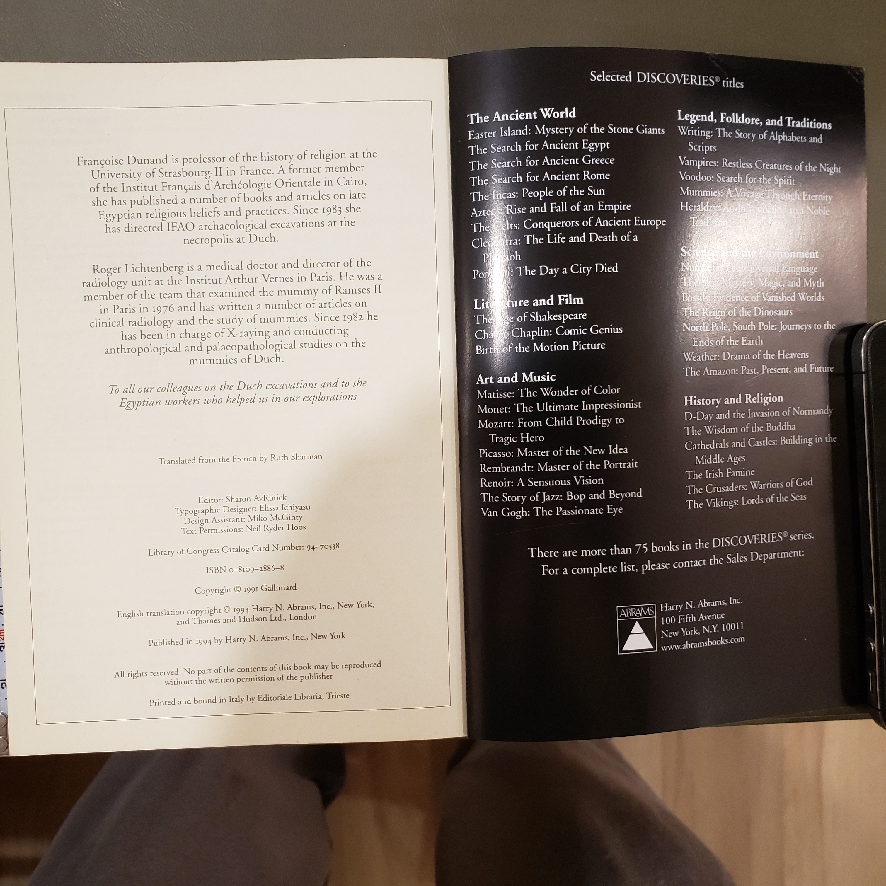

# Egyptian Museum (Cairo)

*A compact, picture-forward guide to the treasures of Cairo’s Egyptian Museum, issued in Abrams’ excellent **Discoveries** series.*

---

## Why you might want to read this
- You want an approachable visual tour of the Egyptian Museum’s “greatest hits” with concise captions.
- You’re planning (or reminiscing about) a museum visit and want context without a heavy reference tome.
- You’re building a shelf on Egyptology and want a browsable companion that ties objects to historical periods.

---

## What it covers (concise overview)
The booklet surveys highlight objects at the Egyptian Museum in Cairo—royal portraits, funerary art, jewelry, reliefs, and daily-life artifacts—placing them within Old, Middle, and New Kingdom frames. Texts are succinct; the emphasis is on quality photographs and quick interpretive notes suitable for gallery-style reading.

---

## Table of contents (from the book)
*(abbreviated; page numbers not captured—fill in if you’d like)*

- Foreword  
- **Introduction**  
- **The Archaic Style**  
- **The Elegant Style**  
- **The Pharaonic Style**  
- **The Spiritual Style**  
- Notes — Bibliography — Index  
- British Museum numbers / Egyptian Museum numbers *(series back-matter varies by printing)*

> **Source:** contents page photo (20251025_074504.jpg). Please adjust headings/page ranges if your copy differs.

---

## About the edition, authorship & perspective
- **Series/Editor:** Part of **Discoveries** (Abrams). The series is curated for visually rich, expert-vetted introductions.  
- **Translation:** *Translated from the French by **Ruth Sharman*** (credit visible on the rights page).  
- **English edition:** **1991**, **Harry N. Abrams**, New York.  
- **Perspective:** Museum-forward—object descriptions over long narrative; Egyptological terminology kept light.

*(If your copy credits a principal author—often **Françoise Dunand** is associated with Discoveries titles on Egypt—add that here.)*

---

## Reception & impact (brief)
Discoveries booklets were widely used as accessible museum companions in the 1990s: praised for production quality and portability; sometimes critiqued for brevity. This title fits that pattern—excellent as a primer or visit companion, not a technical catalogue.

---

## Scope & style
- **Scope:** Highlights selection across dynasties; not exhaustive.
- **Style:** Image-led spreads with short essays and extended captions; glossary-light, visitor-friendly.

---

## Publication details (fill-in ready)
- **Publisher:** Harry N. Abrams, Inc. (English ed.)  
- **Place:** New York  
- **Year:** 1991  
- **Series:** Discoveries (Abrams)  
- **Format:** Paperback  
- **ISBN:** *(not legible in the photo—add from verso or back cover)*  
- **Pages / size:** *(please measure/confirm; you can add to the table later)*

---

## UDC subject tags (candidates to aid later filtering)
> These are suggested anchors—tweak to your scheme.

- **069** — Museums. Organization and activities *(core class for museum guides)*  
- **913(62)** — Regional archaeology: Egypt *(place auxiliary for Egypt; verify code in your UDC table)*  
- **904(32-37)** — Cultural remains / antiquities *(general material culture/archaeology grouping)*

**Topical tags:** `Egyptology` · `Museum Guide` · `Material Culture` · `Ancient Artifacts` · `Cairo`

---

## Cross-references on your shelf
- **The Nimrud Ivories** (BC01-S02-001) — comparative ancient Near Eastern decorative art.  
- Broader survey/biography volumes on your Shelf 0 (e.g., *Freedom From Fear*, etc.) for 20th-century museum/heritage context.

---

## Images

---

## Notes to self
- Add **ISBN** and **page count** from verso/back cover.
- Measure **height/width** (mm) with the ruler you placed in the photo and update the spreadsheet.
