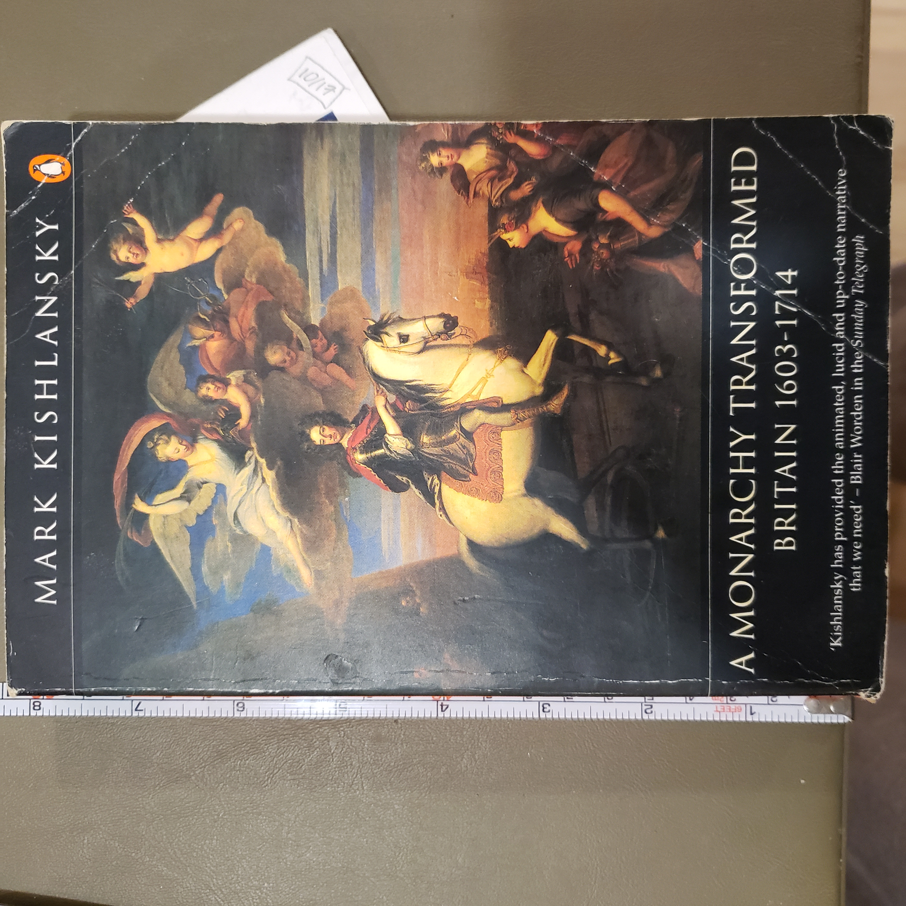
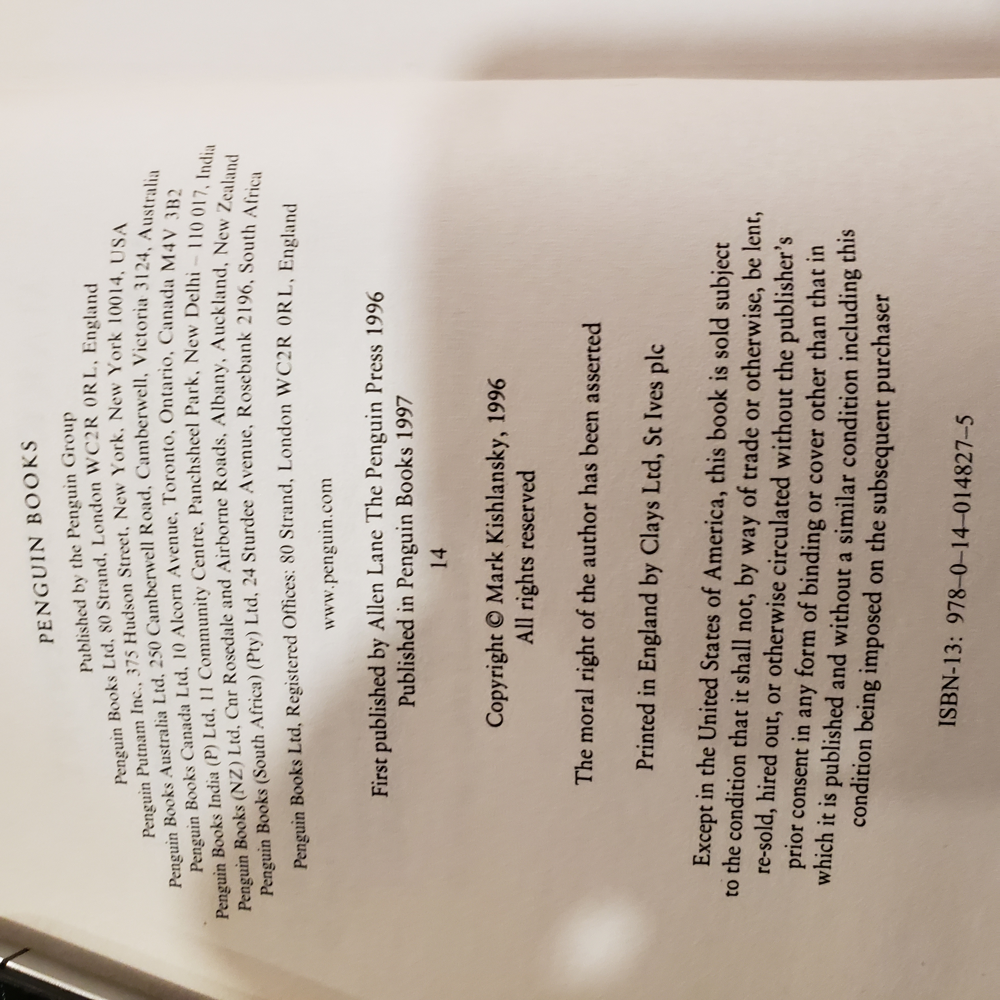

Here you go—CSV you can paste, plus the ready-to-save markdown.

---

### 1) CSV header (for reference — copy once)

```
VolumeID,Title,Subtitle,Author(s),Editor/Translator,Series,VolumeNo,Edition,PubYear,Publisher,PubCity,ISBN,Format,Pages,Height_mm,Width_mm,Thickness_mm,Condition,BookCase,Shelf,Section,Position,Barcode,Keywords,CoverImage,TitlePageImage,CIPImage,Notes
```

### 2) CSV row for this volume (no header)

```
BC01-S02-005 (tentative),A Monarchy Transformed,Britain 1603–1714,"Kishlansky, Mark",,Penguin History of Britain,,Penguin Books pbk. ed.,1997,Penguin Books,London,978-0-14-014827-5,PB,,198,129,27,"Good–; creased cover; edge/shelf wear",BookCase01,2,,5,BC01-S02-005,UK history; Stuart monarchy; Civil War; Restoration; Glorious Revolution; Political history,20251025_081437.jpg,20251025_081520.jpg,,First published by Allen Lane 1996; this is the Penguin Books 1997 paperback. Dimensions estimated from ruler in photo; add exact page count when handy.
```

---

## MonarchyTransformed_Kishlansky.md  *(suggested filename)*

# A Monarchy Transformed: Britain 1603–1714 — Mark Kishlansky

> A crisp, revisionist tour of the Stuart century—from the uneasy union under James I to the Hanoverian threshold—asking how a relatively poor composite monarchy generated revolution, republican experiment, restoration, and the “Glorious” re-settlement of 1688–89.



### At-a-Glance

* **Author:** Mark Kishlansky
* **Edition/Imprint:** Penguin Books paperback, 1997 (first published by Allen Lane, 1996)
* **ISBN:** 978-0-14-014827-5
* **Period Covered:** 1603–1714 (James I to Anne)
* **Type:** Scholarly narrative history (general readership)
* **Shelf ID:** BC01-S02-005 (tentative)

---

## What it’s about (concise)

Kishlansky surveys a century that reconfigured the British state: dynastic union, religious fractures, fiscal and constitutional crises, civil wars across multiple kingdoms, the regicide and Commonwealth, Restoration monarchy, and the Revolution Settlement. His through-line is political—how authority was contested, negotiated, and ultimately reframed—rather than a longue-durée social/economic account.

---

## Table of Contents (typical, abbreviated)

* The Stuart Inheritance (1603)
* Kings, Courts, and Parliaments
* Religion and the Multiple Kingdoms
* Fiscal-Military State & War (Bishops’ Wars; Wars of the Three Kingdoms)
* Republic and Protectorate
* Restoration Monarchy
* Crisis: Exclusion to James II
* Revolution of 1688–89
* Union and Succession (to 1714)
  *(Exact chapter titles vary by printing.)*

---

## Author, perspective & method

* **Mark Kishlansky (1953–2015)**, early modern British historian (Harvard).
* **Perspective:** Part of the “revisionist” wave—emphasizes short-term political choices, institutions, and the composite nature of the Stuart monarchies over deterministic social causes.
* **Sources/Approach:** Parliamentary records, state papers, printed polemic, and recent historiography, synthesized into a fast, thesis-driven narrative.

---

## Reception & impact (brief)

* **Reception:** Well regarded as the accessible political volume in the *Penguin History of Britain* series. Praised for clarity and argumentation; sometimes critiqued by social/Whig-leaning readers for giving less weight to long-run socio-economic drivers.
* **Use today:** A compact orientation text for students and general readers before diving into specialized studies of Civil War, Restoration politics, or the 1688–89 settlement.

---

## Scope & style

* **Scope:** High-level political narrative with targeted forays into religion, war, finance, and the “three kingdoms” framework (England, Scotland, Ireland).
* **Style:** Concise chapters; argument-forward prose; light scholarly apparatus in trade format.

---

## Intended readership & publication type

* **Readership:** General readers, undergraduates, and researchers needing a one-volume survey of 1603–1714.
* **Type:** Trade history / scholarly synthesis in a mainstream series.

---

## UDC tags (for library searchability)

Use these to power cross-library topical queries later:

* **94(410)"1603/1714"** — History of Great Britain, 1603–1714
* **321.6(410)** — Monarchy in Great Britain
* **328(410)"17"** — Parliament & political institutions, 17th c.
* **94(410).05** — Revolution/constitutional change (use with period)
* **27-43(410)** — Church of England & religion in Britain (optional adjunct)
* **355/359(410)"1640/1660"** — Wars of the Three Kingdoms / Civil War (as needed)

*(Treat these as working tags; refine to your preferred UDC granularity.)*

---

## How to cite

Kishlansky, Mark. *A Monarchy Transformed: Britain 1603–1714*. London: Penguin Books, 1997. ISBN 978-0-14-014827-5.

---

## Librarian notes (local)

* **Copy condition:** Good–; creased cover and edge wear.
* **Physical:** ~198 × 129 × 27 mm (est.).
* **To verify:** Exact page count; confirm if your copy shows the 1997 Penguin reprint line.

---

## Images

* 

---
