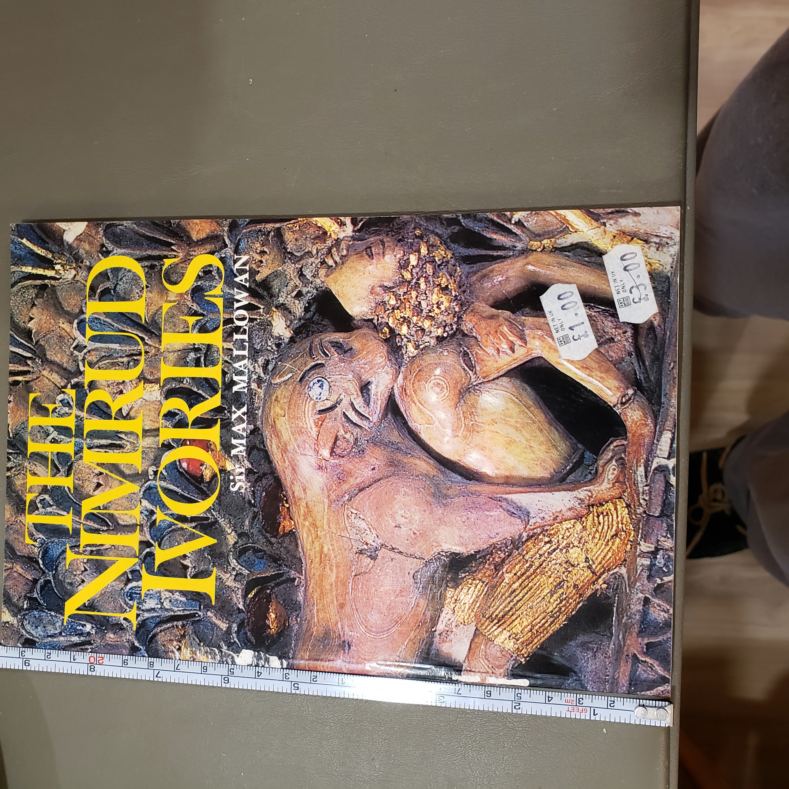
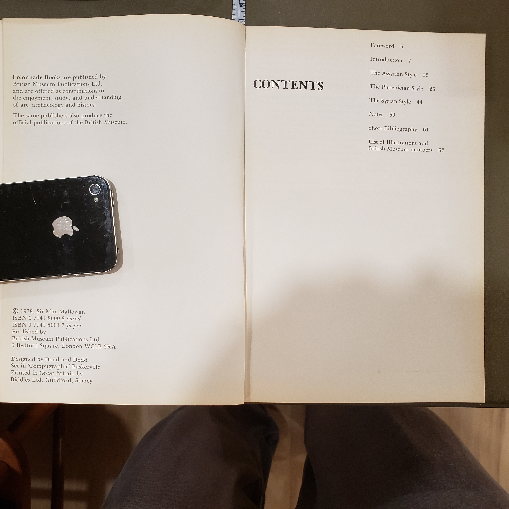

Here you go — **NimrudIvories.md** in the same house-style we’ve been using.

---

# The Nimrud Ivories

*Sir Max Mallowan*




## At-a-glance

| Field                 | Detail                                                                                         |
| --------------------- | ---------------------------------------------------------------------------------------------- |
| **VolumeID**          | BC01-S02-001 *(tentative; update if you use a different shelf code)*                           |
| **Title**             | *The Nimrud Ivories*                                                                           |
| **Author**            | Sir Max Mallowan                                                                               |
| **Series / Imprint**  | Colonnade Books; British Museum Publications                                                   |
| **Publisher / Place** | British Museum Publications Ltd — London                                                       |
| **Year**              | c. **1978/1985** *(verify on verso of your copy)*                                              |
| **Format**            | PB                                                                                             |
| **Pages**             | 62                                                                                             |
| **ISBN**              | **0-7141-8001-7 (pbk.)** *(cloth is often 0-7141-8000-9; verify your copy)*                    |
| **Subjects**          | Archaeology; Ancient Near East; Assyrian art; Decorative arts; Ivory carving; Museum catalogue |
| **Shelf**             | BookCase01 → Shelf 2 *(assumed)*                                                               |

---

## Why read it

Short, richly illustrated, and written by one of the most influential excavators of the ancient Near East, this booklet is the most approachable single-sitting introduction to the famed carved ivories unearthed at **Nimrud** (ancient Kalhu) — objects that changed how scholars understand luxury craft, courtly taste, and cultural exchange across Assyria, Phoenicia, and the Levant.

---

## What it’s about (concise description)

Mallowan surveys the discovery, stylistic features, and likely provenance of the **Nimrud ivories** recovered from Assyrian palace contexts. Organized by style families (Assyrian, Phoenician, “Samarian”), the book pairs brief commentary with images, museum numbers, and a compact bibliography, giving readers a field archaeologist’s orientation to form, iconography, and workmanship.

---

## Table of Contents *(from your photos)*

* Foreword — p. 6
* Introduction — p. 7
* **The Assyrian Style** — p. 12
* **The Phoenician Style** — p. 24
* **The “Samarian” Style** — p. 36
* **Notes** — p. 60
* **Select Bibliography** — p. 61
* **British Museum numbers** — p. 62

---

## Author, perspective, time, purpose

**Sir Max Mallowan** (1904–1978) was a leading field archaeologist (Ur, Nineveh, Nimrud; later Director, British School of Archaeology in Iraq). His perspective here is curatorial-archaeological: to offer a clear, image-led guide that sorts the ivories by recognisable formal features and likely cultural origins. The tone is concise and authoritative, aimed at museum visitors and students who need orientation rather than exhaustive catalogue raisonné detail.

---

## Reception & impact (brief)

For decades this booklet functioned as the go-to **introductory** survey for the Nimrud material — frequently cited in course syllabi and museum guides. Later technical catalogues and scientific studies superseded aspects of attribution and dating, but Mallowan’s style groupings and clean visual presentation still make this an efficient first stop for non-specialists.

---

## Scope & style

* **Scope:** the core British Museum holdings; limited narrative; focus on typology, motifs, and workmanship.
* **Presentation:** short text with **many plates**, museum numbers, and a back-matter list for quick cross-reference.
* **Use-case:** perfect for quick identification checks, classroom demos, or planning a museum visit.

---

## Publication & intended readership

A **British Museum** Colonnade booklet meant for **general readers**, students of archaeology / ancient art, and museum visitors requiring a reliable, compact guide.

---

## Suggested UDC classifications *(to make later searching useful)*

> Use these as **tags** in your spreadsheet; refine later if you want finer decimals.

* **902** — Archaeology (general)
* **935** — History of the ancient Near East / Mesopotamia (Assyria)
* **7** (Art) → **736** — Carving and carvings *(ivory carving fits here)*
* **069** — Museums (exhibitions, catalogues)

**Search tags:** `Archaeology; Assyria; Nimrud; Ivories; Phoenician art; Decorative arts; British Museum; Museum catalogue`

---

## Cross-references (in your library)

* General Near Eastern history (UDC 93/94 subsets), Assyrian art overviews (UDC 73/736), excavation reports and museum catalogues (UDC 069).
* When you catalogue more ANE titles, link them here for a mini-pathfinder.

---

## Citation & identifiers

* **Mallowan, Max.** *The Nimrud Ivories.* London: British Museum Publications, **[year of your copy]**.
* **ISBN:** 0-7141-8001-7 (pbk.) *(verify on your verso/back cover)*

---

## How to cite in your library

```
Worstell, B., ed. “The Nimrud Ivories — Sir Max Mallowan.” WorstellBerryLibrary, BookCase01/Shelf2, Vol. BC01-S02-001. Accessed [today’s date].
```

---

## Image notes

* `20251025_074307.jpg` (cover), `20251025_074348.jpg` (title page / contents).
  Place the images beside this `.md` or adjust relative paths as needed.

---

