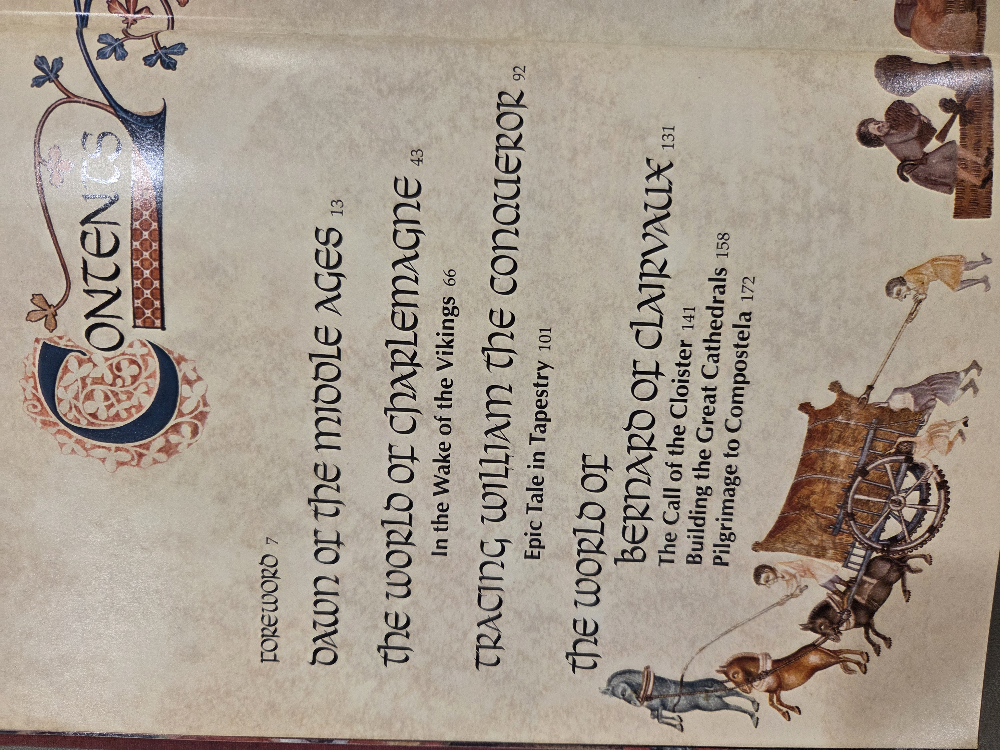
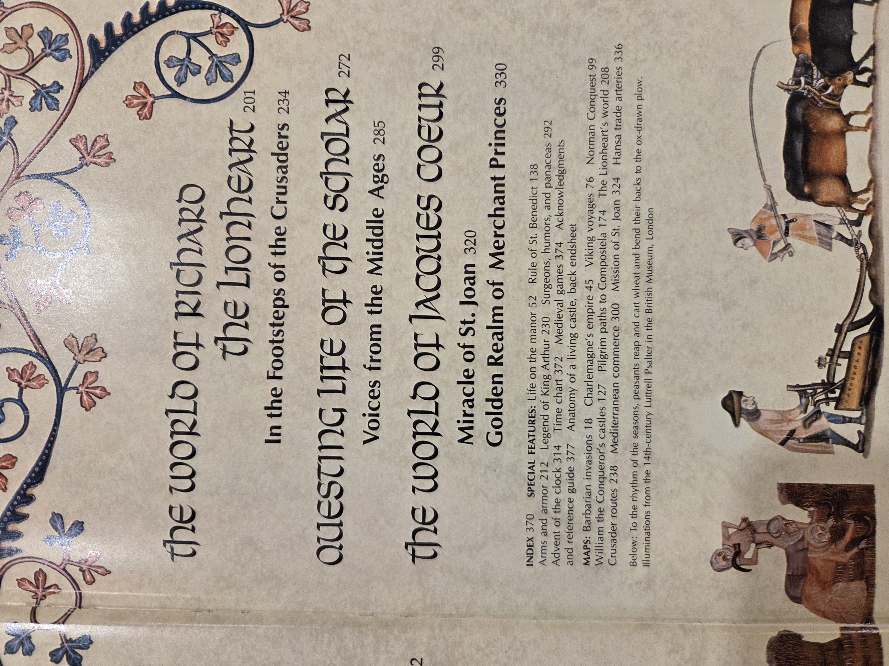
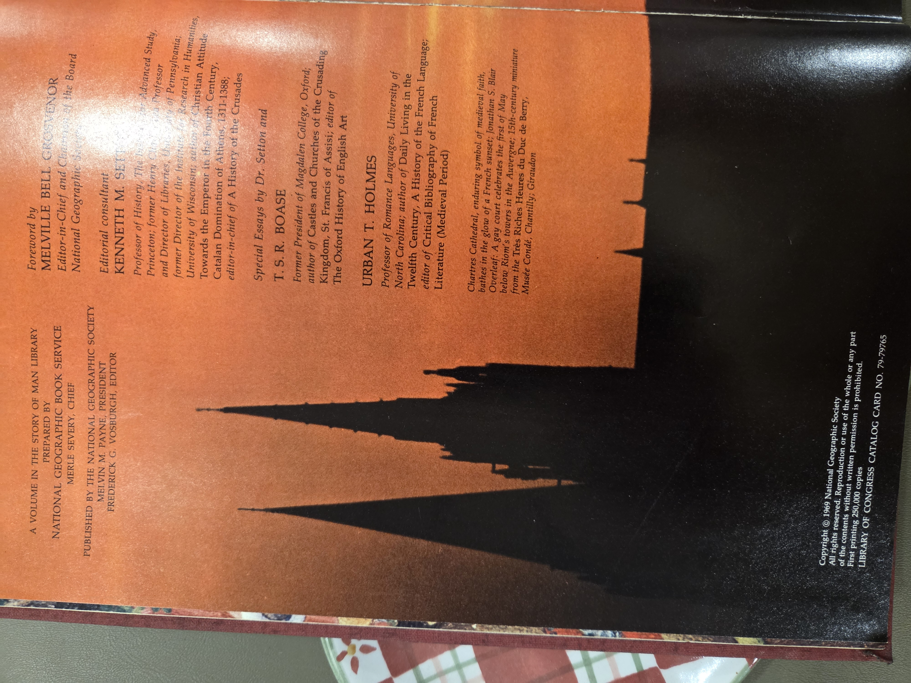

# The Age of Chivalry — National Geographic Society

*“A volume in the Story of Man Library.”*  

## Why read this
A richly illustrated, accessible survey of the European Middle Ages, this National Geographic volume moves from the **dawn of the Middle Ages** through the worlds of **Charlemagne**, **William the Conqueror**, **Bernard of Clairvaux**, **Richard the Lionheart**, and **Jacques Cœur**. It’s a visually guided introduction ideal for general readers curious about castles, cathedrals, crusading, monastic life, and medieval commerce.

## What it’s about (concise overview)
Organized as a sequence of thematic “worlds,” the book blends narrative chapters with short features, maps, and image essays. Scholarly voices (special essays by **T. S. R. Boase** and **Urban T. Holmes**) complement the magazine-style presentation overseen by editorial consultant **Kenneth M. Setton**. Topics range from Viking seaways and Norman conquest to cloister life, Gothic building, pilgrimage, crusading routes, and late-medieval trade. The result is a broad, readable panorama of medieval Europe, circa 5th–15th centuries.

## Table of contents (from this copy)
- **Foreword**, p. 7  
- **Dawn of the Middle Ages**, p. 13  
- **The World of Charlemagne**, p. 43  
  - *In the Wake of the Vikings*, p. 66  
- **Tracing William the Conqueror**, p. 92  
  - *Epic Tale in Tapestry*, p. 101  
- **The World of Bernard of Clairvaux**, p. 131  
  - *The Call of the Cloister*, p. 141  
  - *Building the Great Cathedrals*, p. 158  
  - *Pilgrimage to Compostela*, p. 172  
- **The World of Richard the Lionheart**, p. 201  
  - *In the Footsteps of the Crusaders*, p. 234  
- **Questing Life of the Scholar**, p. 272  
  - *Voices from the Middle Ages*, p. 285  
- **The World of Jacques Cœur**, p. 299  
  - *Miracle of St. Joan*, p. 320  
  - *Golden Realm of Merchant Princes*, p. 330  

**Back matter & features**  
- Index, p. 370 • Time chart, p. 372 • Medieval games, p. 374 • Acknowledgments & reference guide, p. 377 • “Anatomy of a living castle,” back sheet  
- Special features (in-text): Life on the manor (p. 52); Rule of St. Benedict (p. 138); Arms & armor (p. 212); Legend of King Arthur (p. 230); Surgeons, humors & panaceas (p. 292); Advent of the clock (p. 314)  
- Maps: Barbarian invasions (p. 18); Charlemagne’s empire (p. 45); Viking voyages (p. 76); Norman Conquest (p. 99); William’s castles (p. 127); Pilgrim paths to Compostela (p. 174); The Lionheart’s world (p. 208); Crusader routes (p. 238); Mediterranean commerce (p. 300); Mission of St. Joan (p. 324); Hansa trade arteries (p. 336)

  
Show original TOC scans (optional)

  

  

## Author & perspective
Prepared by the **National Geographic Book Service** with scholarly guidance (Setton; essays by Boase and Holmes) and a foreword by **Melville Bell Grosvenor**. The treatment is synthesis and survey rather than monograph, written for a general audience in the late-1960s National Geographic house style. Expect emphasis on monuments, leaders, and routes, balanced by sidebars on everyday life; some interpretations reflect mid-20th-century mainstream views of the Middle Ages.

## UDC subject classification (for search)
- **Primary:** `94(4)` — European history (Middle Ages)  
- **Secondary:** `355` — Military affairs (chivalry, crusades); `271` — Monastic orders  
- **Tags:** medieval • crusades • cathedrals • monasticism • Europe

## Publication details (this copy)
National Geographic Society, Washington, D.C., 1969.  

## Related volumes on this shelf
- _BC01-S03-002 —_ (placeholder)
- _BC01-S03-003 —_ (placeholder)
- _BC01-S03-004 —_ (placeholder)
