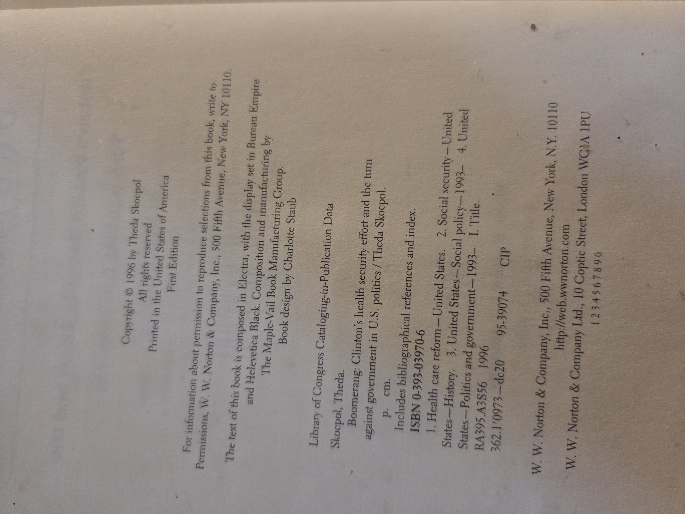

# Boomerang  
### Clinton’s Health Security Effort and the Turn against Government in U.S. Politics  
**Theda Skocpol** (W. W. Norton & Company, 1996) — ISBN 0-393-03970-6

> Shelf: **BookCase01 / Shelf03 / Volume 12**

---

## Cover

## Bibliographic note
Skocpol, Theda. *Boomerang: Clinton’s Health Security Effort and the Turn against Government in U.S. Politics*. New York: W. W. Norton & Company, 1996. First edition. ISBN 0-393-03970-6.

- Copyright © 1996 Theda Skocpol. Printed in the United States of America.  
- Library of Congress subjects (from CIP on verso): Health care reform—United States; Social security—United States—History; United States—Social policy—1993– ; United States—Politics and government—1993–.  

---

## Table of Contents (from images)

### OCR-style contents for searching (verbatim headings)
- **Preface**, xi  
- **Introduction** — *A Pivotal Episode*, 1  
- **Chapter One** — *A Way through the Middle?*, 20  
- **Chapter Two** — *Designing Health Security*, 48  
- **Chapter Three** — *Democrats in Disarray*, 74  
- **Chapter Four** — *Marketing an Ambivalent Message*, 107  
- **Chapter Five** — *Mobilization against Government*, 133  
- **Chapter Six** — *Legacies and Lessons*, 173  
- **Notes**, 189 · **Index**, 219

---

## Why you should read this book
- **Anatomy of a policy failure.** Skocpol’s inside–outside account of the 1993–94 Clinton health-security drive remains one of the clearest case studies of how design choices, interest-group pushback, media framing, and institutional veto points can sink major reform in the U.S. system.  
- **Concepts you can reuse.** Coalition-building, policy feedback, “policy design as politics,” and the limits of task-force style legislating—ideas that travel well beyond health care.  
- **A snapshot of a turning point.** The book traces how the backlash helped power a wider **turn against government** in the 1990s, shaping party coalitions and rhetoric that still echo in contemporary debates.  
- **Readable political sociology.** Combines archival detail with accessible narrative—useful for students of public policy, political science, health administration, and recent U.S. history.

---

## UDC classifications (filing aids)
> Provisional suggestions for shelving and search; adjust to your local UDC practice.

- **614.2(73)** — Health services policy and administration in the **United States**.  
- **32:614.2(73)** — Political processes in relation to U.S. health services (policy and governance aspect).  
- **362(73)** — Social policy and social services in the United States (welfare dimension).  
- Optional time/place auxiliaries may be added for the **1990s** and **federal level** as applicable.

---

## Provenance / notes
- Volume cataloged for **BookCase01 · Shelf03**.  
- Condition: hardcover/dust-jacketed; clean text; first edition noted on CIP page.

---

## Cross-references (Shelf03 placeholders)
- Volume 10 — *Made in America* (Dertouzos · Lester · Solow).  
- Volume 11 — *The Making of the President 1972* (Theodore H. White).  
- (Links to other Shelf03 volumes to be filled in once filenames are finalized.)

---

## Image gallery

