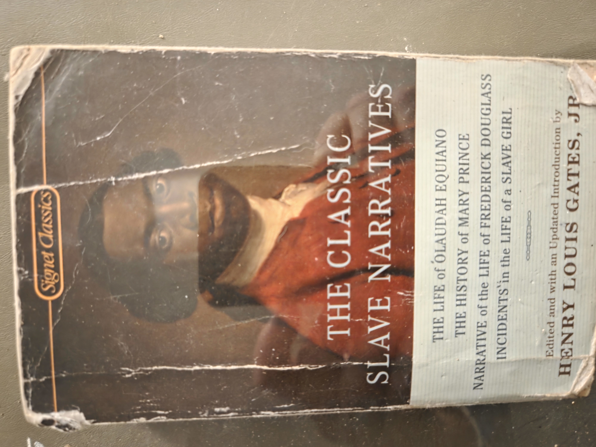
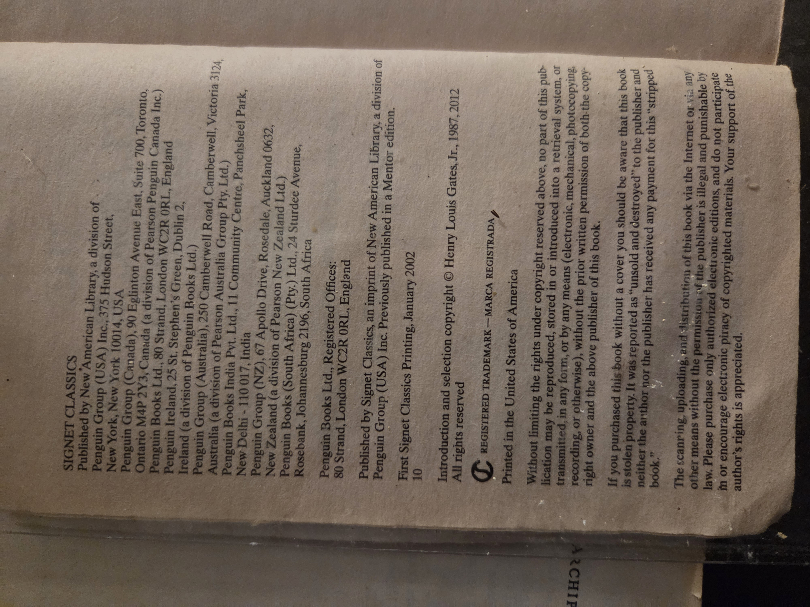
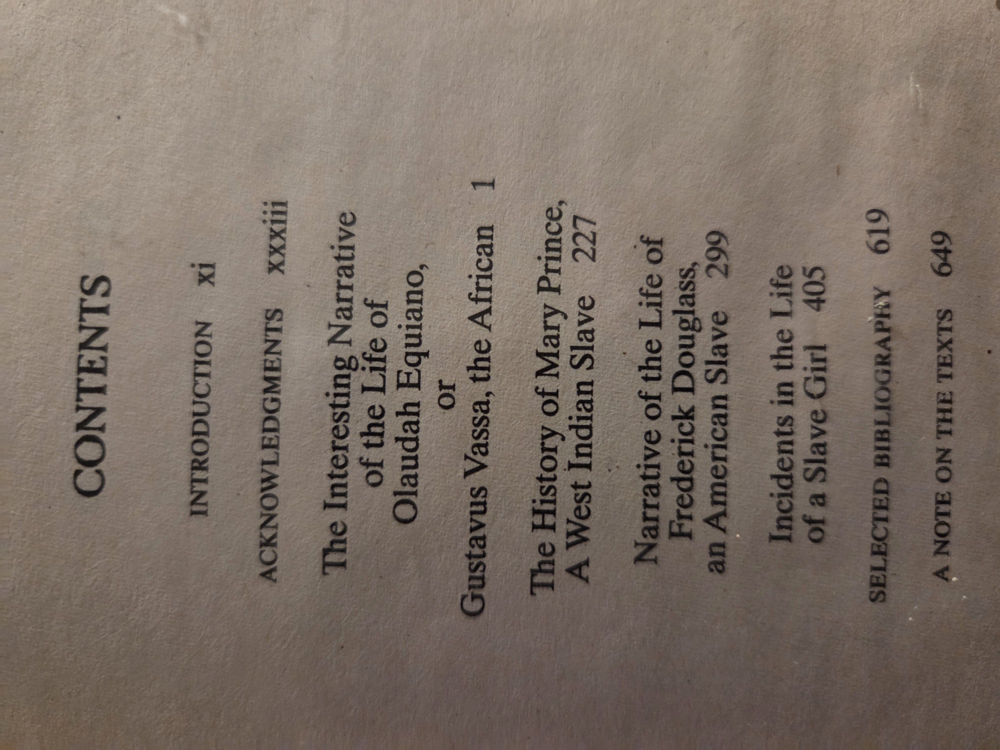
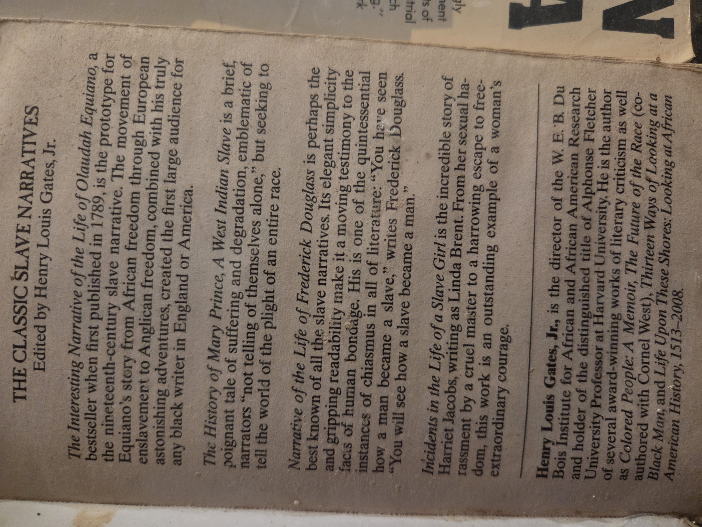

---

# The Classic Slave Narratives

*Edited by Henry Louis Gates, Jr.*
(Signet Classics / New American Library, a division of Penguin Group (USA) Inc.)

**Shelf location:** BookCase01 → Shelf03 → **Vol. 09**
**Edition notes (from book):** First Signet Classics printing, January **2002**. Introduction & selection copyright © **Henry Louis Gates, Jr.** (1987, 2012).
**Format:** Mass-market paperback
**ISBN:** *(not visible on provided leaf)*
**Condition/provenance:** Heavily read mass-market copy; creasing and edge wear typical of Signet/NAL printings. Back-matter “stripped book” notice present.

---

## Catalog & imprint page

*(for quick verification)*

---

## What this volume contains (Signet Classics omnibus)

Four foundational first-person narratives printed complete, with the editor’s introduction and notes:

1. **The Interesting Narrative of the Life of Olaudah Equiano, or Gustavus Vassa, the African** — *Olaudah Equiano* (pp. **1–226**)
2. **The History of Mary Prince, A West Indian Slave** — *Mary Prince* (p. **227**)
3. **Narrative of the Life of Frederick Douglass, an American Slave** — *Frederick Douglass* (p. **299**)
4. **Incidents in the Life of a Slave Girl** — *Harriet Jacobs* (p. **405**)

Back-matter: Selected Bibliography (p. **619**); A Note on the Texts (p. **649**).

*(Rear-cover summary and editor bio for reference)*

---

## Why you should read this book

* **Primary voices of slavery and emancipation.** These accounts anchor the canon of English-language slave narratives and remain indispensable sources for the lived experience of enslavement, resistance, and freedom.
* **Range of perspective.** Together they present African (Equiano), Afro-Caribbean (Prince), African American male (Douglass), and African American female (Jacobs) vantage points—broadening context across Atlantic worlds and gender.
* **Historical impact.** Equiano’s bestseller (1789) fueled British abolition; Douglass’s *Narrative* (1845) became the archetype of American antislavery literature; Jacobs (1861) uniquely documents sexual exploitation under slavery; Prince (1831) is the first account by a Black woman published in Britain.
* **Literary craft + rhetoric.** Each author blends testimony with eloquence—mastering Enlightenment appeals (reason, moral sentiment, providence) and sharpening abolitionist argument.
* **Teaching & research ready.** Gates’s framing introduction, standardized texts, and bibliography make this a reliable classroom/reading-group edition while still suitable for citation.
* **For local/family history.** Names, places, trades, faith communities, and networks inside these narratives often surface in parish, court, and manumission records—useful leads for community and genealogical projects.

---

## Universal Decimal Classification (UDC) — suggested shelf numbers

*(Indicative combinations you can use in your catalog; refine as needed.)*

* **326** — Slavery. Emancipation
* **94(73)** — History of the United States *(context for Douglass/Jacobs)*
* **94(41)** and **94(29)** — History of the **United Kingdom** / **Caribbean** *(context for Prince)*
* **94(6)** — History of **Africa** *(context for Equiano)*
* **(092)** — Biographies / personal narratives *(apply to each author)*
* **82-94** — Diaries, memoirs, correspondence; **82-3** *(life writing / non-fiction narrative prose)*
* Example compound call numbers:

  * *326(73)(092) Douglass* — slavery in the U.S.; personal narrative
  * *326(41)(092) Equiano* — slavery/abolition in Britain; life of Equiano
  * *326(29)(092) Prince* — slavery in the Caribbean; life of Prince
  * *326(73)(092) Jacobs* — slavery in the U.S.; life of Jacobs

> *Note:* UDC allows faceted combinations; choose the geographic facet **(place)** and **(092)** as appropriate for copy- or author-specific records.

---

## Quick bibliographic citation (house style)

**The Classic Slave Narratives.** Edited, with introduction, by **Henry Louis Gates, Jr.** New York: **Signet Classics / New American Library**, 2002. Mass-market paperback.

---

## Shelf navigation (placeholders)

* ◀︎ **Vol. 08:** *The Gulag Archipelago* — *(link placeholder)*
* **Shelf03 index** — *(link placeholder to Shelf overview)*
* **Vol. 10:** *(next title placeholder)* ▶︎

---
