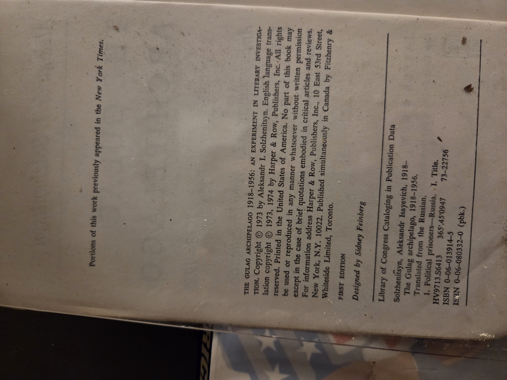
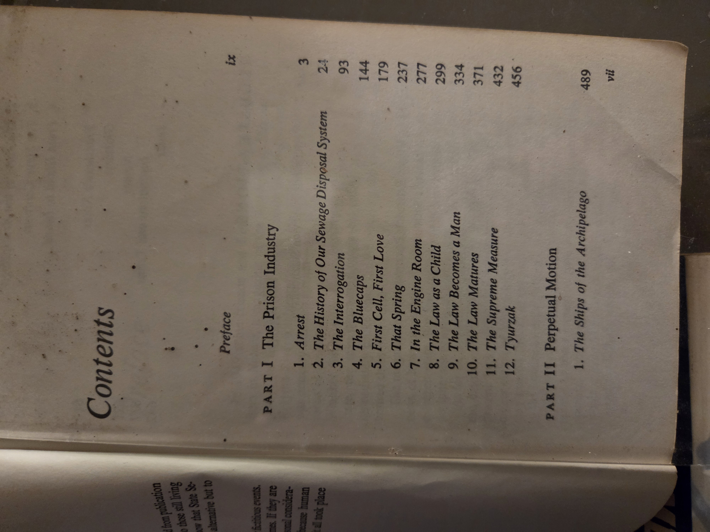
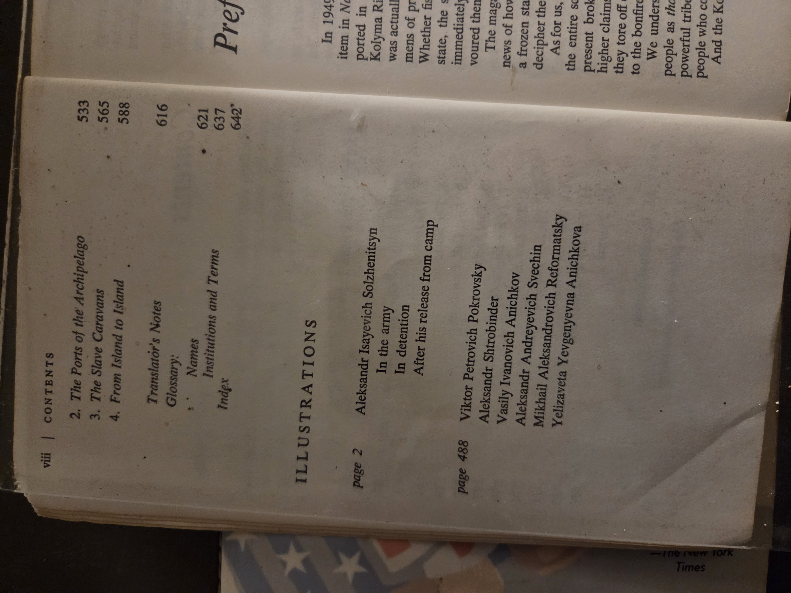

# The Gulag Archipelago, 1918–1956: An Experiment in Literary Investigation (I–II)
*Aleksandr I. Solzhenitsyn; trans. Thomas P. Whitney*

**BookCase:** 01  **Shelf:** 03  **Volume:** 08  
**Edition/Imprint:** Harper & Row (New York / Evanston / San Francisco / London), 1973–1974. “First Edition” noted.  
**ISBN(s):** 0-06-013914-5 (cloth); 0-06-080332-0 (pbk).  
**LoC/CIP (from volume):** 73-22756; class range shown under **HV9713…** (political prisoners—Russia).  
**Rights note (from volume):** Portions previously appeared in *The New York Times*.  
**Physical note:** Translation from the Russian by Thomas P. Whitney; includes glossary, translator’s notes, index; illustrations noted on p. 2 and p. 488.

---

## Cover & prelims (reference images)
- 

> Additional pages for reference (optional):
> - 
> - 

---

## Why you should read this book
- **A landmark exposé of state repression.** Solzhenitsyn assembled testimonies, documents, and his own experience to reveal the scale and mechanics of the Soviet forced-labor camp system (“Gulag”), reshaping global understanding of 20th-century authoritarianism.  
- **Literature as civic courage.** Written and circulated at great personal risk, the work models how historical memory can be preserved when archives are closed and speech is constrained.  
- **Method + moral argument.** Beyond narrative, it’s a taxonomy of arrest, interrogation, transport, camp life, and release—linking bureaucratic routines to ethical catastrophe.  
- **Historical impact.** The book’s publication helped catalyze human-rights discourse in the 1970s and contributed to reassessments of Soviet history in both East and West.  
- **Pairs well with primary sources.** Read alongside camp memoirs and archival scholarship for a fuller picture of Soviet criminal justice, political policing, and everyday survival.

*(Background/impact reference: concise overviews on Solzhenitsyn and **The Gulag Archipelago** in Britannica and other standard references.)*

---

## Table of Contents (from the volume)
*(headings and pagination transcribed from TOC pages)*

**Preface** ix

### PART I — *The Prison Industry*
1. Arrest 3  
2. The History of Our Sewage Disposal System 24  
3. The Interrogation 93  
4. The Bluecaps 144  
5. First Cell, First Love 179  
6. That Spring 237  
7. In the Engine Room 277  
8. The Law as a Child 299  
9. The Law Becomes a Man 334  
10. The Law Matures 371  
11. The Supreme Measure 432  
12. Tyurzak 456

### PART II — *Perpetual Motion*
1. The Ships of the Archipelago 489  
2. The Ports of the Archipelago 533  
3. The Slave Caravans 565  
4. From Island to Island 588

**Translator’s Notes** 616  
**Glossary — Names** 621  
**Glossary — Institutions and Terms** 637  
**Index** 642

**Illustrations noted**: p. 2 (*Aleksandr Isayevich Solzhenitsyn*—in the army; in detention; after release from camp); p. 488 (V. P. Pokrovsky; A. Shtrobinder; V. I. Anichkov; A. A. Svechin; M. A. Reformatsky; Y. Y. Anichkova).

---

## UDC classifications (subject suggestions)
> Provisional numbers to aid shelving and cross-reference; adapt to your local practice.

- **343.8** — Punishment. Execution of sentences. Prisons / penology (core subject of forced-labour/prison system). :contentReference[oaicite:0]{index=0}  
- **94(470+571)** — History of Russia and neighbouring states (place auxiliary for Russian Federation/CIS context). *Example of combined place code appears in UDC change notices for “(470+571)”.* :contentReference[oaicite:1]{index=1}  
- **Time auxiliary (20th century / specific years):** add **"1918/1956"** after the class as needed (UDC uses quoted time auxiliaries; examples show century/year notation such as `"19"` for the 20th century). :contentReference[oaicite:2]{index=2}

**Practical shelflist examples:**
- `343.8(470+571)"1918/1956"` — Soviet penal/forced-labour system, 1918–1956  
- `94(470+571)"1918/1956"` — Soviet history, Civil War to post-Stalin amnesty period

---

## Notes & provenance (local)
- This copy records: “First Edition”; Harper & Row imprint; translator Thomas P. Whitney.  
- CIP shows LoC subject focus on **political prisoners—Russia** and early works on **journeys around the world** are *not* applicable here (appears only in some records for Cook/Ledyard—ignore for this title).  
- Keep dust-jacket if present; illustrations referenced at pp. 2 and 488.

---

## Cross-references (Shelf links)
- **On this shelf (exploration, empire, and testimony):**  
  *JamesCookJournals.md* • *LastVoyageCaptainCook.md* • *WesternEuropeMiddleAges.md* • *LifeTimesFrederickDouglas.md* • *SalemWitchJudge.md* • *VaultsOfMemory.md* • *AgeOfChivalry.md*

---

## Suggested external references
- Encyclopaedia overview of Solzhenitsyn and the *Gulag* system (for context and teaching notes).  
- Major library records (LoC / WorldCat) for edition verification and alternative translations.

