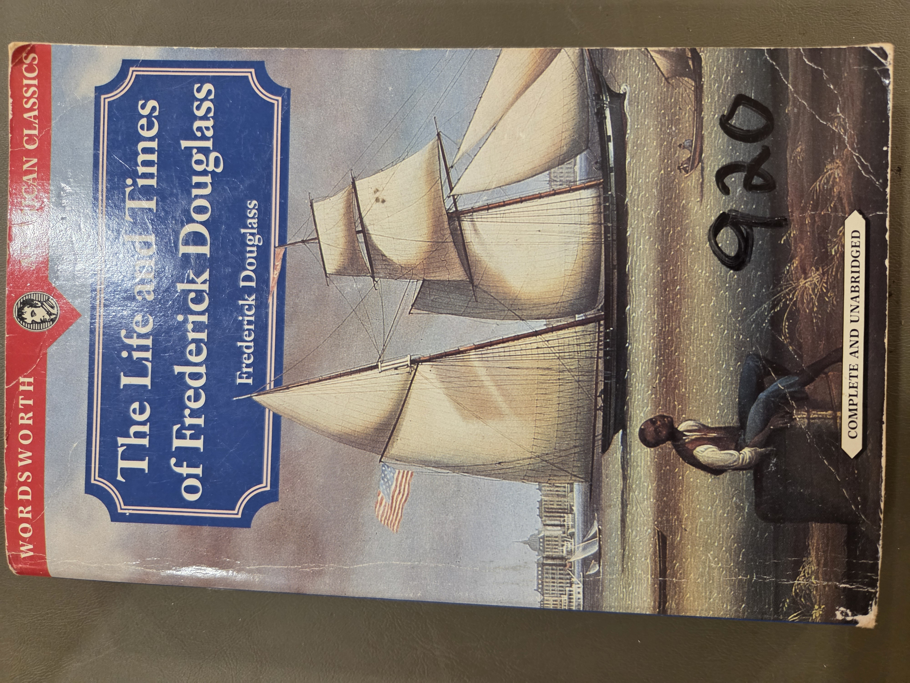
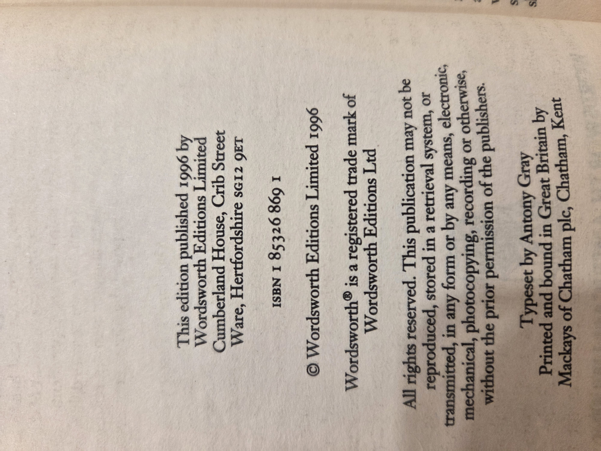
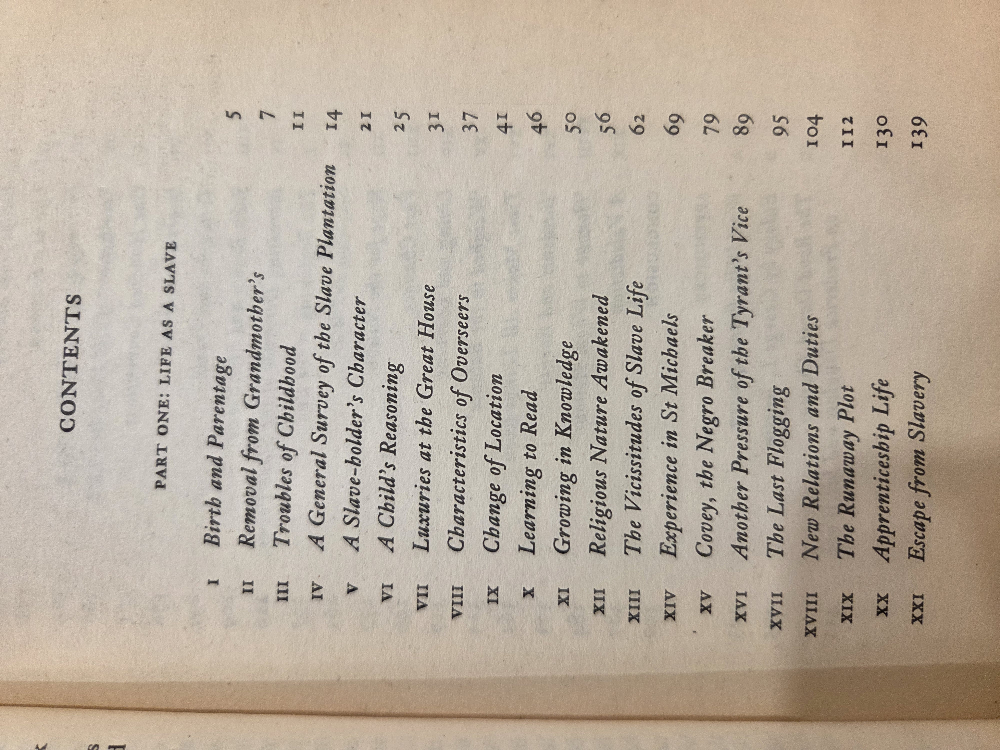
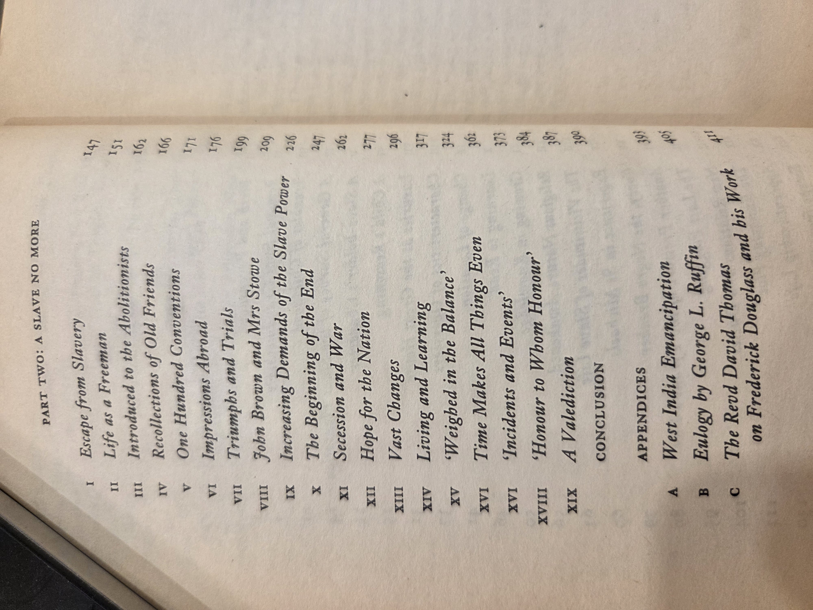

Here’s an updated **`LifeTimesFrederickDouglas.md`** that restores the two sections you asked for (“Why you should read this book” and “UDC classifications”) while keeping the Shelf01 house-style. You can paste this straight into your repo (BookCase01/Shelf03). I kept punctuation ASCII-clean to dodge mojibake.

---

# The Life and Times of Frederick Douglass

**Author:** Frederick Douglass
**Edition:** Wordsworth Editions Limited, 1996 (Complete and unabridged)
**ISBN:** 1-85326-869-1
**Series:** Wordsworth American Classics
**Physical:** Paperback

**Shelf:** BookCase01 → Shelf03 → Volume04
**Provenance:** Personal copy

*Copyright and printing data.*

---

## Quick description

Douglass’s third autobiography, revised late in life, expanding his earlier narratives with his public career as abolitionist, editor, diplomat, and statesman. It spans slavery, escape, antislavery organizing, the Civil War, and Reconstruction.

---

## Table of contents (images)

* 
* 

<strong>Optional: OCR table of contents (for search)</strong>

### Part One: Life as a Slave

1. Birth and Parentage — 5
2. Removal from Grandmother's — 7
3. Troubles of Childhood — 11
4. General Survey of the Slave Plantation — 14
5. A Slave-holder's Character — 21
6. A Child's Reasoning — 25
7. Luxuries at the Great House — 31
8. Characteristics of Overseers — 37
9. Change of Location — 41
10. Learning to Read — 46
11. Growing in Knowledge — 50
12. Religious Nature Awakened — 56
13. Vicissitudes of Slave Life — 62
14. Experience in St Michaels — 69
15. Covey, the Negro Breaker — 79
16. Another Pressure of the Tyrant's Vice — 89
17. The Last Flogging — 95
18. New Relations and Duties — 104
19. The Runaway Plot — 112
20. Apprenticeship Life — 130
21. Escape from Slavery — 139

### Part Two: A Slave No More

1. Escape from Slavery — 147
2. Life as a Freeman — 151
3. Introduced to the Abolitionists — 162
4. Recollections of Old Friends — 166
5. One Hundred Conventions — 171
6. Impressions Abroad — 176
7. Triumphs and Trials — 199
8. John Brown and Mrs Stowe — 209
9. Increasing Demands of the Slave Power — 226
10. The Beginning of the End — 247
11. Secession and War — 262
12. Hope for the Nation — 277
13. Vast Changes — 296
14. Living and Learning — 317
15. Weighed in the Balance — 324
16. Time Makes All Things Even — 362
17. Incidents and Events — 373
18. Honour to Whom Honour — 384
19. A Valediction — 387
    Conclusion — 390

**Appendices**
A. West India Emancipation — 393
B. Eulogy by George L. Ruffin — 405
C. The Revd David Thomas on Frederick Douglass and his Work — 411

---

## Why you should read this book

* **A first-person account with national scope.** Douglass moves from enslaved child to public intellectual and statesman; his late-career perspective connects plantation slavery, antislavery strategy, the Civil War, and Reconstruction in one narrative arc.
* **Primary source for emancipation politics.** The book documents abolitionist networks, Black organizing, and policy debates (e.g., Black enlistment, citizenship, suffrage) in the author’s own words.
* **Rhetoric and media savvy.** Douglass shows how speeches, newspapers, and lecture tours were used to build a mass movement, making the volume a case study in advocacy and civic communication.
* **Continuing relevance.** Themes of citizenship, rights, policing of Black mobility, and the uses of history for democratic reform remain central to public life today.

---

## Research and teaching uses

* **African American history and political thought:** slavery, resistance, abolition, Reconstruction.
* **Media history:** antislavery press, lecture circuits, transatlantic public sphere.
* **Narrative studies:** autobiography, testimony, and memory as historical evidence.
* **Local history tie-ins:** chapters name people and places that can be mapped to regional archives and newspapers.

---

## UDC classifications (suggested)

Use or adapt to your local UDC edition; combine with auxiliaries for place and time as needed.

* **Primary:** `929 Douglass, Frederick (1818–1895)` — Biography and related studies.
* **History facet (common auxiliary of place and time):** `94(73)"18"` — United States history, 19th century. `(73)` is the UDC place auxiliary for the USA (see example usage in UDC literature: `821.111(73)`), and `"18"` is the auxiliary for the 19th century. ([IFLA Archive][1])
* **Topical facet (optional, for subject approach):** `326` — Slavery and emancipation; combine as needed with place/time, e.g., `326(73)"18"`. *(Note: wording and granularity vary by UDC edition, but 3xx social sciences and 326 for slavery/emancipation are standard in practice.)*

> Notes on syntax: parentheses denote **place** auxiliaries; quoted numerals denote **time** auxiliaries; numbers can be combined additively for complex subjects. For overviews of UDC common auxiliaries and combination syntax, see the UDC summary and outline. ([Wikipedia][2])

---

## Cross-links on this shelf

* Volume01: *The Age of Chivalry* — placeholder
* Volume02: *Vaults of Memory* — placeholder
* Volume03: *Western Europe in the Middle Ages* — placeholder
* **Volume04: The Life and Times of Frederick Douglass** — this entry
* Volume05–08: placeholders

---

## Citation

Douglass, Frederick. *The Life and Times of Frederick Douglass*. Wordsworth Editions Limited, 1996. Wordsworth American Classics.

---

[1]: https://origin-archive.ifla.org/IV/ifla69/papers/032e-Slavic.pdf?utm_source=chatgpt.com "World Library and Information Congress"
[2]: https://en.wikipedia.org/wiki/Universal_Decimal_Classification?utm_source=chatgpt.com "Universal Decimal Classification"
