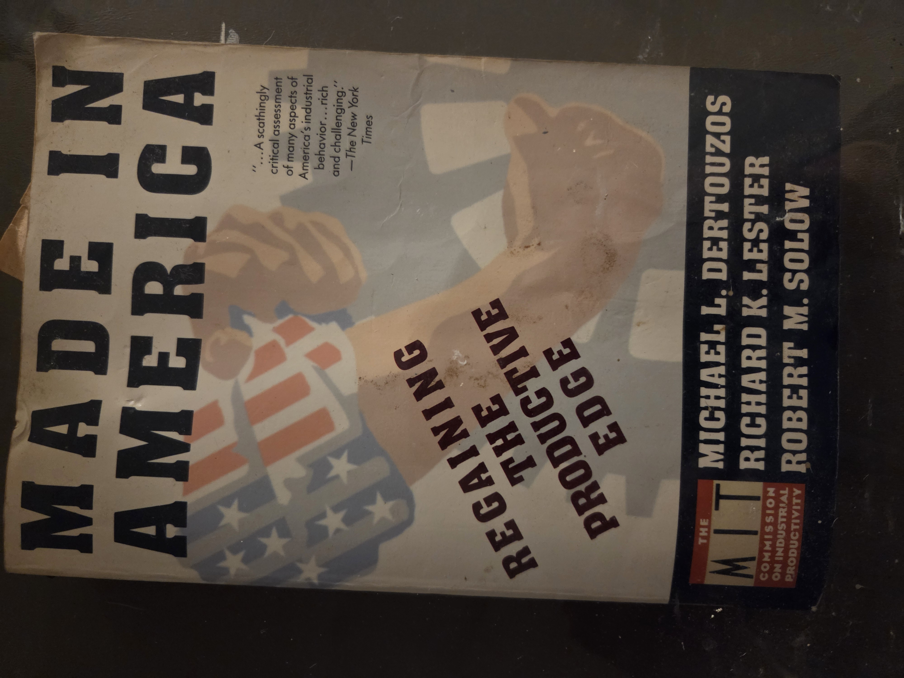
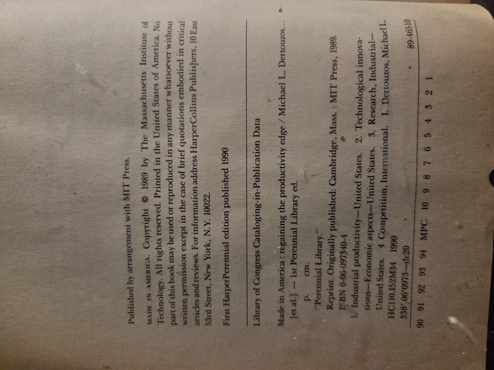
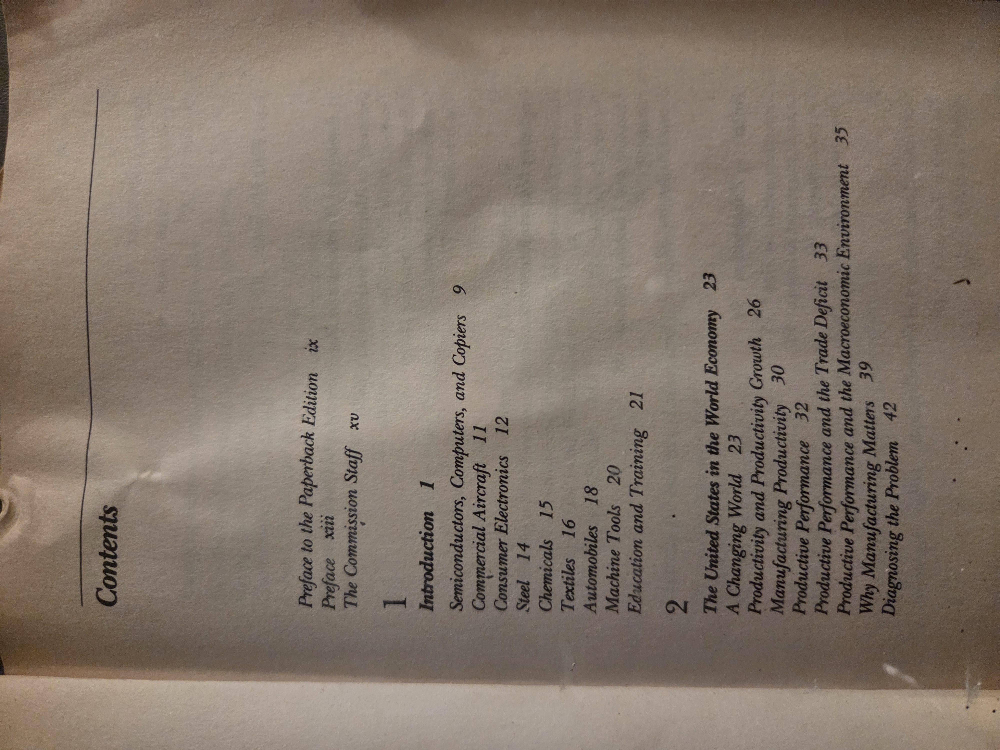
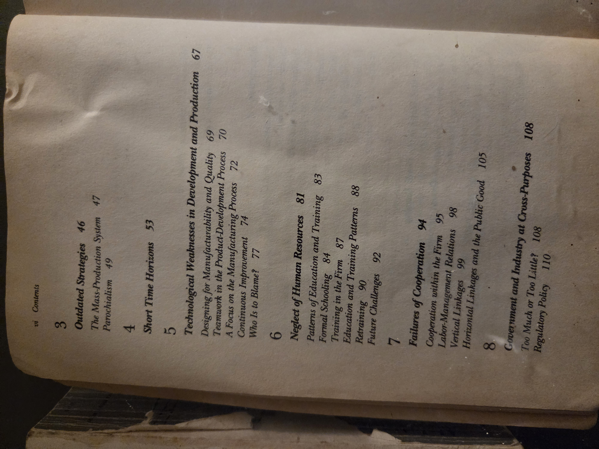
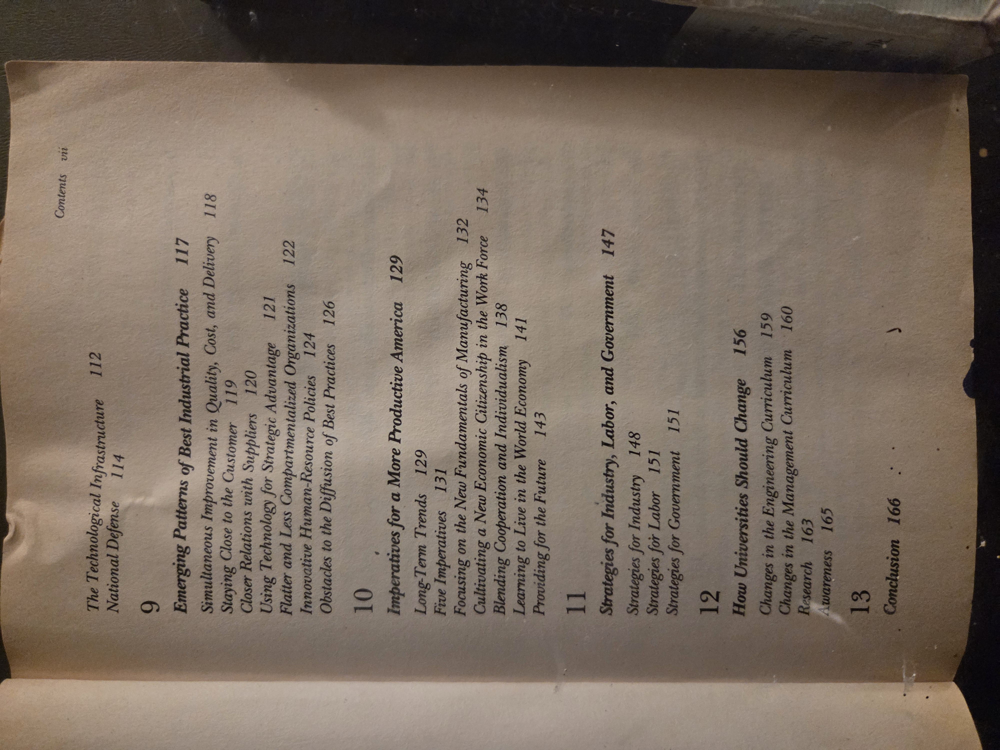
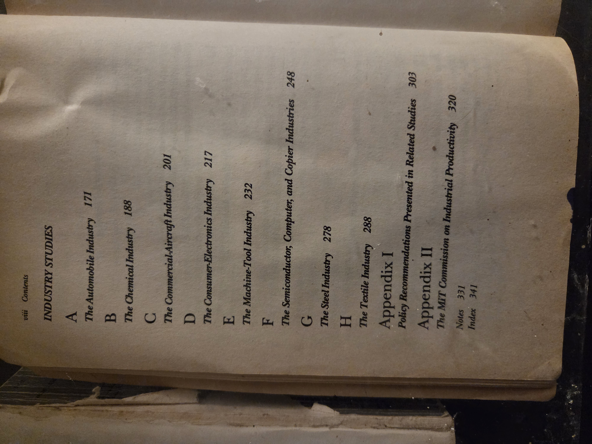

# BookCase01 · Shelf03 · Volume10
# *Made in America: Regaining the Productive Edge*

**Authors**: Michael L. Dertouzos; Richard K. Lester; Robert M. Solow  
**Commission**: MIT Commission on Industrial Productivity  
**Edition**: HarperPerennial paperback (reprint of the 1989 MIT Press edition)  
**Publisher**: HarperCollins (by arrangement with MIT Press)  
**Place**: New York, NY, USA  
**Year**: 1990 (1st Perennial ed.; original MIT Press edition 1989)  
**ISBN**: 0-06-097340-4  
**Series/Imprint**: Perennial Library  
**Library of Congress (from book)**: HC110.I52 M34 1990 (industrial productivity—United States)

---

## Images
- **Cover** — 
- **Copyright / publication data** — 
- **Table of Contents** —    

> Replace paths as needed for your repo layout (e.g., `/BookCase01/Shelf03/Volume10/images/...`).

---

## Table of Contents (transcribed)
**Front matter**  
- Preface to the Paperback Edition — ix  
- Preface — xiii  
- The Commission Staff — xv

**1 · Introduction** — 1  
  Semiconductors, Computers, and Copiers — 9 · Commercial Aircraft — 11 · Consumer Electronics — 12 · Steel — 14 · Chemicals — 15 · Textiles — 16 · Automobiles — 18 · Machine Tools — 20 · Education and Training — 21

**2 · The United States in the World Economy** — 23  
  A Changing World — 23 · Productivity and Productivity Growth — 26 · Manufacturing Productivity — 30 · Productive Performance — 32 · Productive Performance and the Trade Deficit — 33 · Productive Performance and the Macroeconomic Environment — 35 · Why Manufacturing Matters — 39 · Diagnosing the Problem — 42

**3 · Outdated Strategies** — 46  
  The Mass-Production System — 47 · Parochialism — 49

**4 · Short Time Horizons** — 53

**5 · Technological Weaknesses in Development and Production** — 67  
  Designing for Manufacturability and Quality — 69 · Teamwork in the Product-Development Process — 70 · A Focus on the Manufacturing Process — 72 · Continuous Improvement — 74 · Who Is to Blame? — 77

**6 · Neglect of Human Resources** — 81  
  Patterns of Education and Training — 83 · Formal Schooling — 84 · Training in the Firm — 87 · Education and Training Patterns — 88 · Retraining — 90 · Future Challenges — 92

**7 · Failures of Cooperation** — 94  
  Cooperation within the Firm — 95 · Labor-Management Relations — 98 · Vertical Linkages — 99 · Horizontal Linkages & the Public Good — 105

**8 · Government and Industry at Cross-Purposes** — 108  
  Too Much or Too Little? — 108 · Regulatory Policy — 110 · The Technological Infrastructure — 112 · National Defense — 114

**9 · Emerging Patterns of Best Industrial Practice** — 117  
  Simultaneous Improvement in Quality, Cost, and Delivery — 118 · Staying Close to the Customer — 119 · Closer Relations with Suppliers — 120 · Using Technology for Strategic Advantage — 121 · Flatter & Less Compartmentalized Organizations — 122 · Innovative Human-Resource Policies — 124 · Obstacles to the Diffusion of Best Practices — 126

**10 · Imperatives for a More Productive America** — 129  
  Long-Term Trends — 129 · Five Imperatives — 131 · Focusing on the New Fundamentals of Manufacturing — 132 · Cultivating a New Economic Citizenship in the Work Force — 134 · Building Cooperation & Individualism — 138 · Learning to Live in the World Economy — 141 · Providing for the Future — 143

**11 · Strategies for Industry, Labor, and Government** — 147  
  Strategies for Industry — 148 · Strategies for Labor — 151 · Strategies for Government — 151

**12 · How Universities Should Change** — 156  
  Changes in the Engineering Curriculum — 159 · Changes in the Management Curriculum — 160 · Research — 163 · Awareness — 165

**13 · Conclusion** — 166

**Industry Studies**  
A. The Automobile Industry — 171 · B. The Chemical Industry — 188 · C. The Commercial-Aircraft Industry — 201 · D. The Consumer-Electronics Industry — 217 · E. The Machine-Tool Industry — 232 · F. The Semiconductor, Computer, and Copier Industries — 248 · G. The Steel Industry — 278 · H. The Textile Industry — 288

**Back matter**  
Appendix I: Policy Recommendations Presented in Related Studies — 303  
Appendix II: The MIT Commission on Industrial Productivity — 320  
Notes — 331 · Index — 341

---

## Bibliographic & edition notes
- “Published by arrangement with MIT Press.” First Perennial edition 1990; original MIT Press edition 1989.  
- **Copyright © 1989 Massachusetts Institute of Technology.** Printed in the U.S.A.  
- Book subjects (from the CIP data): *Industrial productivity—United States*; *Technological innovations—Economic aspects—United States*; *Research, Industrial—United States*; *Competition, International.*

---

## Provenance
- Worstell Berry Library — BookCase01 → Shelf03 → **Volume10**.  
- Physical condition: paperback; heavy reading wear; no inscriptions noted.

---

## Why you should read this book
- **A clear, data-driven diagnosis of late-1980s U.S. industrial malaise** by MIT’s Commission—pinpointing short time horizons, weak product-development integration, and adversarial labor/management dynamics.  
- **Blueprint for renewal that still resonates**: design for manufacturability, continuous improvement, closer supplier ties, flatter organizations, and customer focus prefigure “lean” and “agile.”  
- **Connects plant floor to policy**—linking practices to trade performance, education, and the national innovation system; helpful for comparing eras of U.S. industrial strategy.  
- **Bridges disciplines** (economics, engineering, management) with co-author **Robert M. Solow** (1987 Nobel laureate), lending both rigor and reach.

---

## UDC (Universal Decimal Classification) — suggested
*(Provisional—adjust to your preferred cataloging granularity.)*  
- **338.012** — Productivity (general)  
- **338.45** — Manufacturing industries (economics by branches; add auxiliaries as needed)  
- **338.024.2** — Industrial policy; state measures for efficiency/productivity  
- **658.5** — Production/operations management (process, quality, CI)  
- **331.5** — Labor–management relations; workforce development (combine with 658.3 for HR)  
- **004/007** (auxiliary) — Information technology as production factor (semiconductors/computing)

---

## Subjects & tags
Industrial productivity · Manufacturing strategy · Technology policy · Human capital · Supply chains · Lean/quality · MIT Commission on Industrial Productivity · U.S. competitiveness (1980s–1990s)

---

## Cross-references (Shelf03)
- Vol.01 — *AgeOfChivalry.md* (placeholder)  
- Vol.02 — *VaultsOfMemory.md*  
- Vol.03 — *WesternEuropeMiddleAges.md*  
- Vol.04 — *LifeTimesFrederickDouglas.md*  
- Vol.05 — *SalemWitchJudge.md*  
- Vol.06 — *JamesCookJournals.md*  
- Vol.07 — *LastVoyageCaptainCook.md*  
- Vol.08 — *GulagArchipelago.md*  
- Vol.09 — *ClassicSlaveNarrative.md*  
- **Vol.10 — *MadeInAmerica.md* (this volume)**  
- Vol.11 — *(placeholder)*

---

## Notes
- Replace placeholder cross-links with your repo’s relative paths once added.  
- House-style preserved from Shelf01: image block; transcribed TOC; concise bib; provenance; “Why read” perspective; provisional UDC.
