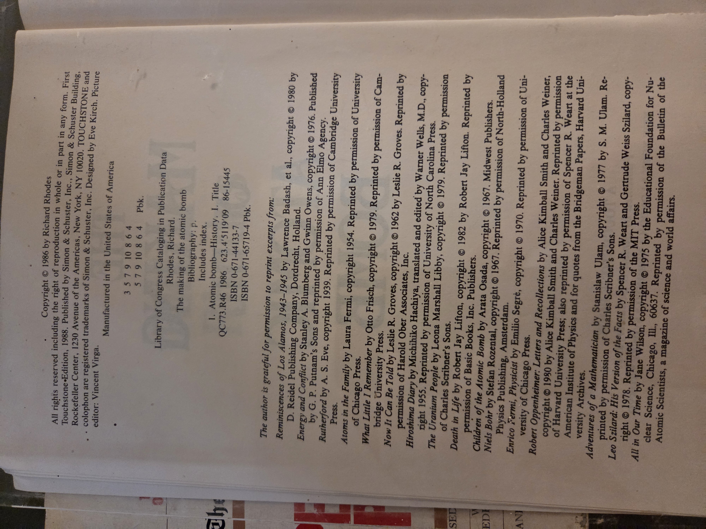
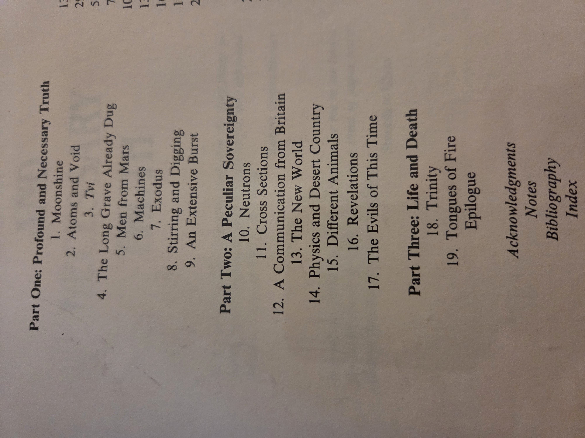

# The Making of the Atomic Bomb — Rhodes (BookCase01 · Shelf01)

**Author**: Richard Rhodes  
**Title**: *The Making of the Atomic Bomb*  
**Publisher**: Simon & Schuster — Touchstone edition, 1988 (originally 1986)  
**ISBN**: 0-671-44133-7, 0-671-65719-4 (pbk)  
**Library of Congress Catalog Card No.**: 86-15445  
**Format**: Paperback (Touchstone)  
**Copy on this shelf**: Personal reading copy used for reference and teaching notes.

---

## Cite this book
Rhodes, Richard. *The Making of the Atomic Bomb*. New York: Simon & Schuster, 1986. Touchstone paperback ed., 1988. ISBN 0-671-44133-7 / 0-671-65719-4.

---

## Why you should read this book
- Pulitzer-Prize–winning narrative that shows **how physics became policy**—the fusion of science, logistics, secrecy, and state power that produced the first nuclear weapons.  
- Vivid, humane portraits of scientists, engineers, soldiers, and refugees—clarifies the **moral conflicts** and world-historical stakes from WWII into the early Cold War.  
- Essential background for today’s debates on **nonproliferation, deterrence, dual-use tech**, and the governance of high-risk research.  
- A masterclass in research writing, blending memoir, primary sources, and technical explanation without losing narrative momentum—great for students.

---

## Suggested UDC classifications (approximate)
> Practical shelf codes; adjust to local schedules if your UDC tables differ.

- **94(100)"1939/1945"** — Second World War, global history.  
- **621.039(091)** — History of nuclear energy / atomic technology.  
- **355.4** — Weapons and military technology (general).  
- **539.1(091)** — History of atomic & nuclear physics (scientific background).

---

## Table of Contents (from this copy)

**Part One: Profound and Necessary Truth**  
1. Moonshine  
2. Atoms and Void  
3. *Tvi* (as printed in this edition)  
4. The Long Grave Already Dug  
5. Men from Mars  
6. Machines  
7. Exodus  
8. Stirring and Digging  
9. An Extensive Burst  

**Part Two: A Peculiar Sovereignty**  
10. Neutrons  
11. Cross Sections  
12. A Communication from Britain  
13. The New World  
14. Physics and Desert Country  
15. Different Animals  
16. Revelations  
17. The Evils of This Time  

**Part Three: Life and Death**  
18. Trinity  
19. Tongues of Fire  
*Epilogue*  

**Back matter**: Acknowledgments · Notes · Bibliography · Index

---

## Images (from this copy)
> Update paths to match your repo’s image folder.

  
  

---

## Notes for our library
- This edition’s cover cites major awards: **Pulitzer Prize**, **National Book Award**, **National Book Critics Circle Award**.  
- Cross-references on Shelf01: *The Journals of Captain Cook* (exploration & empire), *The Last Voyage of Captain Cook* (Ledyard), *The Gulag Archipelago* (state power & repression), *Made in America* (industrial policy).  
- Teaching pairings: history of science, ethics of technology, policy analysis, and writing seminars on long-form research.
