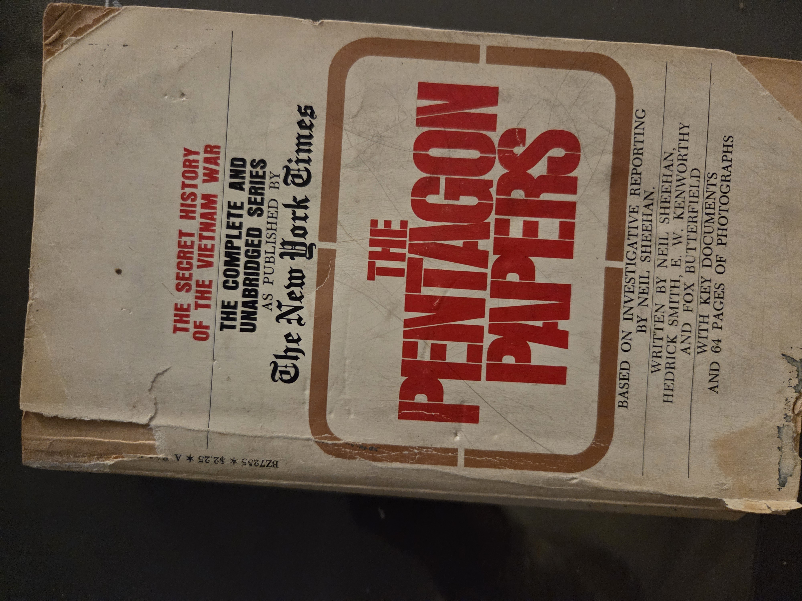
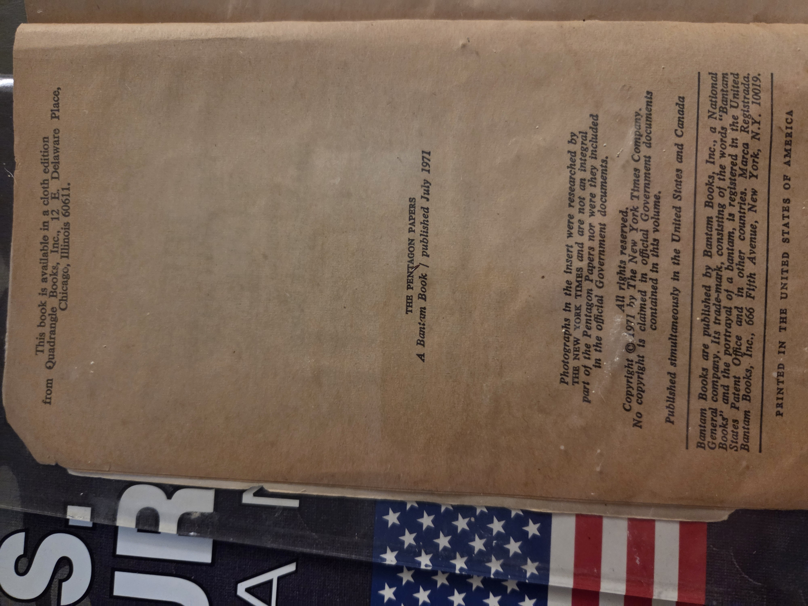
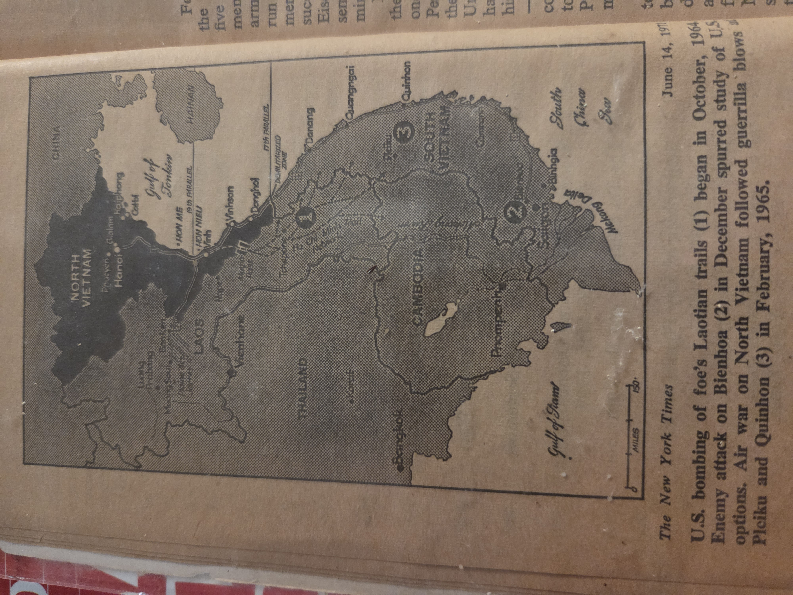
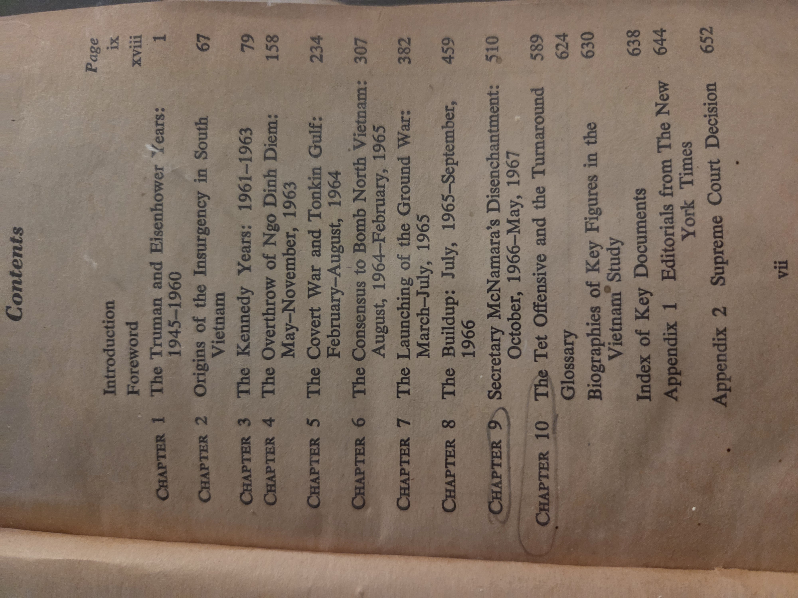

# The Pentagon Papers: The Secret History of the Vietnam War

*The complete and unabridged series as published by* **The New York Times** (Bantam, July 1971)

* **Editors/writers:** Neil Sheehan, Hedrick Smith, E. W. Kenworthy, Fox Butterfield (based on NYT investigative reporting)
* **Publisher:** Bantam Books, New York; simultaneously in U.S. & Canada
* **Edition/format:** Bantam paperback, 1971 (cloth edition available from Quadrangle Books, Chicago)
* **Copyright note:** © 1971 The New York Times Company. *No copyright is claimed in official U.S. Government documents contained in this volume.*
* **ISBN / cataloging:** Not shown on the provided pages (Bantam used series numbers in this era)

---

## Contents (selected)

*(from the book’s table of contents; page starts as printed)*

* **Introduction** (ix)
* **Foreword** (xviii)

1. **The Truman and Eisenhower Years: 1945–1960** (1)
2. **Origins of the Insurgency in South Vietnam** (67)
3. **The Kennedy Years: 1961–1963** (79)
4. **The Overthrow of Ngo Dinh Diem: May–November, 1963** (158)
5. **The Covert War and Tonkin Gulf: February–August, 1964** (234)
6. **The Consensus to Bomb North Vietnam: Aug. 1964–Feb. 1965** (307)
7. **The Launching of the Ground War: March–July, 1965** (382)
8. **The Buildup: July 1965–September 1966** (459)
9. **Secretary McNamara’s Disenchantment: Oct. 1966–May 1967** (510)
10. **The Tet Offensive and the Turnaround** (589)

* **Glossary** (624)
* **Biographies of Key Figures in the Vietnam Study** (630)
* **Index of Key Documents** (638)
* **Appendix 1: Editorials from *The New York Times*** (644)
* **Appendix 2: Supreme Court Decision** (652)

---

## Why you should read this book

* **Primary-source window into policy:** This volume condenses the Defense Department’s classified study of U.S. decision-making in Vietnam (1945–1967). You’re reading internal memos, estimates, and chronologies that reveal how strategy was formed—often at odds with public statements.
* **Landmark in press freedom:** Its publication sparked *New York Times Co. v. United States* (1971), the Supreme Court case that set the modern high bar against prior restraint, shaping American journalism and whistleblowing norms.
* **Civic literacy & historical method:** Side-by-side editorial framing and documentary evidence model how to interrogate sources, compare claims, and trace bureaucratic reasoning—skills directly transferable to studying later conflicts and policy debates.
* **Context for the Vietnam era:** The chapter sequence maps turning points (Tonkin Gulf, escalation, Tet) and the evolving roles of presidents, Pentagon leadership, and intelligence assessments.

---

## UDC classifications (proposed)

> Practical, shelf-level tags to help discovery; refine as needed by your classifier.

* **94(597)** — History of Vietnam
* **94(73)"1945/1975"** — U.S. history, Vietnam era focus
* **355/359** — Military science; war and armed forces (general)
* **355.48(597)** — War in Vietnam (operational/military aspects)
* **327(73:597)** — International relations, U.S.–Vietnam
* **070(73)** — U.S. press; journalism (context: publication, reportage)
* **342.7:070** — Fundamental rights and the press (press freedom context)
* **34:355/359** — Law and war (legal appendices, Supreme Court decision)

*(If you prefer a tighter set, keep 94(597), 355/359, 327(73:597), and 070(73) as the core quartet.)*

---

## Shelf notes

* This Bantam edition emphasizes accessibility: reportage that introduces and contextualizes government memoranda, followed by appendices (NYT editorials and the Supreme Court ruling).
* Useful companion images include NYT theater maps (see below) that situate timelines and operations geographically.

---

## Image gallery

* 
* 
* 

---

