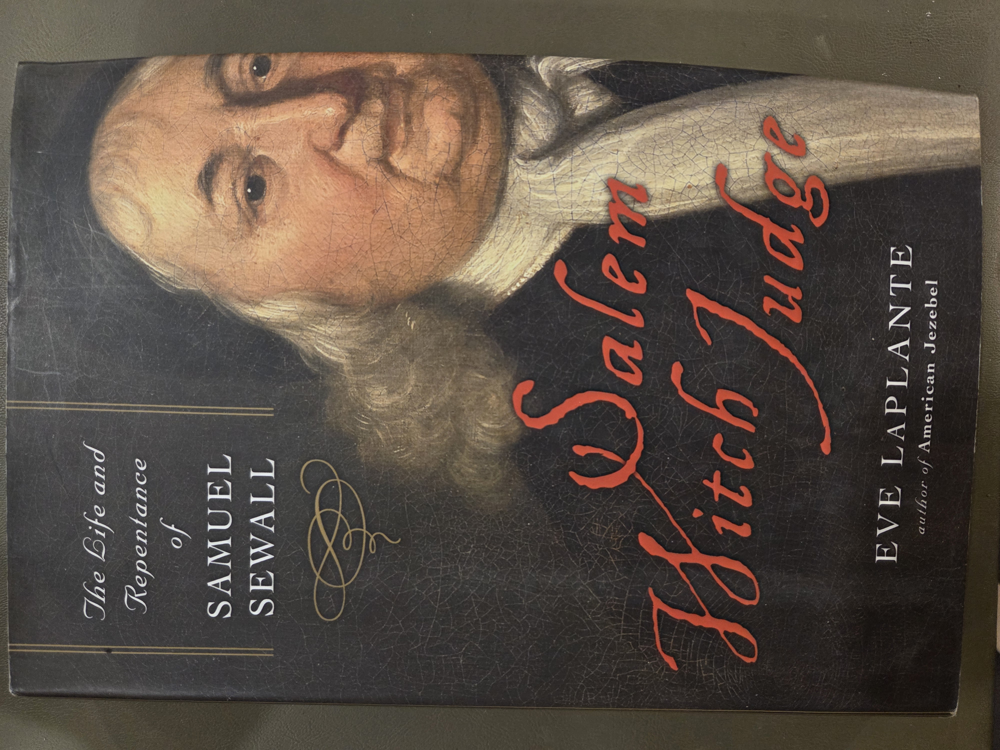
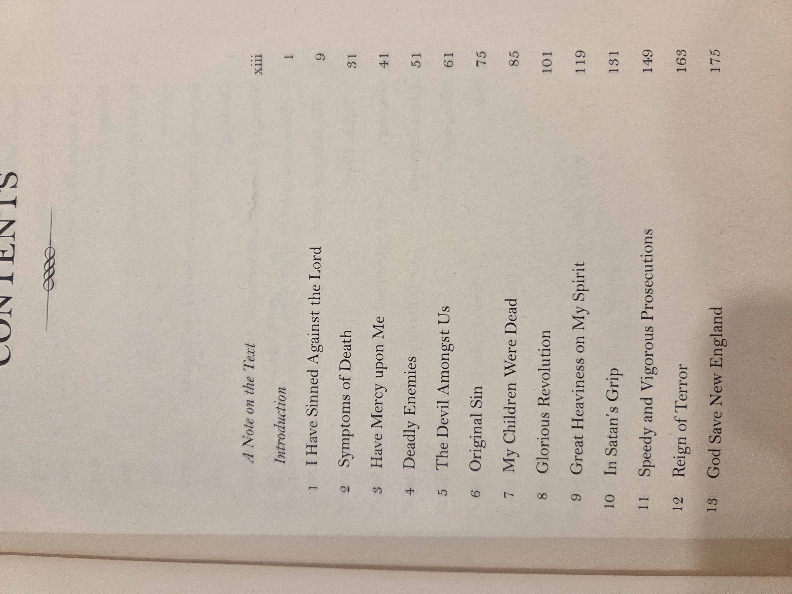
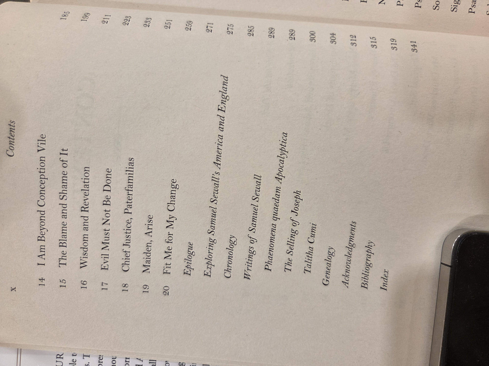
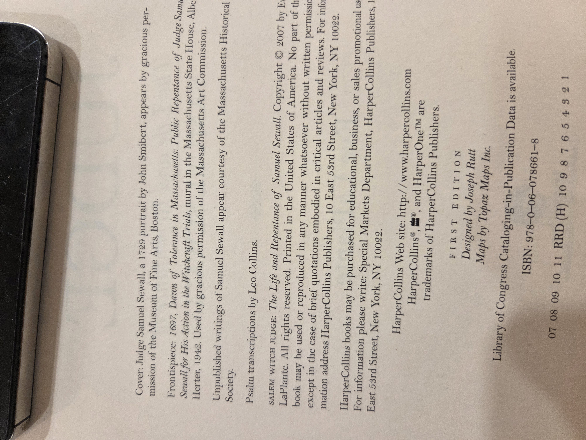

# *Salem Witch Judge* — Eve LaPlante (2007)

> **Series / placement:** BookCase01 → Shelf03 → *Salem Witch Judge* (LaPlante)  
> **Companion volumes on this shelf (placeholders):**  
> 01 · *The Age of Chivalry*  •  02 · *Vaults of Memory*  •  03 · *Western Europe in the Middle Ages*  •  04 · *The Life and Times of Frederick Douglass*  •  **05 · *Salem Witch Judge*** *(this volume)*

{ loading=lazy }

---

## Catalog card

- **Title:** *Salem Witch Judge: The Life and Repentance of Samuel Sewall*  
- **Author:** Eve LaPlante  
- **Publisher / year:** HarperOne (HarperCollins), 2007 — First edition  
- **Place:** New York  
- **ISBN:** 978-0-06-078661-8  
- **Physical:** ill., maps; 24 cm (approx.)  
- **Notes (publisher page):**  
  - **Cover art:** *Judge Samuel Sewall*, 1729 portrait by John Smibert (Museum of Fine Arts, Boston).  
  - **Frontispiece:** *1697, Dawn of Tolerance in Massachusetts: Public Repentance of Judge Samuel Sewall for His Action in the Witchcraft Trials*, mural by Albert Herter (1942), courtesy Massachusetts Art Commission.  
  - **Design:** Joseph Rutt • **Maps:** Topaz Maps Inc.  
  - Library of Congress CIP available.  
- **Condition:** sound binding; normal shelfwear.

---

## Table of contents (transcribed)

> (Pagination from photographs; minor variances by printing possible.)

- A Note on the Text … **xiii**  
- **Introduction** … **1**

1. **I Have Sinned Against the Lord** … **9**  
2. **Symptoms of Death** … **31**  
3. **Have Mercy upon Me** … **41**  
4. **Deadly Enemies** … **51**  
5. **The Devil Amongst Us** … **61**  
6. **Original Sin** … **75**  
7. **My Children Were Dead** … **85**  
8. **Glorious Revolution** … **101**  
9. **Great Heaviness on My Spirit** … **119**  
10. **In Satan’s Grip** … **131**  
11. **Speedy and Vigorous Prosecutions** … **149**  
12. **Reign of Terror** … **163**  
13. **God Save New England** … **175**  
14. **I Am Beyond Conception Vile** … **185**  
15. **The Blame and Shame of It** … **189**  
16. **Wisdom and Revelation** … **199**  
17. **Evil Must Not Be Done** … **211**  
18. **Chief Justice, Paterfamilias** … **223**  
19. **Maiden, Arise** … **238**  
20. **Fit Me for My Change** … **251**

- **Epilogue** … **259**  
- **Exploring Samuel Sewall’s America and England** … **271**  
- **Chronology** … **275**  
- **Writings of Samuel Sewall** … **285**  
  - *Phaenomena quaedam Apocalyptica* … **289**  
  - *The Selling of Joseph* … **299**  
  - *Talitha Cumi* … **300**  
- **Genealogy** … **304**  
- **Acknowledgments** … **312**  
- **Bibliography** … **315**  
- **Index** … **341**

*(Reference images:)*  
{ loading=lazy }  
{ loading=lazy }

---

## Why you should read this book

- **A rare narrative of repentance.** Samuel Sewall—one of the judges at the 1692 Salem witch trials—publicly confessed his error in 1697. LaPlante follows how a leading Puritan’s conscience, theology, and civic life changed after catastrophe.  
- **Bridges court records and private life.** You get the **public** story (court, politics, church) plus the **private** one (family tragedy, spiritual struggle), thanks to Sewall’s journals and printed tracts.  
- **Early American antislavery.** Sewall authored *The Selling of Joseph* (1700), an early American antislavery pamphlet; the book situates that work within Boston’s commercial world.  
- **Useful for New England place-work.** The maps, chronology, and “Exploring Sewall’s America and England” section are handy for tying people and events to specific Boston/Massachusetts locations.  
- **Readable synthesis.** For students and family historians, it’s an accessible route into Puritan religion, the politics of 1690s New England, and how communities reckon with collective wrongs.

---

## Subject headings (local)

**Places:** Boston • Massachusetts • New England • England (London; Bristol)  
**People:** Samuel Sewall (1652–1730) • Increase & Cotton Mather • William Stoughton • Anne Dudley Bradstreet (context)  
**Topics:** Salem witch trials (1692) • Puritanism • repentance • conscience • law & society • antislavery pamphlets

---

## UDC classifications *(pragmatic, for shelving & search)*

> These are practical working numbers for your catalog; refine with your UDC tables as needed.

- **94(73.11)"1692/1697"** — History of the United States, New England region, period of the Salem trials and repentance  
- **133.4(73.11)** — Witchcraft and witch trials, New England  
- **27-52** — Puritanism / Reformed traditions in North America  
- **34:2** — Law and religion (interaction)  
- **342.4(73)** or **343.1(73)** — Rights / criminal procedure in colonial/early U.S. context *(use whichever you employ for trials)*  
- **316.647.8** — Guilt, remorse, apology in social relations *(for thematic tagging)*  
- **326-054.6(73)** — Slavery and antislavery tracts in colonial/early U.S. *(for Sewall’s* The Selling of Joseph*)  

> Tip: If you also track Dewey or LC, add crosswalks: **DDC 974.4** (Massachusetts history); **E443**-range (LC) for Salem trials/witchcraft; **BV**/**BX** for Puritan theology.

---

## Copyright / credits (publisher page)

{ loading=lazy }

- Cover portrait: John Smibert, 1729 (*Judge Samuel Sewall*) — MFA Boston.  
- Frontispiece mural: Albert Herter, 1942 (*Dawn of Tolerance in Massachusetts*), courtesy Massachusetts Art Commission.  
- Design: Joseph Rutt • Maps: Topaz Maps Inc.  
- © HarperCollins Publishers; CIP available.

---

## Notes for the Worstell Berry Library copy

- **Insertions/markings:** none noted from photographs.  
- **Use in teaching:** pairs well with: *The Selling of Joseph* (pamphlet facsimiles), town & court records of Essex County, and sermons of Increase/Cotton Mather.  
- **Cross-shelf links:** for broader medieval/early-modern religious context see Shelf03 Vols. 01–03; for American moral reform and biography, Vol. 04 (*Frederick Douglass*).

---
