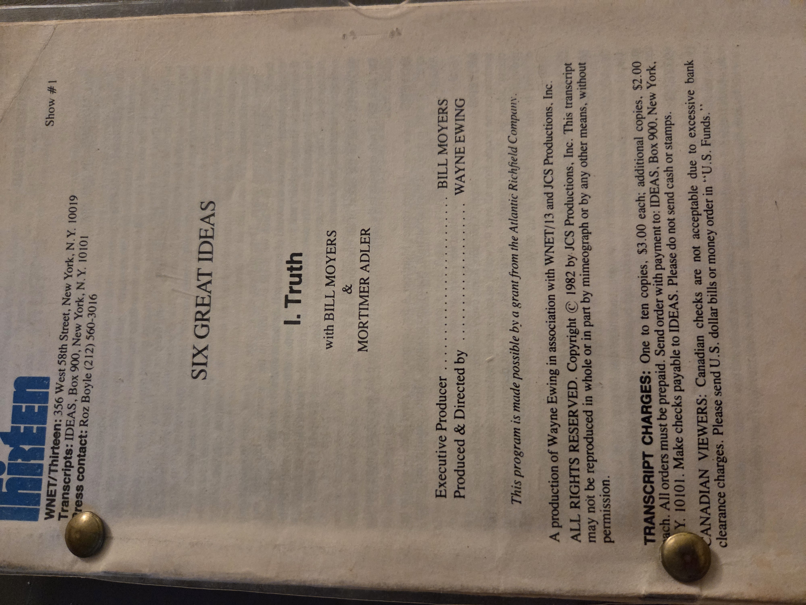
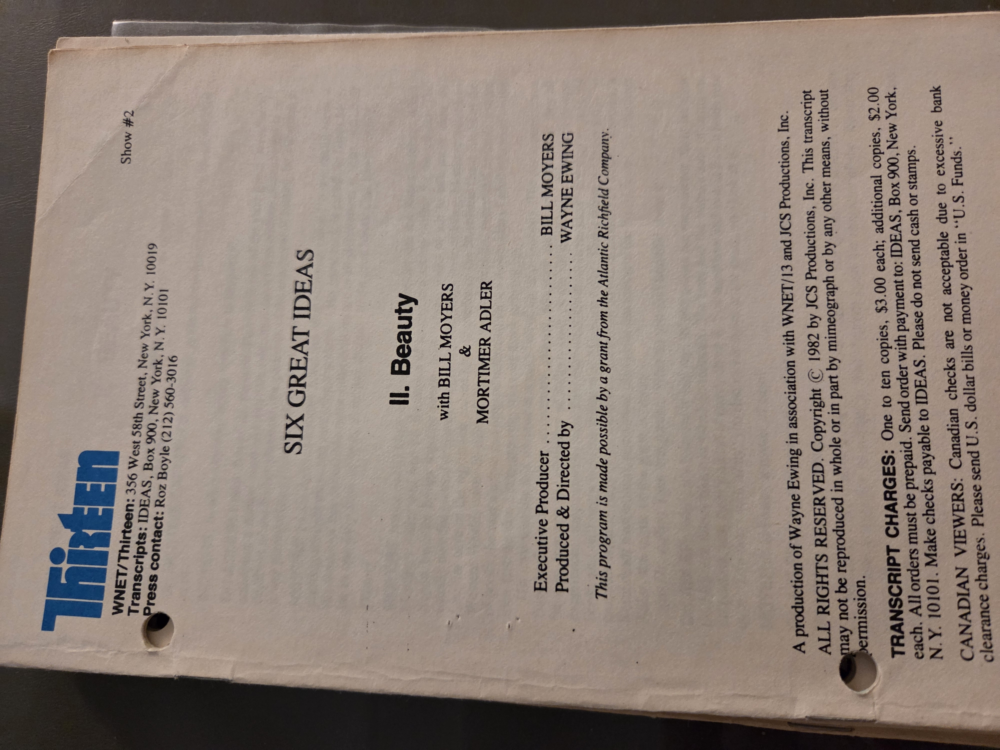
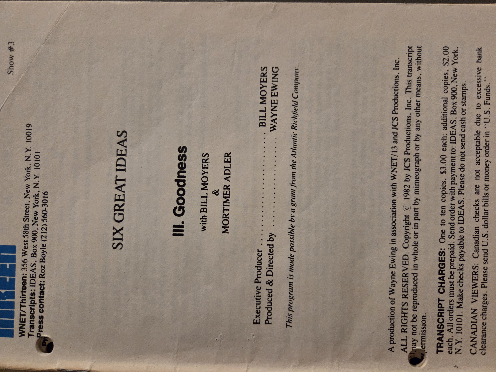
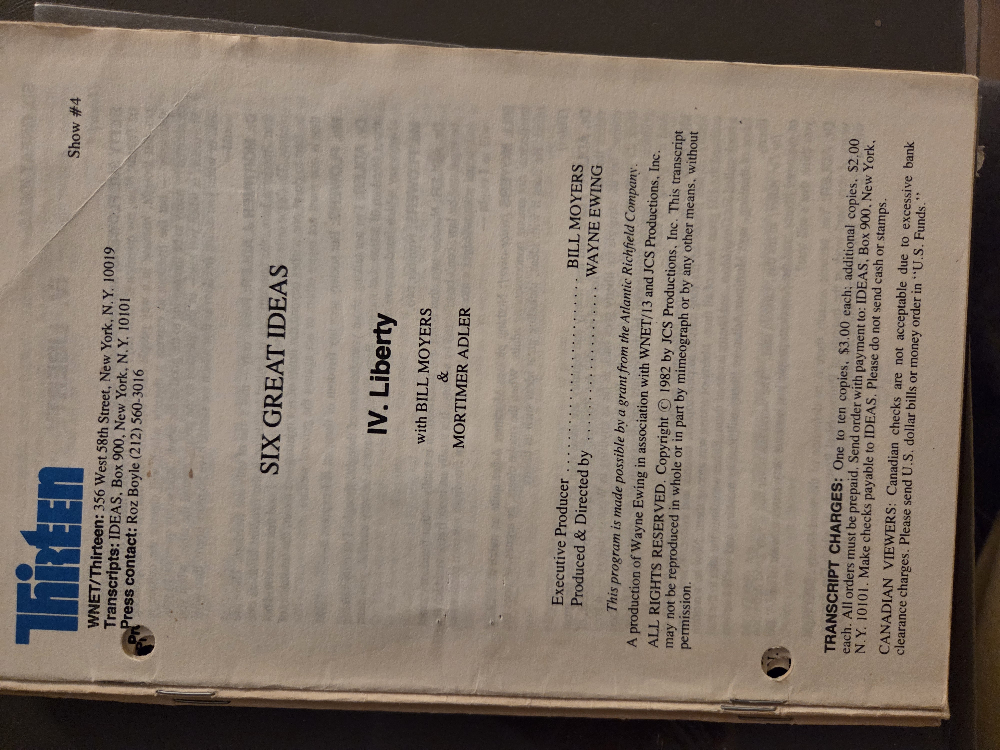
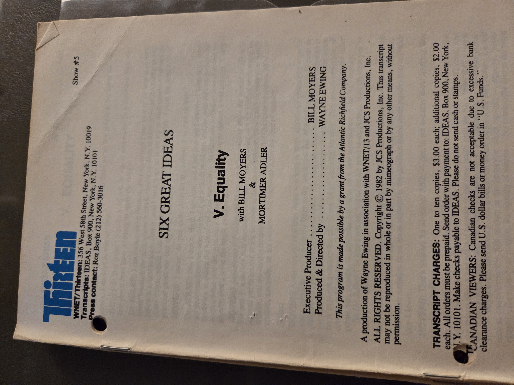
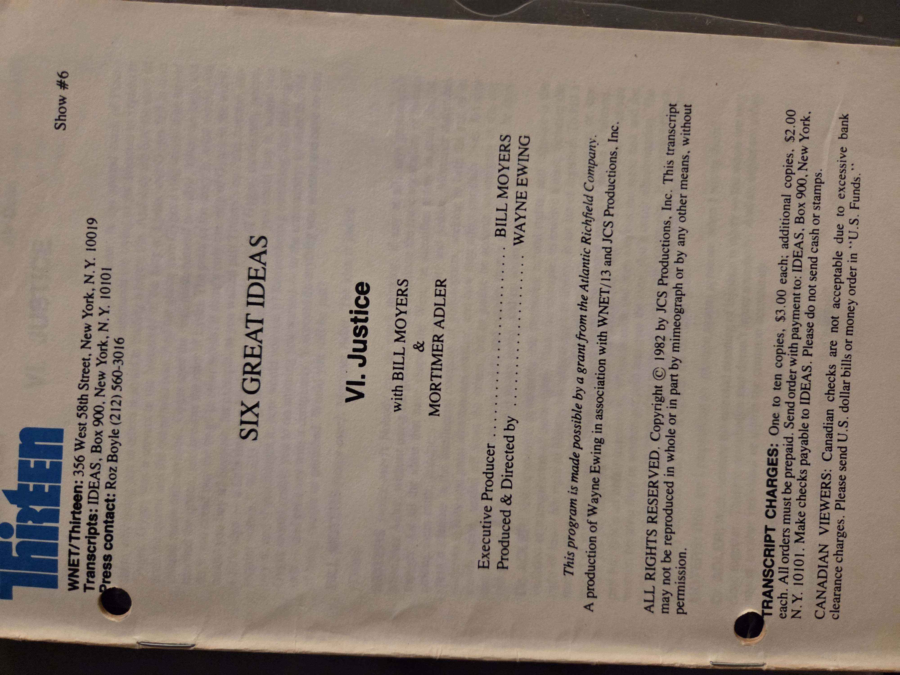

# Six Great Ideas — WNET/Thirteen Transcripts (1982)
**Series**: *Six Great Ideas* with Bill Moyers & Mortimer Adler  
**Producer/Director**: Wayne Ewing • **Executive Producer**: Bill Moyers  
**Transcripts copyright** © 1982 JCS Productions, Inc. • WNET/Thirteen, New York  
**Notes**: Program made possible by a grant from the Atlantic Richfield Company.  
**Type**: Television transcripts (pamphlets), set of six.

**Shelf**: BookCase01 / Shelf01  
**Local images**: stored alongside this `.md` (filenames below).

---

## Covers / Title Pages (by episode)
**I. Truth**  

**II. Beauty**  

**III. Goodness**  

**IV. Liberty**  

**V. Equality**  

**VI. Justice**  

---

## Contents (episode list)
1. **Truth** — how we know, standards of evidence, reason & faith  
2. **Beauty** — aesthetics, taste, and the meaning of art  
3. **Goodness** — ethics and the good life  
4. **Liberty** — freedom of thought and action, limits of state power  
5. **Equality** — persons, rights, and fairness in social orders  
6. **Justice** — law, rights, deserts, and the common good

---

## Why you should read this book (restored)
- **A gateway to the Great Conversation.** Adler distills the core ideas behind the Great Books/Syntopicon project into six approachable dialogues.  
- **Civic literacy in one sitting per theme.** Truth, Beauty, Goodness, Liberty, Equality, and Justice are the bedrock questions in classrooms, courts, galleries, and public life.  
- **Perfect for guided discussion.** The transcript format is modular: ideal for seminars, PTO/teacher nights, and your Truth-in-Translation teaching kits (pair an episode with short passages from Plato, Aquinas, Hume, Kant, Mill, or Rawls).  
- **Bridges scholarship and everyday life.** Moyers’ interviewing makes the abstractions practical—policy, media literacy, and moral reasoning all show up in plain language.  
- **Reusable across your projects.** Each episode maps cleanly onto your multi-reading-level materials (Simple/Layman/Learned) and can anchor lesson sequences or annotated readers.

---

## UDC classifications (restored, suggested)
> Exact notation can vary by UDC edition; use these as working shelf/class marks.

- **1** — Philosophy (general)  
- **1:3** — Interdisciplinary links to social sciences (series-wide)  
- **16** — Logic / methodology (criteria of **Truth**)  
- **7.01** — Aesthetics. Philosophy of art (**Beauty**)  
- **17** — Ethics. Moral philosophy (**Goodness**)  
- **321.01** — Political theory (**Liberty**)  
- **323** — Civil & political rights (**Liberty / Equality**)  
- **316.344.3** — Social equality; inequality studies (**Equality**)  
- **340.12** — Jurisprudence; theory of justice (**Justice**)

*(If your catalog prefers Dewey as secondary: 100; 121; 111/160 (logic); 111/701 (aesthetics); 170 (ethics); 320.01 (political theory); 323 (civil rights); 340.1 (jurisprudence).)*

---

## Bibliographic note
These are official WNET/Thirteen transcripts issued by **JCS Productions, Inc.** in 1982, sold via **IDEAS, Box 900, New York, NY 10101**. Reproduction is restricted; quotes for review/education should follow fair-use and transcript terms shown on the title pages.

---

## Suggested use in Shelf01
- File name: `SixGreatIdeas.md`  
- Companion images:  
  `SixGreatIdeas_Truth.jpg`, `SixGreatIdeas_Beauty.jpg`, `SixGreatIdeas_Goodness.jpg`,  
  `SixGreatIdeas_Liberty.jpg`, `SixGreatIdeas_Equality.jpg`, `SixGreatIdeas_Justice.jpg`

---

## Notes / Annotations (workspace)
- Add favorite pull-quotes per episode with page markers (e.g., **Truth**: correspondence vs. coherence; **Justice**: desert vs. fairness).  
- Cross-link to Shelf01 volumes on civic history and rights (e.g., *The Classic Slave Narratives*, *Making of the President 1972*, *Pentagon Papers*).
