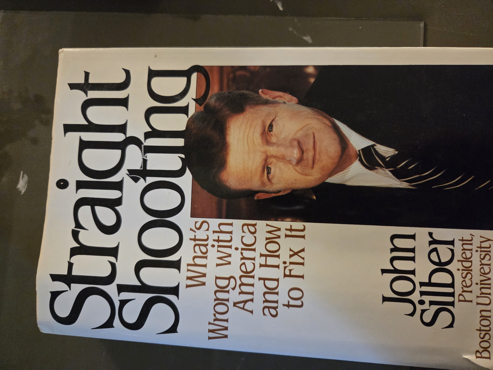
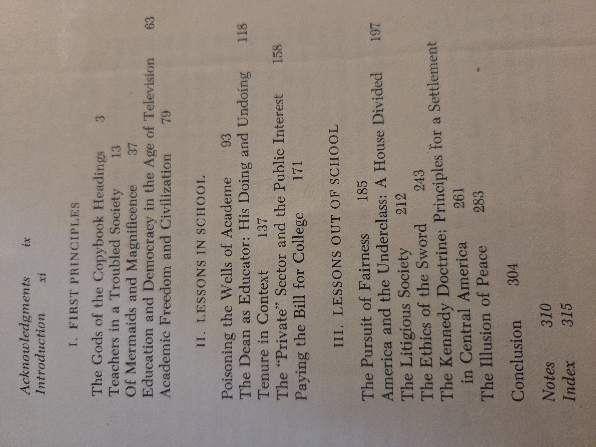

# Straight Shooting: What’s Wrong with America and How to Fix It (1989)

**Author:** John R. Silber  
**Publisher:** Harper & Row, Publishers, Inc., New York  
**Edition:** First edition, 1989  
**Designed by:** Sidney Feinberg  
**ISBN:** 0-06-016184-1  
**Subjects (LoC):** United States—Social conditions—1980– ; Education—United States ; U.S. politics & government—1977– ; Politics and education—United States ; Professional ethics—United States

---

## Cover

## Copyright / Publication Data

---

## Contents (scanned)

## Contents (typed)
- **Acknowledgments** ix  
- **Introduction** xi  

### I. First Principles
1. The Gods of the Copybook Headings — 3  
2. Teachers in a Troubled Society — 13  
3. Of Mermaids and Magnificence — 37  
4. Education and Democracy in the Age of Television — 63  
5. Academic Freedom and Civilization — 79  

### II. Lessons in School
6. Poisoning the Wells of Academe — 93  
7. The Dean as Educator: His Doing and Undoing — 118  
8. Tenure in Context — 137  
9. The “Private” Sector and the Public Interest — 158  
10. Paying the Bill for College — 171  

### III. Lessons out of School
11. The Pursuit of Fairness — 185  
12. America and the Underclass: A House Divided — 197  
13. The Litigious Society — 212  
14. The Ethics of the Sword — 243  
15. The Kennedy Doctrine: Principles for a Settlement in Central America — 261  
16. The Illusion of Peace — 283  

**Conclusion** — 304  
**Notes** — 310  
**Index** — 315

---

## Why You Should Read This Book

John Silber, longtime president of Boston University and a fierce voice in American education and political life, did not shy away from conflict. In *Straight Shooting*, he delivers a pointed critique of what he saw as moral relativism, academic decline, and political timidity—drawing on his career as educator, administrator, and sometimes combative public figure. The essays collected here range widely, touching on pedagogy, justice, geopolitics, and the fraying civic fabric of the late 20th century.

Readers interested in the intersection of education, ethics, and governance will find Silber’s unapologetically principled arguments thought-provoking—whether they agree with him or not. His prose is vigorous, his opinions unsparing, and his positions often controversial. The volume is both a window into one man’s formidable worldview and a challenge to contemporary complacency. Even for those who reject his conclusions, the sharpness of his analysis rewards engagement.

---

## UDC Classification

- **37.01** – Philosophy and theory of education  
- **32** – Politics  
- **316.4** – Social change, social structure  
- **174** – Professional ethics  
- **378** – Higher education (College and university level)

# Straight Shooting: What’s Wrong with America and How to Fix It (1989)

**Author:** John R. Silber  
**Publisher:** Harper & Row, Publishers, Inc., New York  
**Edition:** First edition, 1989  
**Designed by:** Sidney Feinberg  
**ISBN:** 0-06-016184-1  
**Subjects (LoC):** United States—Social conditions—1980– ; Education—United States ; U.S. politics & government—1977– ; Politics and education—United States ; Professional ethics—United States

---

## Cover

## Copyright / Publication Data

---

## Contents (scanned)

## Contents (typed)
- **Acknowledgments** ix  
- **Introduction** xi  

### I. First Principles
1. The Gods of the Copybook Headings — 3  
2. Teachers in a Troubled Society — 13  
3. Of Mermaids and Magnificence — 37  
4. Education and Democracy in the Age of Television — 63  
5. Academic Freedom and Civilization — 79  

### II. Lessons in School
6. Poisoning the Wells of Academe — 93  
7. The Dean as Educator: His Doing and Undoing — 118  
8. Tenure in Context — 137  
9. The “Private” Sector and the Public Interest — 158  
10. Paying the Bill for College — 171  

### III. Lessons out of School
11. The Pursuit of Fairness — 185  
12. America and the Underclass: A House Divided — 197  
13. The Litigious Society — 212  
14. The Ethics of the Sword — 243  
15. The Kennedy Doctrine: Principles for a Settlement in Central America — 261  
16. The Illusion of Peace — 283  

**Conclusion** — 304  
**Notes** — 310  
**Index** — 315

---

## Why You Should Read This Book

John Silber, longtime president of Boston University and a fierce voice in American education and political life, did not shy away from conflict. In *Straight Shooting*, he delivers a pointed critique of what he saw as moral relativism, academic decline, and political timidity—drawing on his career as educator, administrator, and sometimes combative public figure. The essays collected here range widely, touching on pedagogy, justice, geopolitics, and the fraying civic fabric of the late 20th century.

Readers interested in the intersection of education, ethics, and governance will find Silber’s unapologetically principled arguments thought-provoking—whether they agree with him or not. His prose is vigorous, his opinions unsparing, and his positions often controversial. The volume is both a window into one man’s formidable worldview and a challenge to contemporary complacency. Even for those who reject his conclusions, the sharpness of his analysis rewards engagement.

---

## UDC Classification

- **37.01** – Philosophy and theory of education  
- **32** – Politics  
- **316.4** – Social change, social structure  
- **174** – Professional ethics  
- **378** – Higher education (College and university level)

# Straight Shooting: What’s Wrong with America and How to Fix It (1989)

**Author:** John R. Silber  
**Publisher:** Harper & Row, Publishers, Inc., New York  
**Edition:** First edition, 1989  
**Designed by:** Sidney Feinberg  
**ISBN:** 0-06-016184-1  
**Subjects (LoC):** United States—Social conditions—1980– ; Education—United States ; U.S. politics & government—1977– ; Politics and education—United States ; Professional ethics—United States

---

## Cover

## Copyright / Publication Data

---

## Contents (scanned)

## Contents (typed)
- **Acknowledgments** ix  
- **Introduction** xi  

### I. First Principles
1. The Gods of the Copybook Headings — 3  
2. Teachers in a Troubled Society — 13  
3. Of Mermaids and Magnificence — 37  
4. Education and Democracy in the Age of Television — 63  
5. Academic Freedom and Civilization — 79  

### II. Lessons in School
6. Poisoning the Wells of Academe — 93  
7. The Dean as Educator: His Doing and Undoing — 118  
8. Tenure in Context — 137  
9. The “Private” Sector and the Public Interest — 158  
10. Paying the Bill for College — 171  

### III. Lessons out of School
11. The Pursuit of Fairness — 185  
12. America and the Underclass: A House Divided — 197  
13. The Litigious Society — 212  
14. The Ethics of the Sword — 243  
15. The Kennedy Doctrine: Principles for a Settlement in Central America — 261  
16. The Illusion of Peace — 283  

**Conclusion** — 304  
**Notes** — 310  
**Index** — 315

---

## Why You Should Read This Book

John Silber, longtime president of Boston University and a fierce voice in American education and political life, did not shy away from conflict. In *Straight Shooting*, he delivers a pointed critique of what he saw as moral relativism, academic decline, and political timidity—drawing on his career as educator, administrator, and sometimes combative public figure. The essays collected here range widely, touching on pedagogy, justice, geopolitics, and the fraying civic fabric of the late 20th century.

Readers interested in the intersection of education, ethics, and governance will find Silber’s unapologetically principled arguments thought-provoking—whether they agree with him or not. His prose is vigorous, his opinions unsparing, and his positions often controversial. The volume is both a window into one man’s formidable worldview and a challenge to contemporary complacency. Even for those who reject his conclusions, the sharpness of his analysis rewards engagement.

---

## UDC Classification

- **37.01** – Philosophy and theory of education  
- **32** – Politics  
- **316.4** – Social change, social structure  
- **174** – Professional ethics  
- **378** – Higher education (College and university level)

