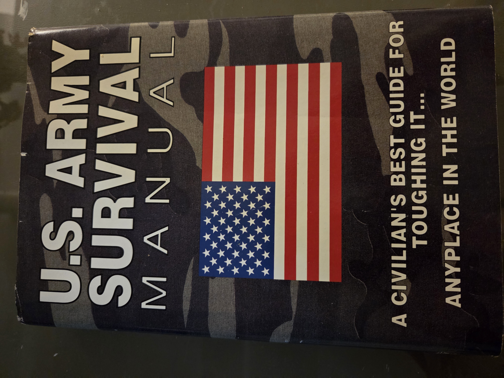
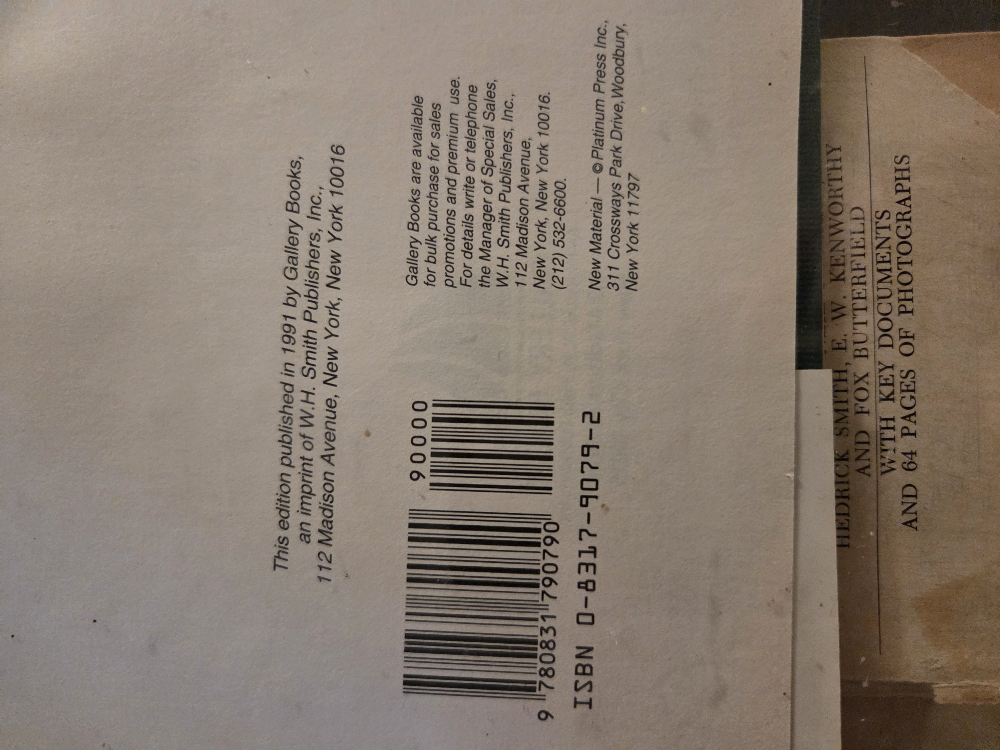
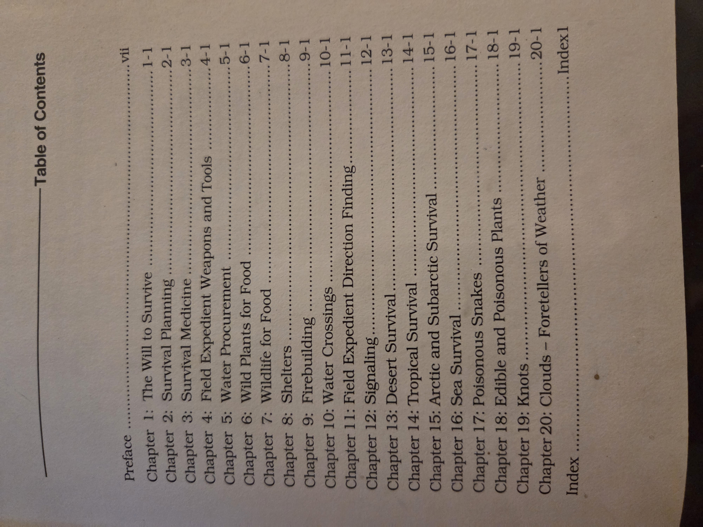

Awesome—thanks for the images and the heads-up on using plain filenames. Here’s a ready-to-paste `.md` in the Shelf01 house-style (with the restored sections). Save as `USArmySurvivalManual.md` in `books/BookCase01/Shelf01/` and you should be good.

---

# U.S. Army Survival Manual

*A civilian’s best guide for toughing it… anyplace in the world.*

**Shelf**: BookCase01 / Shelf01
**Publisher/Imprint**: Gallery Books (imprint of W.H. Smith Publishers, Inc.), New York
**Edition/Year**: 1991
**ISBN**: 0-8317-9079-2
**Notes**: Copyright page indicates “New Material — © Platinum Press Inc., 311 Crossways Park Drive, Woodbury, NY 11797.”

---

## Publication & Copyright

---

## Contents (from book)

* Preface vii

1. The Will to Survive (1-1)
2. Survival Planning (2-1)
3. Survival Medicine (3-1)
4. Field-Expedient Weapons and Tools (4-1)
5. Water Procurement (5-1)
6. Wild Plants for Food (6-1)
7. Wildlife for Food (7-1)
8. Shelters (8-1)
9. Firebuilding (9-1)
10. Water Crossings (10-1)
11. Field-Expedient Direction Finding (11-1)
12. Signaling (12-1)
13. Desert Survival (13-1)
14. Tropical Survival (14-1)
15. Arctic & Subarctic Survival (15-1)
16. Sea Survival (16-1)
17. Poisonous Snakes (17-1)
18. Edible & Poisonous Plants (18-1)
19. Knots (19-1)
20. Clouds — Foretellers of Weather (20-1)
    Index

---

## Why you should read this book

* **All-hazards readiness**: Clear, field-tested techniques for water, shelter, fire, signaling, and wayfinding across **desert, tropical, arctic, sea** and temperate environments.
* **Skill over gear**: Emphasizes methods you can execute with minimal or improvised tools—useful for backcountry travel, disaster prep, or teaching bushcraft.
* **Cross-disciplinary value**: Blends **first aid**, **botany (wild foods)**, **meteorology (cloud reading)**, and **navigation**—great for Scouts, outdoor programs, and field researchers.
* **Analog resilience**: A durable reference when power, GPS, or networks are down; ideal to pair with your practical drills binders.
* **Teach-able modules**: Each chapter aligns with class-length lessons (e.g., water procurement lab; knots practicum; edible plants ID walk).
* **Complements your library**: Pairs well with exploration journals (e.g., Cook/Ledyard) and primary sources on human endurance and adaptation.

---

## Suggested UDC classifications

*(Pick the primary that matches your cataloging intent; add auxiliaries for region/form where desired.)*

* **796.5** — Outdoor life. Mountaineering, camping, hiking (core “bushcraft/survival” shelving).
* **613.69** — Personal safety and protection in emergencies; survival techniques.
* **614.8** — Accidents and emergencies. Accident prevention and response (civil defense / rescue context).
* **355**(094.3):**(02)** — Military field manuals; survival/field-craft (if you want it in a military-science strand).
* **551.5** — Meteorology (for the “Clouds—Foretellers of Weather” chapter).
* **581.6** — Useful plants; wild edible plants (for plant identification/foraging sections).

**Examples of combined notations (optional):**

* **796.5:613.69** (outdoor skills with personal safety emphasis)
* **796.5+551.5+581.6** (outdoor skills + weather + wild plants)
* **355(02):796.5** (military manual presented for civilian outdoor practice)

---

## Librarian’s quick notes

* Practical, modular chapters make this an excellent **hands-on teaching text** for weekend skills workshops.
* Consider printing **laminated quick cards** for: *water procurement*, *shelter forms*, *signal priorities*, and *10 essential knots*.
* Cross-reference in your catalog to: **first-aid handbooks**, **local flora field guides**, and **map & compass navigation** titles.

---

