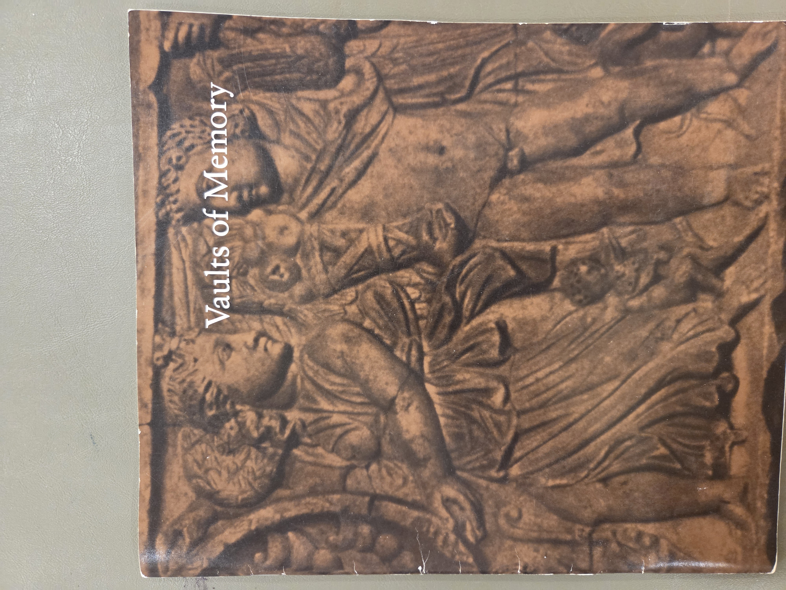
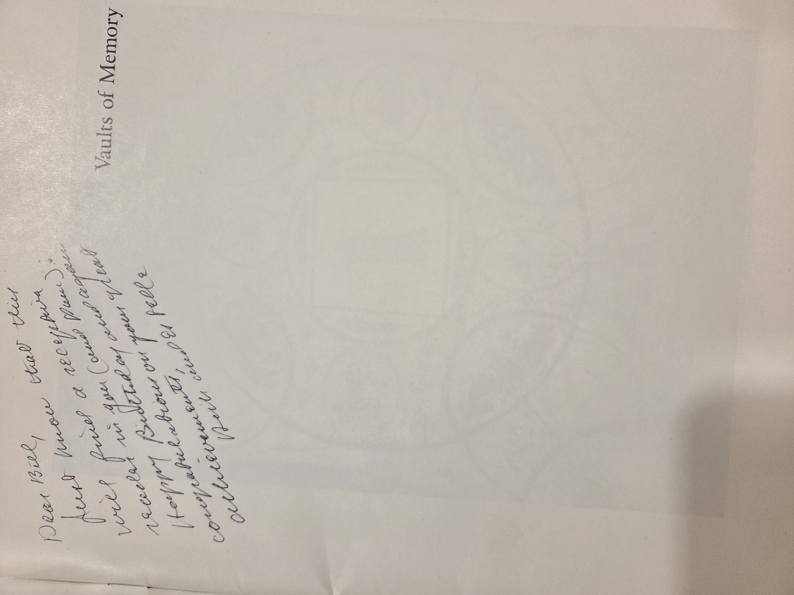
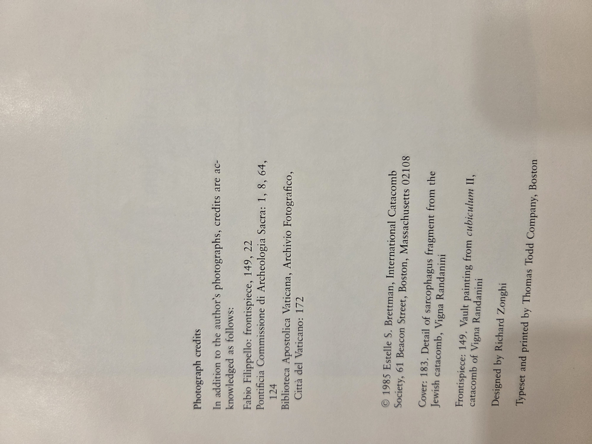

Here’s a ready-to-drop-in **VaultsOfMemory.md** that follows the same “Card Catalog” house style as your Shelf01 entries and the AgeOfChivalry card you approved.
(It assumes the four JPGs sit in the **same folder** as this `.md`. If you keep images in a subfolder, just prefix the filenames accordingly.)

---

# Vaults of Memory — Jewish and Christian Imagery in the Catacombs of Rome

**BookCase01 → Shelf03 → Volume 02**

**Creator/Author**: *Estelle Shohet Brettman*
**Work type**: Exhibition catalog
**Imprint**: Boston (MA): *International Catacomb Society*, 1985
**Physical**: illus.; 28 cm (approx.)
**Designed by**: Richard Zonghi
**Printer**: Thomas Todd Company, Boston
**Photo credits (sel.)**: Fabio Filippello; Pontificia Commissione di Archeologia Sacra; Biblioteca Apostolica Vaticana (Archivio Fotografico) — plus the author’s photographs.
**Rights note**: © 1985 Estelle S. Brettman / International Catacomb Society. Scans here are for catalog/educational reference.

---

## Cover

---

**Title‐page statement**
*Vaults of Memory: Jewish and Christian Imagery in the Catacombs of Rome — An Exhibition*
*Estelle Shohet Brettman* • *International Catacomb Society* • Boston, Massachusetts • 1985

---

## Provenance / Copy notes (this copy)

*Handwritten presentation note on front flyleaf to “Bill” (full hand not transcribed here); see image.*

---

## Publication data & credits

* © 1985 Estelle S. Brettman; International Catacomb Society, 61 Beacon Street, Boston, MA 02108.
* **Cover image**: Detail of sarcophagus fragment from the Jewish catacomb, *Vigna Randanini*.
* **Frontispiece**: Vault painting from *cubicula* II, catacomb of Vigna Randanini.
* **Design**: Richard Zonghi. **Typeset/printed**: Thomas Todd Company, Boston.
* Additional photo acknowledgments listed on page (see image).

---

## Contents (as printed)

> For verification and citation, use the photographed tables below. (OCR is intentionally **not** supplied here so the images remain the reference of record per Shelf01 practice.)

---

## Subject tags (shelf keywords)

* Roman catacombs; Jewish catacombs — Vigna Randanini
* Early Christian art & iconography
* Funerary art; epigraphy & symbols (menorah, lulav, etrog, etc.)
* Rome — archaeology; late antiquity
* Exhibition catalogs — Boston (MA)

---

## Condition / handling

Trade paper exhibition catalog; typical shelf/edge wear; clean interior; strong image plates. Keep flat in mylar.

---

## Shelf navigation

* **Shelf03 (BookCase01)**

  * Vol. 01 — *The Age of Chivalry* — *(completed)*
  * **Vol. 02 — *Vaults of Memory* (this entry)**
  * Vol. 03 — *(placeholder)*
  * Vol. 04 — *(placeholder)*

---

### Notes to future me

* If you later host images in `assets/BookCase01/Shelf03/VaultsOfMemory/`, update the four links at top accordingly.
* For cross-collection context, link this volume from any entries on catacomb iconography or late antique Judaism/Christianity in your Catalog.
