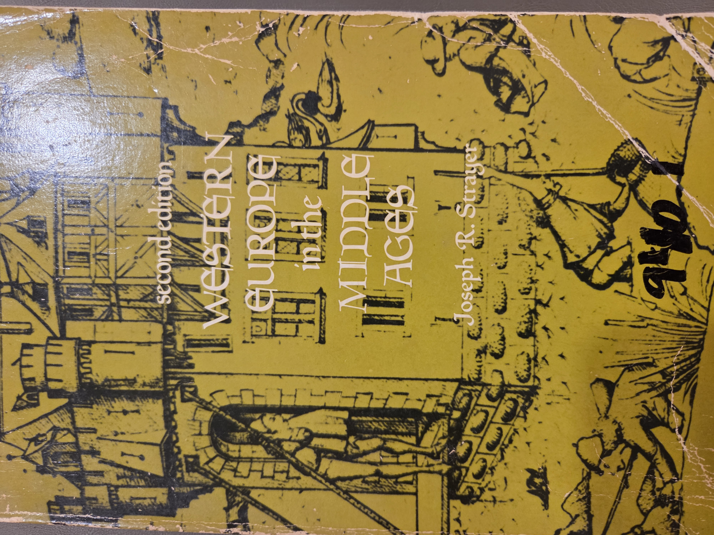
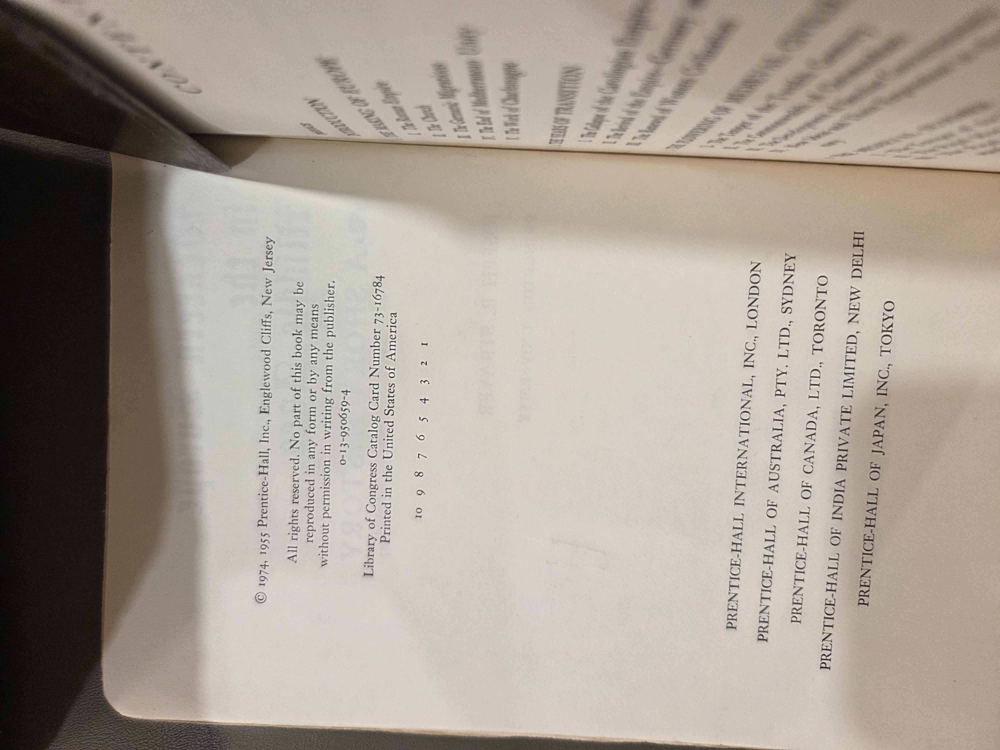
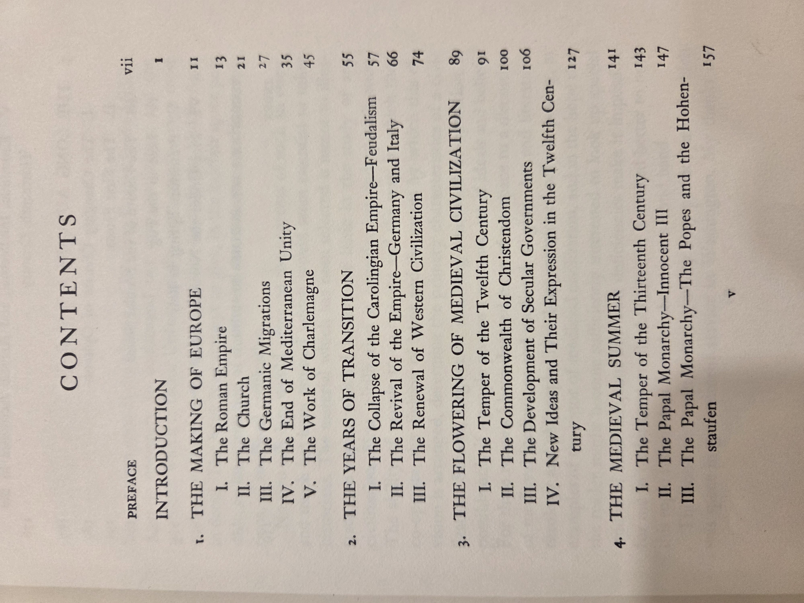
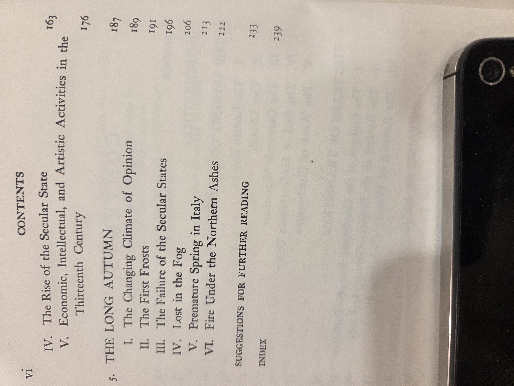

# Western Europe in the Middle Ages (2nd ed.)

**Author**: Joseph R. Strayer  
**Publisher**: Prentice-Hall, Englewood Cliffs, New Jersey  
**Edition**: Second edition (1974; first edition 1955)  
**ISBN**: 0-13-950659-4  
**LCCN**: 73-16784  
**Printing note**: number line shown as `10 9 8 7 6 5 4 3 2 1`  
**Format**: Trade paperback  
**Pages**: 239 pp. (index at p. 239)

> A classic single-volume survey of medieval European history by Joseph R. Strayer, suitable as a concise course text and desk reference for timelines, institutional development, and period framing.

---

## Shelf navigation

- **Shelf**: BookCase01 → Shelf03  
- **Vol. 01**: _Age of Chivalry_ — National Geographic (placeholder link)  
- **Vol. 02**: _Vaults of Memory_ — E. S. Brettman (placeholder link)  
- **Vol. 03**: _Western Europe in the Middle Ages_ — **this volume**  
- **Vol. 04**: _(placeholder)_  
- **Vol. 05**: _(placeholder)_

---

## Cover and imprint

*Front matter / copyright*

**Imprint details (from image):** © 1974, 1955 Prentice-Hall, Inc., Englewood Cliffs, N.J.; Library of Congress Catalog Card Number 73-16784; Printed in the United States of America. ISBN 0-13-950659-4. International Prentice-Hall branches listed (London; Sydney; Toronto; New Delhi; Tokyo).

---

## Table of contents (from images)

**Preface** vii  
**Introduction** 1

### 1. The Making of Europe — 11
- I. The Roman Empire — 13  
- II. The Church — 21  
- III. The Germanic Migrations — 27  
- IV. The End of Mediterranean Unity — 35  
- V. The Work of Charlemagne — 45

### 2. The Years of Transition — 55
- I. The Collapse of the Carolingian Empire — Feudalism — 57  
- II. The Revival of the Empire — Germany and Italy — 66  
- III. The Renewal of Western Civilization — 74

### 3. The Flowering of Medieval Civilization — 89
- I. The Temper of the Twelfth Century — 91  
- II. The Commonwealth of Christendom — 100  
- III. The Development of Secular Governments — 106  
- IV. New Ideas and Their Expression in the Twelfth Century — 127

### 4. The Medieval Summer — 141
- I. The Temper of the Thirteenth Century — 143  
- II. The Papal Monarchy — Innocent III — 147  
- III. The Papal Monarchy — The Popes and the Hohenstaufen — 157  
- IV. The Rise of the Secular State — 163  
- V. Economic, Intellectual, and Artistic Activities in the Thirteenth Century — 176

### 5. The Long Autumn — 187
- I. The Changing Climate of Opinion — 189  
- II. The First Frosts — 191  
- III. The Failure of the Secular States — 196  
- IV. Lost in the Fog — 206  
- V. Premature Spring in Italy — 213  
- VI. Fire Under the Northern Ashes — 222

**Suggestions for Further Reading** — 233  
**Index** — 239

> TOC transcribed for search and consistency with Shelf01. See photos above for verification.

---

## Notes and use

- **Why on this shelf**: pairs well with _Age of Chivalry_ (illustrated cultural survey) and _Vaults of Memory_ (late antique/early Christian material culture) to bracket the long medieval period with a clear political-institutional spine.  
- **Good for**: quick dating of turning points (Carolingian consolidation; 12th-century renaissance; 13th-century papal monarchy; late-medieval crises), concise descriptions of institutions (empire, papacy, secular states).  
- **Limitations**: single-author survey from mid-20th-century perspective; consult recent syntheses for newer interpretive trends.

---

## Provenance and condition

- Paperback with noticeable edge wear; hand-written mark on cover (“946.1”) likely an old shelving/call mark or price.  
- Clean interior in current copy.

---

## Catalog images (low-res for index)

---

### Fair-use note

This entry is a personal “card catalog” record. Images are low-resolution documentary photos of the physical copy for identification, citation, and non-commercial research. No full-text reproduction is provided.

