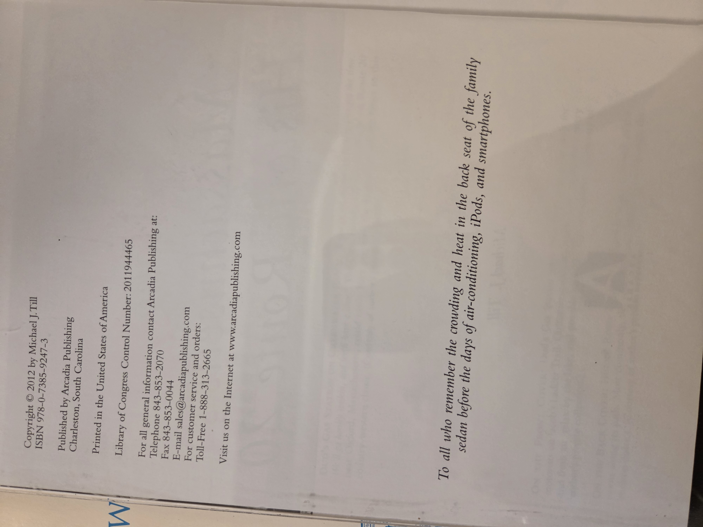
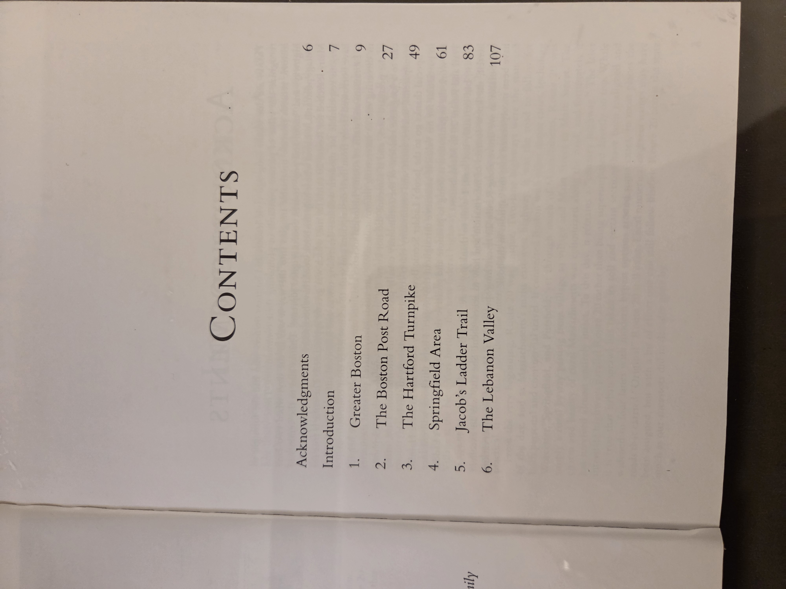

# Along Massachusetts’s Historic Route 20

**Author:** Michael J. Till  
**Publisher:** Arcadia Publishing  
**Series:** Postcard History Series  
**Publication Year:** 2012  
**ISBN:** 978-0-7385-9247-3  
**Library of Congress Control Number:** 2011944465  
**Place of Publication:** Charleston, South Carolina  
**Printer Location:** United States of America  

---

## Cover

---

## 📖 Click to display copyright page (optional)

Click to view

---

## 📖 Click to display table of contents (optional)

Click to view

---

## Table of Contents

1. Greater Boston – p.9  
2. The Boston Post Road – p.27  
3. The Hartford Turnpike – p.49  
4. Springfield Area – p.61  
5. Jacob’s Ladder Trail – p.83  
6. The Lebanon Valley – p.107  

---

## UDC Classification

**Primary Category:** Local History, Transportation  
**Keywords:**  
- U.S. Route 20 – Massachusetts  
- Postcard collections – Historical highways  
- Road travel history – New England  
- Michael J. Till archives  

---
