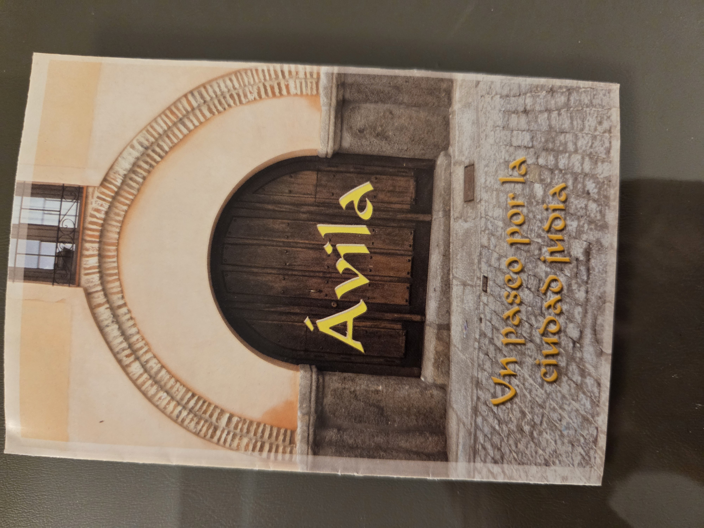
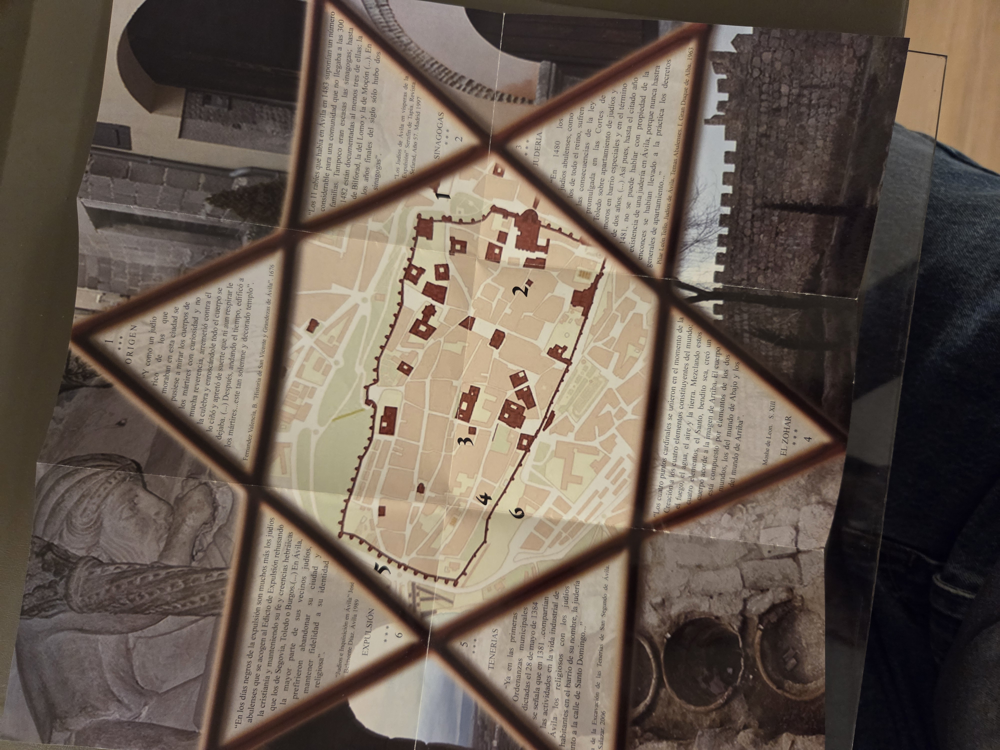

# Ávila: Un Paseo por la Ciudad Judía

---

## Bibliographic Information

- **Title:** Ávila: Un paseo por la ciudad judía
- **Authors:** Juan Carlos García, Santiago Herrero, José Manuel Velayos
- **Photography:** Francisco Fabián, Santiago Herrero
- **Publisher:** TURAVILA, GUÍAS DE TURISMO C.B.
- **Printer:** MARCAM C.B., Ávila
- **Legal Deposit:** Dep. Leg. AV - 127 - 2007
- **Acknowledgments:** Parroquia de San Vicente

---

## Institutional Sponsors

- Ciudad de Ávila (De los Leales Caballeros, Ávila del Rey)
- Red de Juderías de España: Caminos de Sefarad

---

## Map

The included map outlines the key areas of Jewish historical interest in the city of Ávila. Each numbered zone highlights a portion of the city’s Sephardic heritage, framed visually within a Star of David. 

### Featured Sections on the Map:

1. **Origen** – Discusses early Jewish life and presence in Ávila, citing historical documents.
2. **Sinagogas** – Locations of historical synagogues and Jewish communities.
3. **Judería** – Central Jewish quarter and its transformation over time.
4. **El Zohar** – References to Jewish mysticism, including mention of the Zohar.
5. **Tenerías** – The area of traditional tanneries used by Jewish artisans.
6. **Expulsión** – Narratives of the 1492 expulsion and impact on Ávila’s Jewish population.

Quotes and citations from historical sources (e.g., Fernández Varela, Moshé de León) and period documentation provide context to each map area.

---

## Summary

This guide offers a cultural and historical journey through Ávila’s Jewish heritage. It visually maps out notable locations and frames them within textual excerpts describing the religious, social, and political life of the Jewish community from medieval times through the expulsion in 1492. The material is visually enriched with architectural photographs and symbolic graphics to deepen the cultural narrative.

