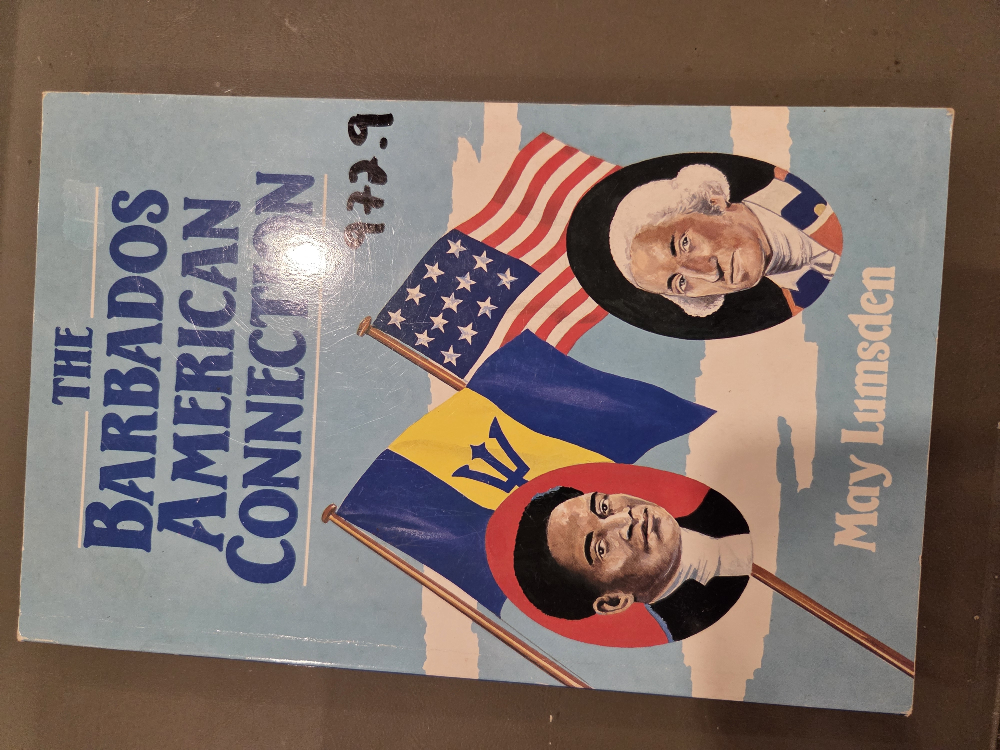
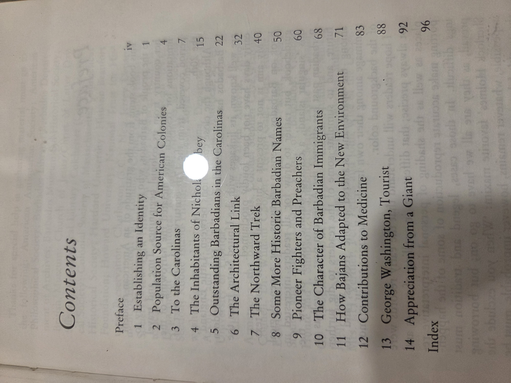

# The Barbados–American Connection — Handler & Homicz

*The Influence of Barbadian Culture and Institutions on the American Colonies*

## Why read this

This slim but insightful volume sheds light on a rarely examined origin of American colonial culture: the deep political, economic, and institutional ties between 17th-century Barbados and the mainland colonies. It’s a useful and accessible introduction for readers interested in the transatlantic links that shaped early America, particularly the Carolinas.

## What it’s about (concise overview)

The book argues that early Barbados—Britain’s most important Caribbean colony in the 17th century—exerted a profound influence on the development of American colonial institutions, particularly in South Carolina and other southern mainland colonies. Drawing on social history and migration patterns, the authors show how Barbadian settlers transplanted plantation systems, slavery-based economies, legal codes, and political structures across the Atlantic. It’s a focused regional study that contributes to a more interconnected view of Atlantic history.

## Table of contents (from this copy)

- **Preface**, p. v  
- **1. The Barbadian Background**, p. 1  
- **2. Early Barbadian Migration to Carolina**, p. 15  
- **3. Cultural Transfer: The Plantation Model**, p. 35  
- **4. Social Structure and Slavery**, p. 53  
- **5. Legal and Political Institutions**, p. 67  
- **Conclusion**, p. 83  
- **Appendix: Select Bibliography**, p. 87

  
Show original TOC scans (optional)

  

## Author & perspective

Jerome S. Handler is a noted anthropologist and historian with deep expertise in Caribbean slavery and culture, while Frederick Homicz is a research associate who has worked extensively on Barbadian colonial history. Their collaboration emphasizes interdisciplinary and cross-regional analysis, combining archaeological, historical, and sociological perspectives. The authors’ background ensures an attentive treatment of African diasporic and plantation society dynamics.

## Reception & impact

Originally published in Barbados, the book has had more regional than global scholarly impact, but it has been cited in Atlantic studies and early American history for its clear articulation of the Caribbean’s role in shaping southern colonial institutions. It remains a useful teaching and reference text, especially in diaspora studies.

## Scope & style

Focused on the 17th and early 18th centuries, this work deals primarily with the cultural and institutional influence of Barbados on early Carolina. It is written in clear, non-technical prose, suitable for general readers and undergraduates. It includes useful maps, tables, and a select bibliography, making it a good entry point for further study.

## Publication & readership

This is a softcover trade edition, published by Caribbean Graphics in collaboration with Letchworth Press. It appears to be aimed at general readers with an interest in Caribbean or American colonial history, as well as students of diaspora studies and Atlantic history.

## UDC subject classification (searchable)

- **Primary**: `325(729.1)` Emigration and immigration — Barbados  
- **Secondary**: `94(73)` U.S. history; `316.7` Social structure  
- **Notes**: Focus on migration from Barbados and institutional transfer to U.S. South.

## At-a-glance facts

* Year: 1990 | Pages: 90 | Format: PB | ISBN: 9768054063  
* Dimensions (mm): H 226 × W 153 × T 6  
* Shelf location: BookCase01 › Shelf 4 › Section  › Pos 3

## Related items in this library

- _Making of the West Indies_ — Brereton & Pares  
- _Bermuda's Story_ — Wilfred Brenton Kerr  
- _1991 Caribbean_ — Insight Guides  

