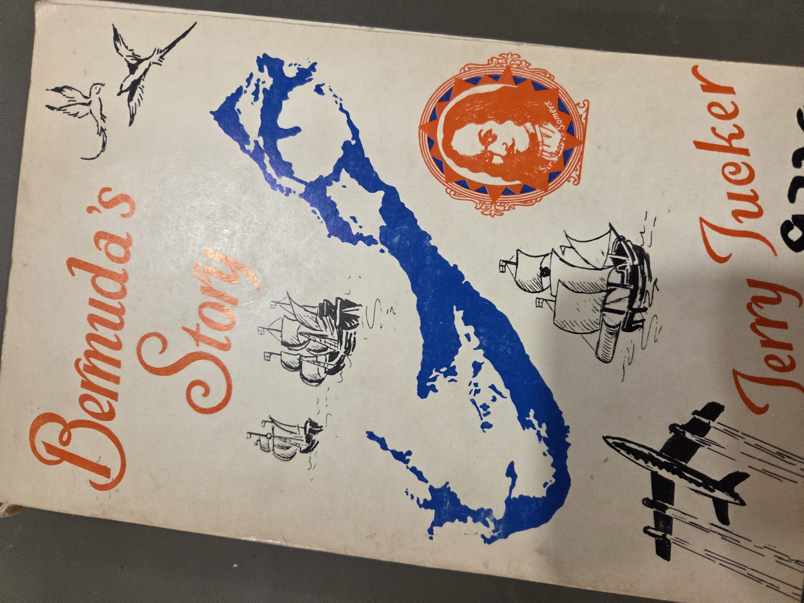
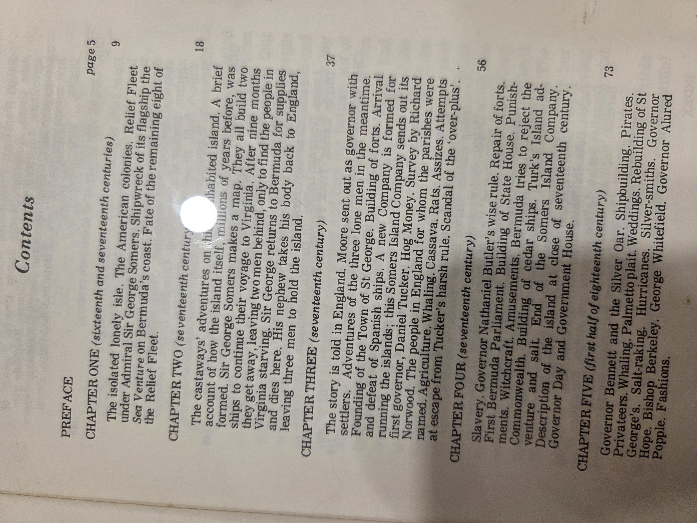
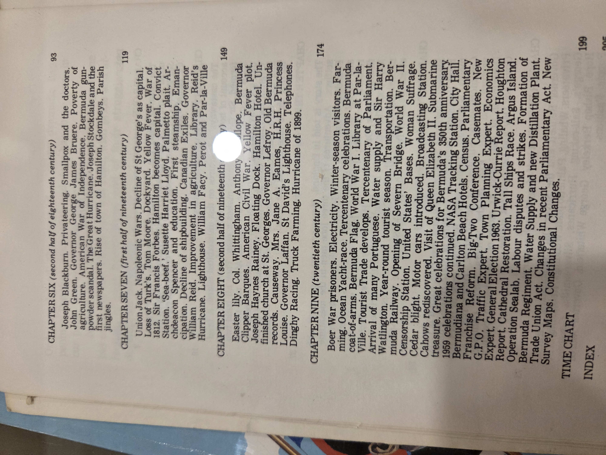

# *Bermuda’s Story* – Jerry Tucker

---

### Table of contents (from this copy’s contents pages)

<strong>Show original TOC scans (optional)</strong>

  

- Chapter One – Discovery and Settlement
- Chapter Two – Early Hardships
- Chapter Three – The Struggle for Control
- Chapter Four – Commerce and Expansion
- Chapter Five – Changing Times
- Chapter Six – New Growth and Prosperity
- Chapter Seven – A Time of Crisis
- Chapter Eight – War Again
- Chapter Nine – From Colony to Country
- A Time Chart of Events
- Index

---

### CIP data and classification

*Not available from this volume.*

**Suggested UDC Classification:**  
930.9(729.9) – History of Bermuda  
325 – Colonization, emigration, immigration  
994 – General history of other areas: Atlantic territories

---

### Why you should read this book

*Bermuda’s Story* delivers an accessible, chapter-oriented history of Bermuda from its earliest encounters with Europeans through the modern period. Especially useful for readers new to Bermudian history, this volume captures the island’s maritime roots, colonial governance, and transition toward greater autonomy. It is commonly used in local educational settings, making it both a cultural artifact and practical survey.

---

### Author & perspective

Jerry Tucker presents a concise historical narrative of Bermuda from discovery through the twentieth century, focusing on colonial settlement, maritime history, and political evolution. The work blends accessible prose with an emphasis on key figures and local developments.

---

### Reception & impact

Used in Bermudian schools and general-interest contexts, this title serves as a foundational introduction to Bermudian history for local readers and students. Its segmented, chronological structure emphasizes educational clarity over analytical depth.

---

### Scope & style

- **Scope:** Bermuda from early European contact through the 1900s.
- **Style:** Straightforward, chapter-based historical overview with summaries at chapter heads; mixes narrative and topical highlights (e.g., shipwrecks, governors, tourism).
- **Structure:** Nine chapters grouped chronologically by century, followed by a time chart and index.

---
