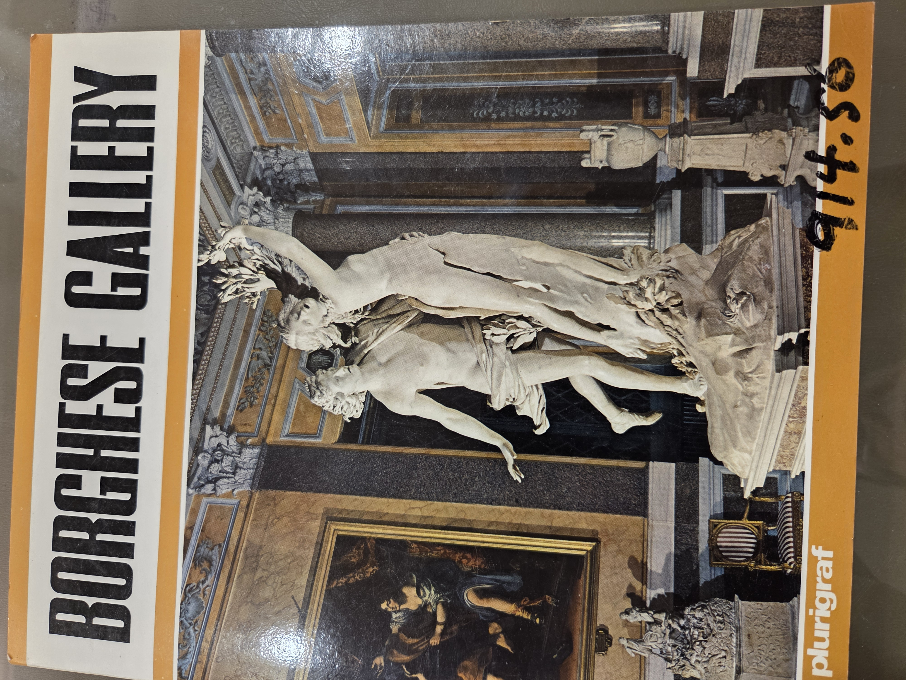

# Borghese Gallery

## Floor Plans

### Ground Floor (Pianterreno)

- **Sala di Enea e Anchise**
- **Sala degli Imperatori**
- **Cappella**
- **Sala dell’Apollo e Dafne**
- **Sala del Davide**
- **Sala di Paolina Borghese**
- **Sala del Fauno Danzante**
- **Sala Egizia**
- **Salone d’Ingresso**
- **Portico**

### Upper Floor (Piano Superiore)

- **Sala della Danae del Correggio**
- **Dosso Dossi**
- **Sala dell’Amor Sacro e Profano**
- **Tiziano, Veronese, Bellini, Antonello da Messina**
- **Sala del Lanfranco - Caravaggio - Bernini - Domenichino - Albani - Guercino**
- **Sala d’Ingresso**
- **Sala di Raffaello**
- **Sala della Venere del Cranach**
- **Andrea del Sarto, Sodoma, Bronzino, Giampietrino**
- **Giulio Romano, Tibaldi, Pulzone, Bacicacca**
- **Pietro da Cortona**
- **Savoldo, Lotto, Palma il Vecchio**

### Notable Artists by Room Clusters

- **Passaggio Rooms:**
  - Rubens, Bril, Codde, Scarsellino, Bassano, Savoldo
  - Barocci, Francia, Mazzolino, Ortolano, Bernini

- **Sala della Terrazza Artists:**
  - Sala dell’Amor Sacro e Profano: Tiziano, Veronese, Bellini, Antonello da Messina

---

## Contents (Index)

1. Villa Borghese and the Gallery – Page 3  
2. Classical Mosaics and Sculpture – Page 9  
3. Baroque and Neoclassical Sculpture – Page 13  
4. Renaissance Paintings – Page 25  
5. Baroque Paintings – Page 47  
6. The Marbles – Page 59  
7. Index – Page 63

