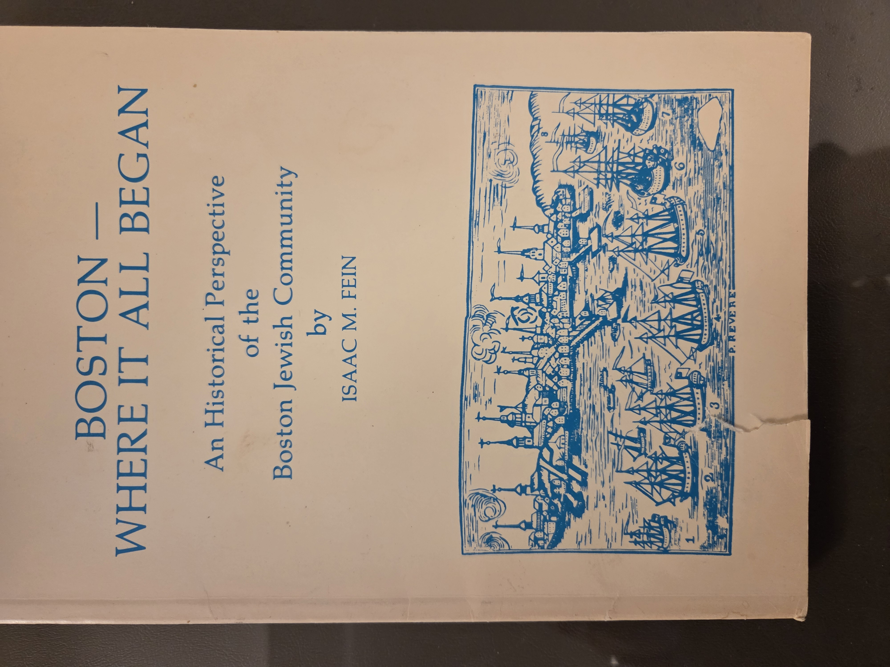
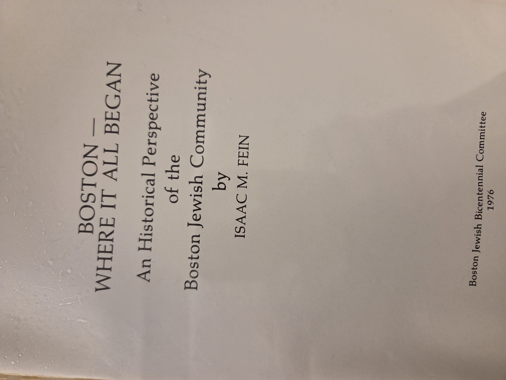
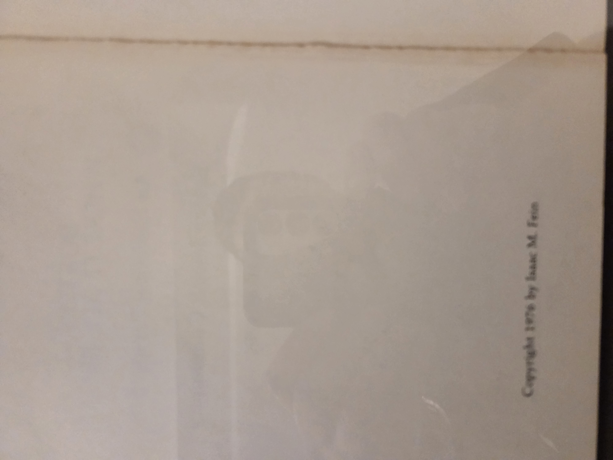
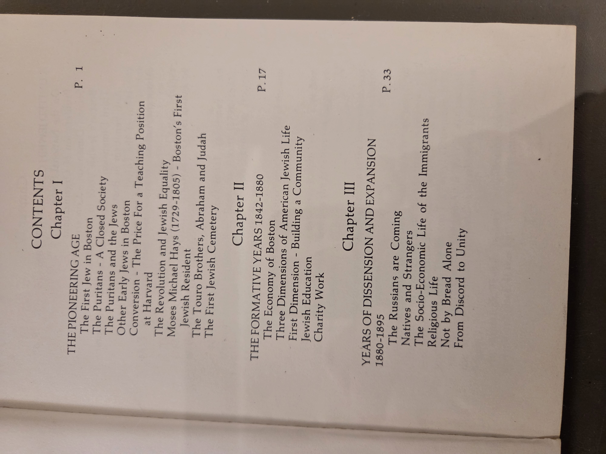
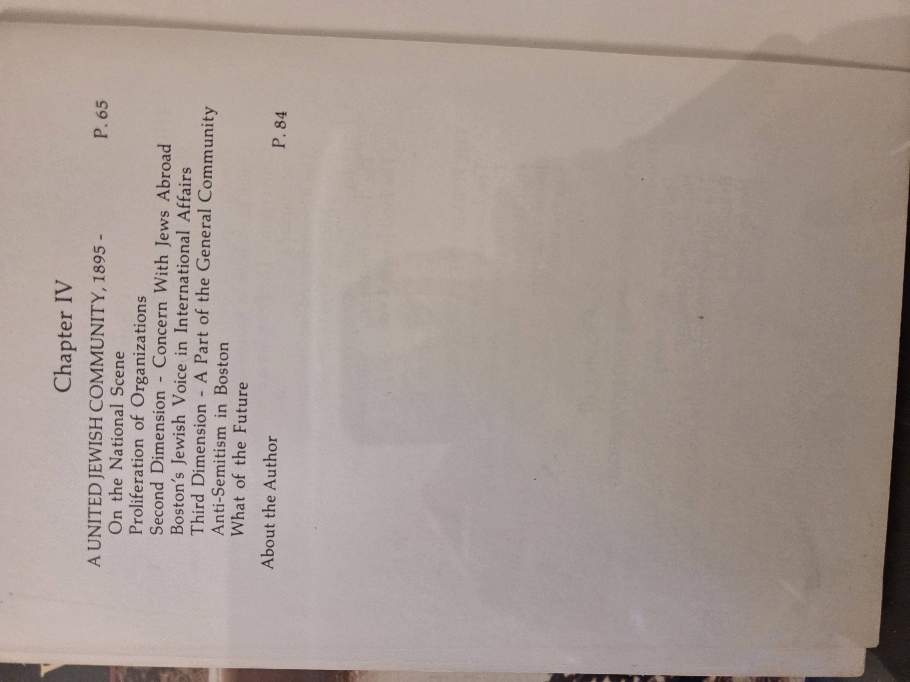

# Boston — Where It All Began

**An Historical Perspective of the Boston Jewish Community**
**Author**: Isaac M. Fein
**Published by**: Boston Jewish Bicentennial Committee, 1976
**Copyright**: 1976 by Isaac M. Fein

---

## Contents

### Chapter I — The Pioneering Age

* The First Jew in Boston (p.1)
* The Puritans – A Closed Society
* The Puritans and the Jews
* Other Early Jews in Boston
* Conversion – The Price For a Teaching Position at Harvard
* The Revolution and Jewish Equality
* Moses Michael Hays (1729–1805) – Boston's First Jewish Resident
* The Touro Brothers, Abraham and Judah
* The First Jewish Cemetery

### Chapter II — The Formative Years 1842–1880

* The Economy of Boston (p.17)
* Three Dimensions of American Jewish Life

  * First Dimension – Building a Community
  * Jewish Education
  * Charity Work

### Chapter III — Years of Dissension and Expansion 1880–1895

* The Russians are Coming (p.33)
* Natives and Strangers
* The Socio-Economic Life of the Immigrants
* Religious Life
* Not by Bread Alone
* From Discord to Unity

### Chapter IV — A United Jewish Community, 1895–

* On the National Scene (p.65)
* Proliferation of Organizations
* Second Dimension – Concern With Jews Abroad
* Boston's Jewish Voice in International Affairs
* Third Dimension – A Part of the General Community
* Anti-Semitism in Boston
* What of the Future

---

**About the Author** (p.84)

---

