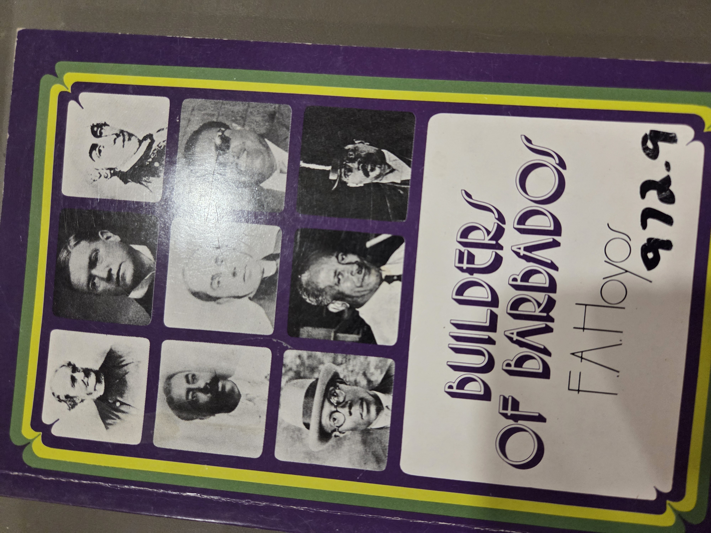
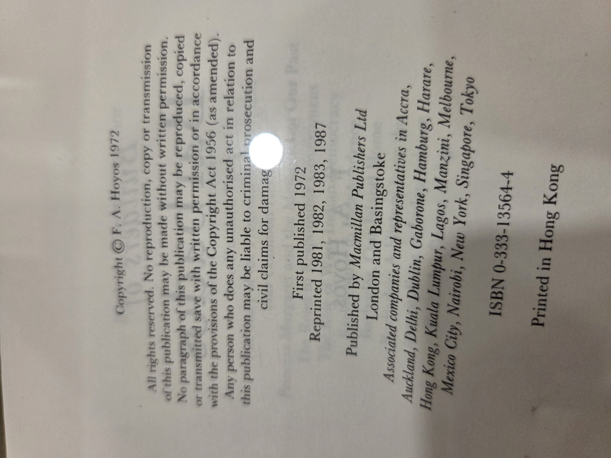
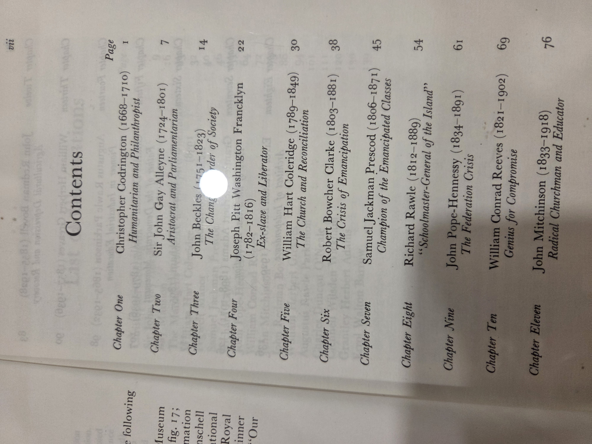
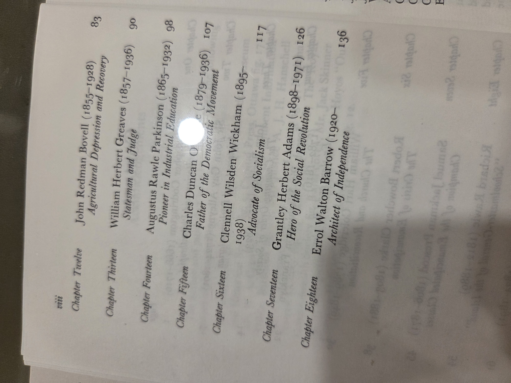

# Builders of Barbados

**Author**: F.A. Hoyos
**Published**: 1972
**Publisher**: *Macmillan Publishers Ltd*, London and Basingstoke
**ISBN**: 0-333-13564-4
**UBC Library Classification**: 972.9
**Edition Notes**: Reprinted 1981, 1982, 1983, 1987
**Printing**: Printed in Hong Kong
**Copyright**: © F.A. Hoyos 1972

## Summary

This volume presents biographical profiles of eighteen major Barbadian figures who played pivotal roles in the shaping of Barbadian society. Spanning the eighteenth to the twentieth century, these individuals include humanitarians, politicians, judges, educators, reformers, and statesmen. Hoyos’ work captures both the evolving colonial context and the movement toward social reform, emancipation, and independence.

## Contents

**Chapter One**
*Christopher Codrington (1668–1710)* — *Humanitarian and Philanthropist* — Page 1

**Chapter Two**
*Sir John Gay Alleyne (1724–1801)* — *Aristocrat and Parliamentarian* — Page 7

**Chapter Three**
*John Beckles (1751–1823)* — *The Changing Order of Society* — Page 14

**Chapter Four**
*Joseph Pitt Washington Francklyn (1782–1816)* — *Ex-slave and Liberator* — Page 22

**Chapter Five**
*William Hart Coleridge (1780–1849)* — *The Church and Reconciliation* — Page 30

**Chapter Six**
*Robert Bowcher Clarke (1803–1881)* — *The Crisis of Emancipation* — Page 38

**Chapter Seven**
*Samuel Jackman Prescod (1806–1871)* — *Champion of the Emancipated Classes* — Page 45

**Chapter Eight**
*Richard Rawle (1812–1889)* — *“Schoolmaster-General of the Island”* — Page 54

**Chapter Nine**
*John Pope-Hennessy (1834–1891)* — *The Federation Crisis* — Page 61

**Chapter Ten**
*William Conrad Reeves (1821–1902)* — *Genius for Compromise* — Page 69

**Chapter Eleven**
*John Mitchinson (1833–1918)* — *Radical Churchman and Educator* — Page 76

**Chapter Twelve**
*John Redman Bovell (1855–1928)* — *Agricultural Depression and Recovery* — Page 83

**Chapter Thirteen**
*William Herbert Greaves (1857–1936)* — *Statesman and Judge* — Page 90

**Chapter Fourteen**
*Augustus Rawle Parkinson (1865–1932)* — *Pioneer in Industrial Education* — Page 98

**Chapter Fifteen**
*Charles Duncan O’Neal (1879–1936)* — *Father of the Democratic Movement* — Page 107

**Chapter Sixteen**
*Clennell Wilsden Wickham (1895–1938)* — *Advocate of Socialism* — Page 117

**Chapter Seventeen**
*Grantley Herbert Adams (1898–1971)* — *Hero of the Social Revolution* — Page 126

**Chapter Eighteen**
*Errol Walton Barrow (1920– )* — *Architect of Independence* — Page 136

---

<strong>Click to display book cover (optional)</strong>

  
!

<strong>lick to display copyright page (optional)</strong>

  

<strong>Click to display Table of Contents scan (optional)</strong>

  

