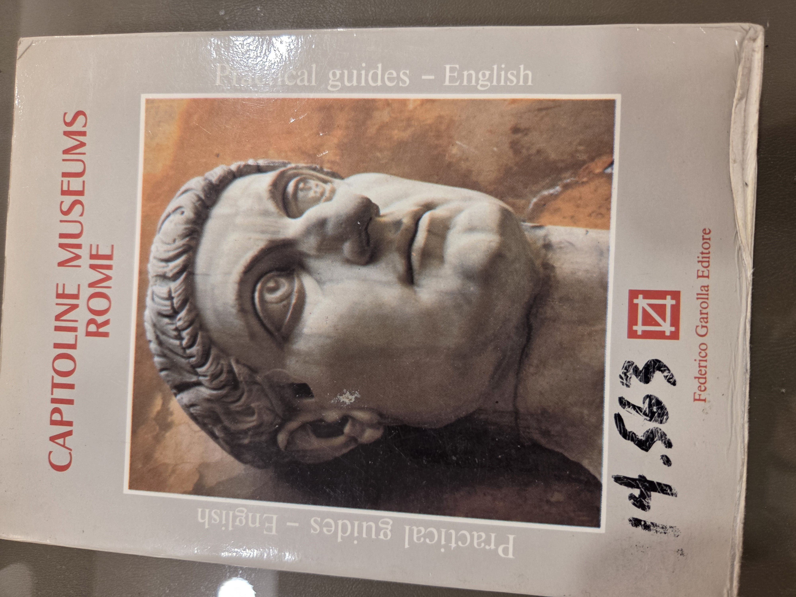
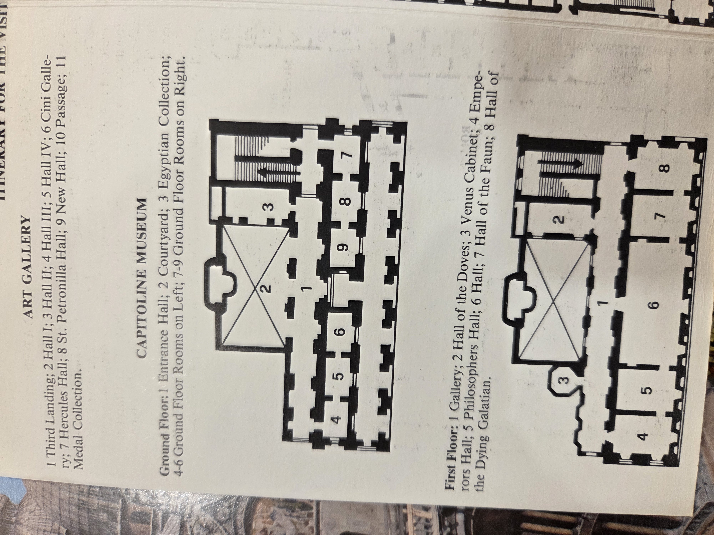
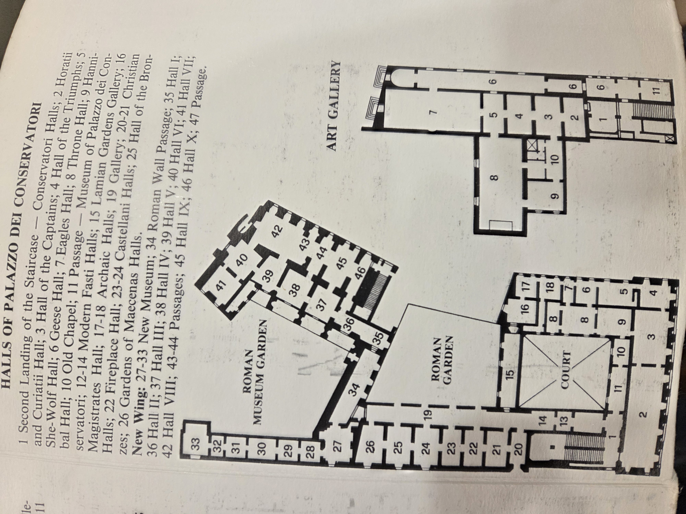

# CapitolineMuseumRome.md

**Capitoline Museums — Rome**
*Guide n. 5 – Practical Guides, English*
**Authors:**

* Eugenio La Rocca (Archaeological Director)
* Maria Elisa Tittoni Monti (History of Art Director)
* Translation by Nina Balzarotti
  **Publisher:** Federico Garolla Editore
  © 1984, Federico Garolla Editore S.r.l., Via Pinamonte da Vimercate, 6 – 20121 Milan, Tel. 02/6554548
  Periodical: *"Practical guides"*, Director: Federico Garolla
  Printed by: Grafiche Lithos – Carugate (MI)
  Auth. Trib. Milan N° 291 – 20 July 1982

---

## 📘 Cover

---

## 🗺️ Maps and Room Indexes

### Capitoline Museum – Ground and First Floor

**Ground Floor:**

1. Entrance Hall
2. Courtyard
3. Egyptian Collection
   4–6. Ground Floor Rooms on Left
   7–9. Ground Floor Rooms on Right

**First Floor:**

1. Gallery
2. Hall of the Doves
3. Venus Cabinet
4. Emperors Hall
5. Philosophers Hall
6. Hall
7. Hall of the Faun
8. Hall of the Dying Galatian

---

### Halls of Palazzo dei Conservatori & Art Gallery

**Palazzo dei Conservatori Highlights:**

* 1–2: Conservatori Halls
* 3: Hall of the Captains
* 4: Hall of the Triumphs
* 5: She-Wolf Hall
* 6: Geese Hall
* 7: Eagles Hall
* 8: Throne Hall
* 9: Hannibal Hall
* 10: Old Chapel
* 11: Passage
* 12–14: Modern Fasti Halls
* 19: Gallery
* 20–21: Christian Halls
* 25: Hall of the Bronzes
* 26: Gardens of Maecenas
* 27–33: New Museum
* 34–46: Hall sequence through the Roman Museum Garden

**Art Gallery (Numerical Index):**

1. Third Landing
   2–4. Hall I–IV
2. Hall IV
3. Cini Gallery
4. Hercules Hall
5. St. Petronilla Hall
6. New Hall
7. Passage
8. Medal Collection
