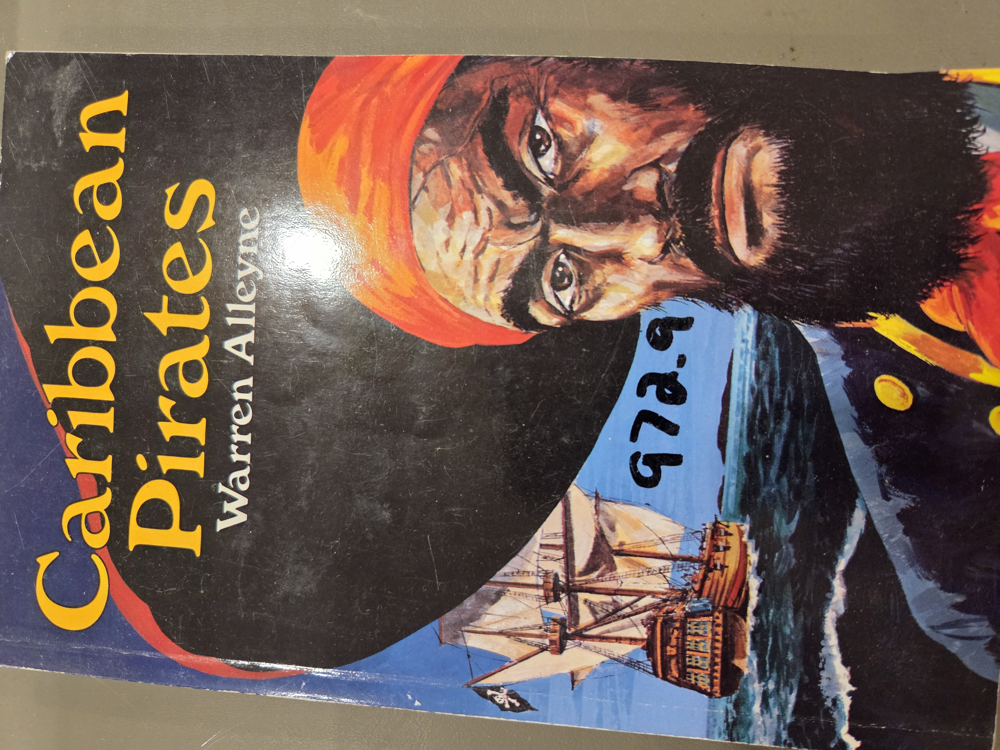
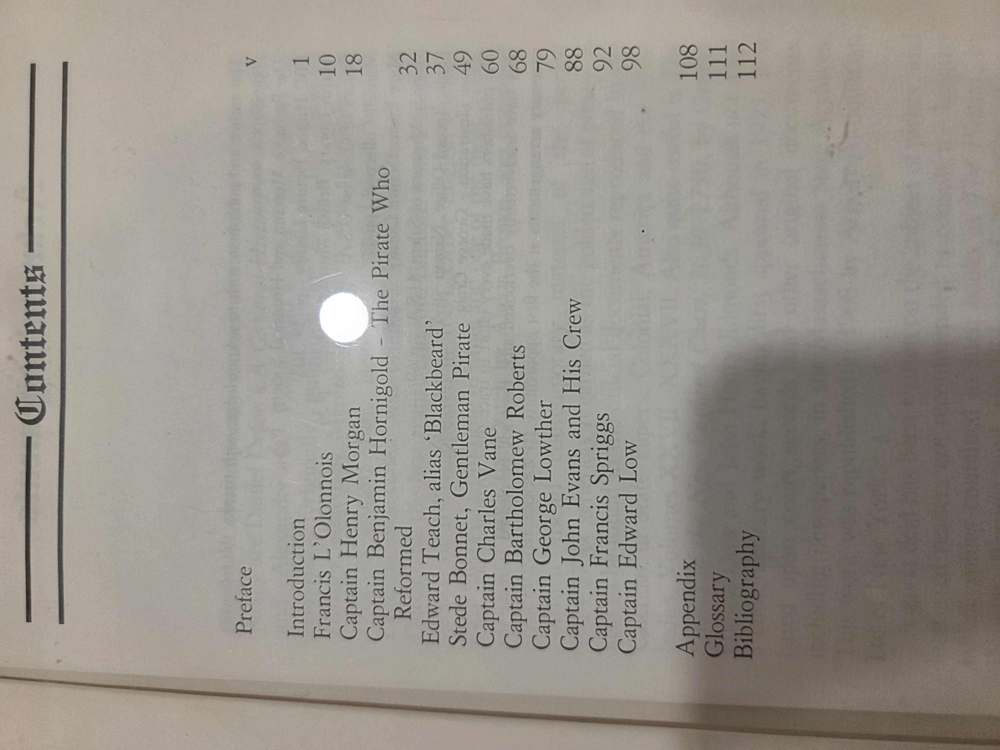

# Caribbean Pirates

**Author**: Warren Alleyne  
**Published**: 1986  
**Publisher**: *Macmillan Publishers Ltd*, London and Basingstoke  
**Printing**: Printed in Hong Kong  
**Edition Notes**: First published 1986. Reprinted 1987, 1989.  
**Copyright**: © W. Alleyne 1986  
**ISBN**: 0-333-40570-6 (cased), 0-333-40584-6 (paper)  
**UBC Library Classification**: 972.9  
**UDC**: 910.4'53 F2161  
**British Library Cataloguing in Publication Data**:  
Alleyne, Warren  
*Caribbean Pirates*  
1. Pirates—Caribbean Area—History  
I. Title

<  

---

## Summary

This compact historical survey by Warren Alleyne chronicles the dramatic lives and criminal legacies of some of the most infamous pirates in the Caribbean. Blending archival research and narrative biography, the book highlights legendary figures like Blackbeard, Henry Morgan, and Bartholomew Roberts. Alleyne provides insight into both their fearsome reputations and their roles in shaping the politics, commerce, and mythology of the Caribbean during the golden age of piracy.

---

## Contents

**Introduction** — Page 1  
**Francis L’Olonnais** — Page 10  
**Captain Henry Morgan** — Page 18  
**Captain Benjamin Hornigold – The Pirate Who Reformed** — Page 32  
**Edward Teach, alias ‘Blackbeard’** — Page 37  
**Stede Bonnet, Gentleman Pirate** — Page 49  
**Captain Charles Vane** — Page 60  
**Captain Bartholomew Roberts** — Page 68  
**Captain George Lowther** — Page 79  
**Captain John Evans and His Crew** — Page 88  
**Captain Francis Spriggs** — Page 92  
**Captain Edward Low** — Page 98  

**Appendix** — Page 108  
**Glossary** — Page 111  
**Bibliography** — Page 112  

---

<strong>Click to display book cover (optional)</strong>

  

<strong>Click to display copyright page (optional)</strong>

  

<strong>Click to display table of contents (optional)</strong>

  

# Caribbean Pirates

**Author**: Warren Alleyne  
**Published**: 1986  
**Publisher**: *Macmillan Publishers Ltd*, London and Basingstoke  
**Printing**: Printed in Hong Kong  
**Edition Notes**: First published 1986. Reprinted 1987, 1989.  
**Copyright**: © W. Alleyne 1986  
**ISBN**: 0-333-40570-6 (cased), 0-333-40584-6 (paper)  
**UBC Library Classification**: 972.9  
**UDC**: 910.4'53 F2161  
**British Library Cataloguing in Publication Data**:  
Alleyne, Warren  
*Caribbean Pirates*  
1. Pirates—Caribbean Area—History  
I. Title

<  

---

## Summary

This compact historical survey by Warren Alleyne chronicles the dramatic lives and criminal legacies of some of the most infamous pirates in the Caribbean. Blending archival research and narrative biography, the book highlights legendary figures like Blackbeard, Henry Morgan, and Bartholomew Roberts. Alleyne provides insight into both their fearsome reputations and their roles in shaping the politics, commerce, and mythology of the Caribbean during the golden age of piracy.

---

## Contents

**Introduction** — Page 1  
**Francis L’Olonnais** — Page 10  
**Captain Henry Morgan** — Page 18  
**Captain Benjamin Hornigold – The Pirate Who Reformed** — Page 32  
**Edward Teach, alias ‘Blackbeard’** — Page 37  
**Stede Bonnet, Gentleman Pirate** — Page 49  
**Captain Charles Vane** — Page 60  
**Captain Bartholomew Roberts** — Page 68  
**Captain George Lowther** — Page 79  
**Captain John Evans and His Crew** — Page 88  
**Captain Francis Spriggs** — Page 92  
**Captain Edward Low** — Page 98  

**Appendix** — Page 108  
**Glossary** — Page 111  
**Bibliography** — Page 112  

---

  

<strong>Click to display table of contents Pa(optional)</strong>

  

