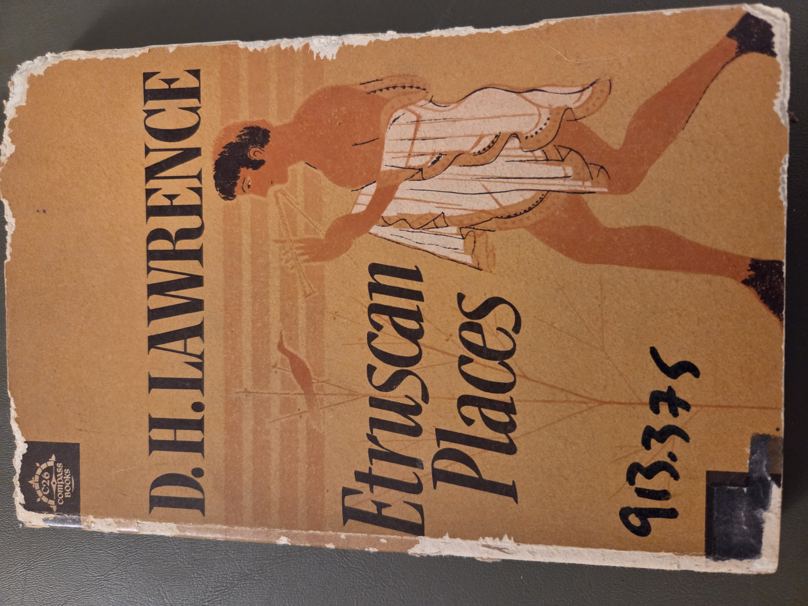
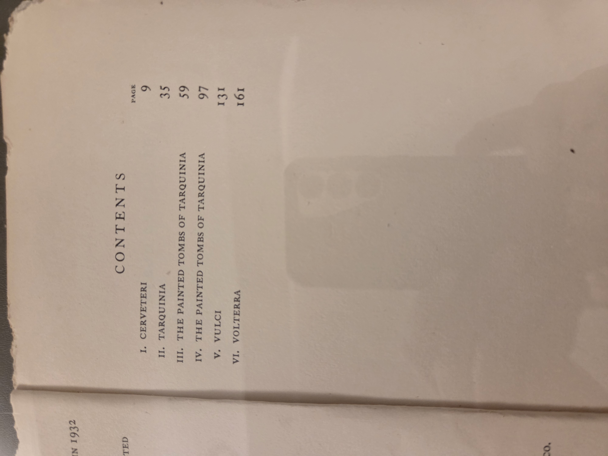

# Etruscan Places — Lawrence, D. H.

*Sketches of vanished towns and cultures in the hills of Italy.*

## Why read this

For readers of travel literature or ancient history, D. H. Lawrence’s evocative tour of Etruscan cities is a fascinating blend of poetic reflection and cultural insight. It’s an unusual look at pre-Roman Italy, filtered through the sensibility of a major 20th-century literary figure. A good companion volume to more archaeological or academic accounts of the Etruscans.

## What it’s about (concise overview)

In _Etruscan Places_, Lawrence recounts his 1927 journey through the remnants of the ancient Etruscan civilization in central Italy. The work is part travelogue, part cultural critique, exploring the ruins, frescoes, and spirit of Etruscan cities such as Cerveteri, Tarquinia, and Volterra. Lawrence contrasts the liveliness he perceives in Etruscan art and social life with what he views as the sterility of both modern and Roman Italian culture. His prose is often lyrical and impressionistic, more concerned with emotional truth than scholarly rigor, offering readers a vivid, if idiosyncratic, meditation on ancient life.

## Table of contents (from this copy)

- **Cerveteri**, p. 7  
- **Tarquinia**, p. 21  
- **The Painted Tombs of Tarquinia**, p. 33  
- **The Florence Museum**, p. 49  
- **Volterra**, p. 69  
- **The Cemetery of Perugia**, p. 89  
- **Perugia**, p. 97  
- **The Archaic Tombs**, p. 117  
- **The Riccardi Palace**, p. 141

  
Show original TOC scans (optional)

  

## Author & perspective

David Herbert Lawrence (1885–1930) was a British novelist, poet, and essayist known for his introspective fiction and uncompromising views on industrial society. Writing at the end of his life while in self-imposed exile, Lawrence turned to travel and cultural essays as a means of exploring alternate ways of life. His take on the Etruscans is romantic and reactionary—he idealizes their civilization as sensuous and vital in contrast to modern mechanized existence. This lends the book literary force, but also biases that modern readers should recognize.

## Reception & impact

Though not an academic work, _Etruscan Places_ has remained in print and is valued for its literary style and evocative descriptions. Its influence lies more in cultural than archaeological discourse, giving readers a lyrical entry point into interest in the Etruscans. Scholars have noted both its poetic strengths and its speculative inaccuracies.

## Scope & style

The book focuses on selected sites in Tuscany and Umbria associated with the ancient Etruscans, exploring their tombs, frescoes, and urban remains. Lawrence’s style is intensely subjective, reflective, and imagistic. Rather than providing historical synthesis or archaeological detail, he offers mood-driven impressions rooted in place. The prose is accessible and literary, with no scholarly apparatus.

## Publication & readership

This paperback edition was issued by Penguin Books in 1954, likely for a general readership. There are no maps, indexes, or footnotes, and the tone is clearly directed toward thoughtful lay readers rather than specialists. It complements more structured or visual guides to Etruscan sites by offering emotional and aesthetic engagement.

## UDC subject classification (searchable)

* **Primary**: `914.5` Travel in central Italy  
* **Secondary**: `930.85` Archaeological heritage of ancient Italic civilizations; `72` Architecture  
* **Notes**: Travelogue reflecting on Etruscan culture and tomb architecture through Lawrence’s literary lens

## At-a-glance facts

* Year: 1954 | Pages: 159 | Format: PB | ISBN: TBD  
* Dimensions (mm): H 180 × W 110 × T 12  
* Shelf location: BookCase01 › Shelf 1 › Section  › Pos 

## Related items in this library

* _Sicily Archaeological Guide_ — (BC01-S01-XXX)  
* _Museo di Villa Giulia_ — (BC01-S01-XXX)  
* _Capitoline Museum Rome_ — (BC01-S01-XXX)  
* _VilladEste_ — (BC01-S01-XXX)

