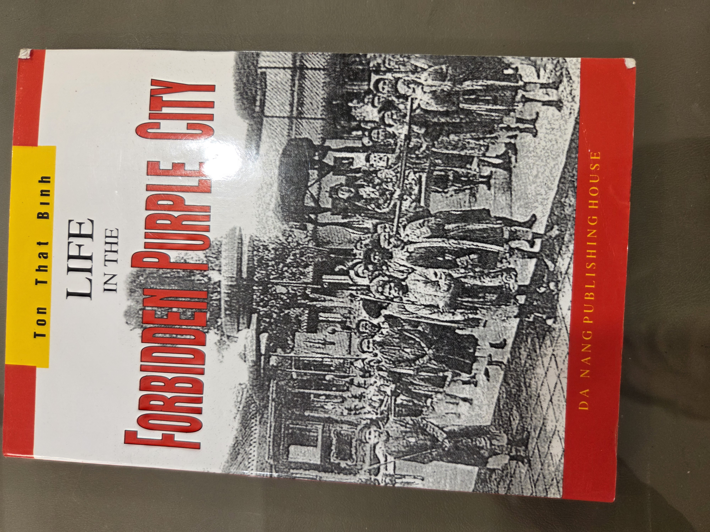
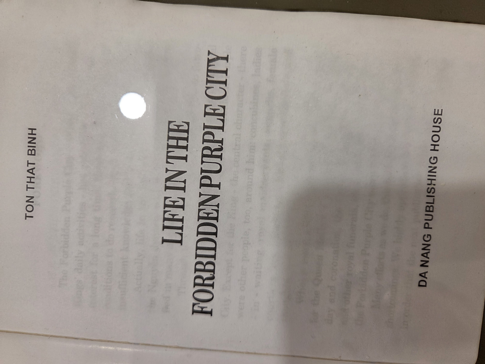
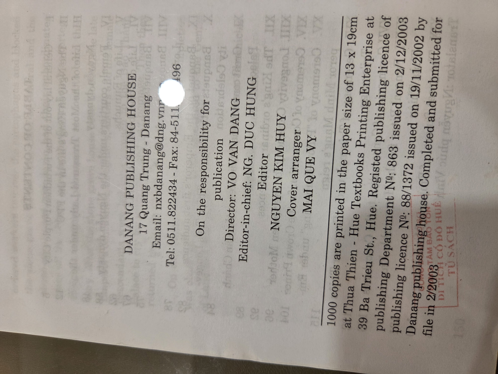
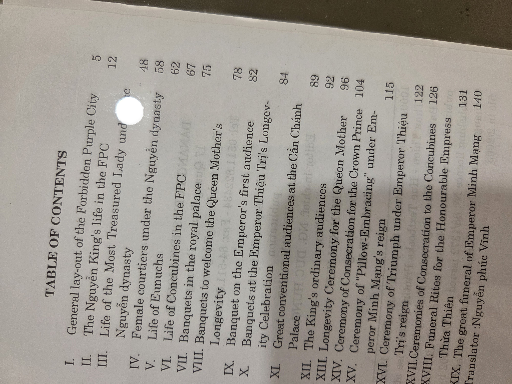
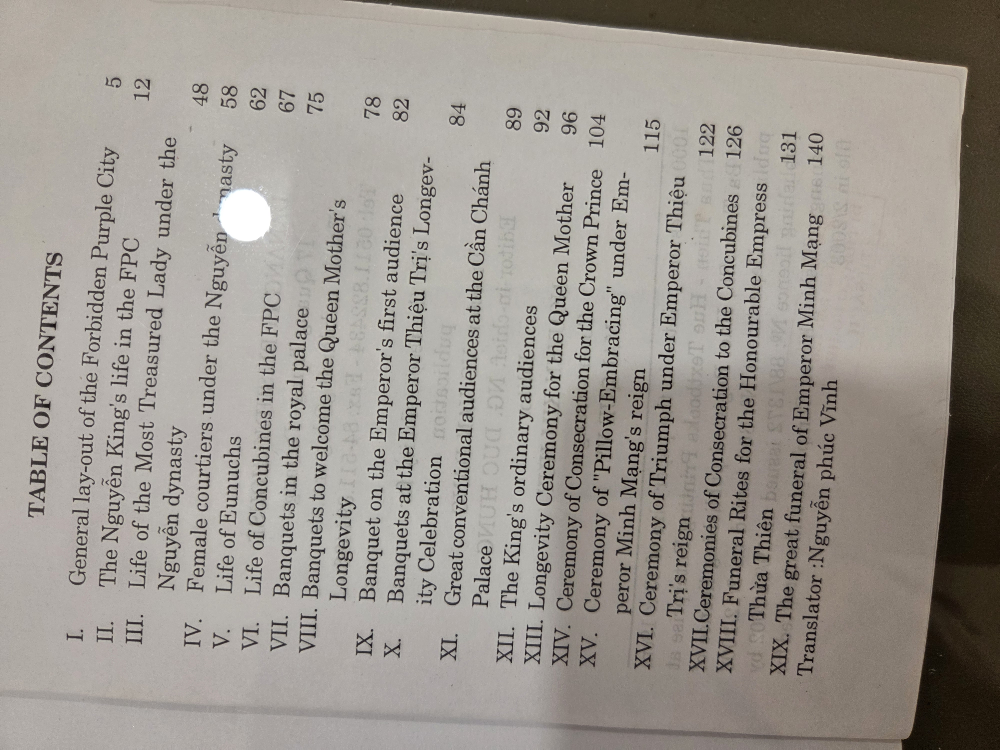

# Life in the Forbidden Purple City

**Author**: Ton That Binh  
**Translator**: Nguyễn Phúc Vinh  
**Publisher**: Da Nang Publishing House  
**Publication Year**: 2003  
**Publishing License No.**: 88/1372 issued on 19/11/2002  
**Printing License No.**: 863 issued on 2/12/2003  
**Edition Size**: 1000 copies  
**Format**: 13 x 19 cm  
**Printed at**: Hue Textbooks Printing Enterprise  
**ISBN**: Not listed  
**Pages**: ~145  
**Location**: Vietnam  

---

## UDC Classification

**959.7043** – History of Vietnam – Nguyễn Dynasty – Court life – Ceremonial customs – Imperial family  
**392.3** – Customs related to social life – Royal ceremonies  
**395** – Etiquette (customs of the palace, life of eunuchs, concubines)

---

## Why You Should Read This Book

"Life in the Forbidden Purple City" offers a rare and richly detailed window into the hidden inner court life of Vietnam's Nguyễn Dynasty, particularly within the Forbidden Purple City of Hue. The book dives into not only royal activities but also the lives of eunuchs, concubines, court ceremonies, royal banquets, and funerary rites. It’s a must-read for historians, Vietnam enthusiasts, or anyone captivated by the pageantry and ritual of monarchic Asia.

---

## Table of Contents

I. General Layout of the Forbidden Purple City – 5  
II. The Nguyễn King's Life in the FPC – 12  
III. Life of the Most Treasured Lady under the Nguyễn Dynasty – 42  
IV. Female Courtiers under the Nguyễn Dynasty – 48  
V. Life of Eunuchs – 58  
VI. Life of Concubines in the FPC – 62  
VII. Banquets in the Royal Palace – 67  
VIII. Banquets to Welcome the Queen Mother’s Longevity – 75  
IX. Banquet on the Emperor’s First Audience – 78  
X. Banquets at the Emperor Thiệu Trị’s Longevity Celebration – 82  
XI. Great Conventional Audiences at the Cần Chánh Palace – 84  
XII. The King’s Ordinary Audiences – 89  
XIII. Longevity Ceremony for the Queen Mother – 92  
XIV. Ceremony of Consecration for the Crown Prince – 96  
XV. Ceremony of “Pillow-Embracing” under Emperor Minh Mạng’s Reign – 104  
XVI. Ceremony of Triumph under Emperor Thiệu Trị’s Reign – 115  
XVII. Ceremonies of Consecration to the Concubines – 122  
XVIII. Funeral Rites for the Honourable Empress – 126  
XIX. The Great Funeral of Emperor Minh Mạng – 140  

---

## Cover

---

## Title Page

---

## Publisher Page

---

## Table of Contents Scans

  

---

## Tags

`Vietnam` `Nguyễn Dynasty` `Imperial Court` `Hue` `Royal Customs` `Asian History` `Palace Life` `Court Rituals` `Historical Documentation`

# Life in the Forbidden Purple City

**Author**: Ton That Binh  
**Translator**: Nguyễn Phúc Vinh  
**Publisher**: Da Nang Publishing House  
**Publication Year**: 2003  
**Publishing License No.**: 88/1372 issued on 19/11/2002  
**Printing License No.**: 863 issued on 2/12/2003  
**Edition Size**: 1000 copies  
**Format**: 13 x 19 cm  
**Printed at**: Hue Textbooks Printing Enterprise  
**ISBN**: Not listed  
**Pages**: ~145  
**Location**: Vietnam  

---

## UDC Classification

**959.7043** – History of Vietnam – Nguyễn Dynasty – Court life – Ceremonial customs – Imperial family  
**392.3** – Customs related to social life – Royal ceremonies  
**395** – Etiquette (customs of the palace, life of eunuchs, concubines)

---

## Why You Should Read This Book

"Life in the Forbidden Purple City" offers a rare and richly detailed window into the hidden inner court life of Vietnam's Nguyễn Dynasty, particularly within the Forbidden Purple City of Hue. The book dives into not only royal activities but also the lives of eunuchs, concubines, court ceremonies, royal banquets, and funerary rites. It’s a must-read for historians, Vietnam enthusiasts, or anyone captivated by the pageantry and ritual of monarchic Asia.

---

## Table of Contents

I. General Layout of the Forbidden Purple City – 5  
II. The Nguyễn King's Life in the FPC – 12  
III. Life of the Most Treasured Lady under the Nguyễn Dynasty – 42  
IV. Female Courtiers under the Nguyễn Dynasty – 48  
V. Life of Eunuchs – 58  
VI. Life of Concubines in the FPC – 62  
VII. Banquets in the Royal Palace – 67  
VIII. Banquets to Welcome the Queen Mother’s Longevity – 75  
IX. Banquet on the Emperor’s First Audience – 78  
X. Banquets at the Emperor Thiệu Trị’s Longevity Celebration – 82  
XI. Great Conventional Audiences at the Cần Chánh Palace – 84  
XII. The King’s Ordinary Audiences – 89  
XIII. Longevity Ceremony for the Queen Mother – 92  
XIV. Ceremony of Consecration for the Crown Prince – 96  
XV. Ceremony of “Pillow-Embracing” under Emperor Minh Mạng’s Reign – 104  
XVI. Ceremony of Triumph under Emperor Thiệu Trị’s Reign – 115  
XVII. Ceremonies of Consecration to the Concubines – 122  
XVIII. Funeral Rites for the Honourable Empress – 126  
XIX. The Great Funeral of Emperor Minh Mạng – 140  

---

## Cover

---

## Title Page

---

## Publisher Page

---

## Table of Contents Scans

  

---

## Tags

`Vietnam` `Nguyễn Dynasty` `Imperial Court` `Hue` `Royal Customs` `Asian History` `Palace Life` `Court Rituals` `Historical Documentation`

