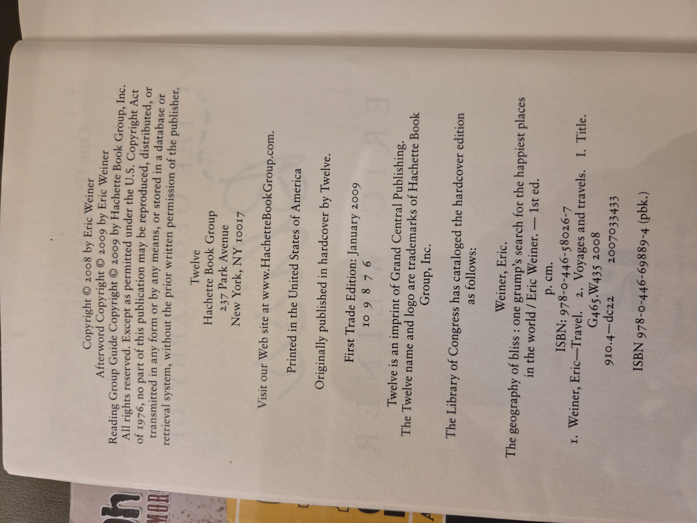

# The Geography of Bliss

**Author:** Eric Weiner  
**Publisher:** Twelve, an imprint of Grand Central Publishing  
**Imprint:** Hachette Book Group  
**Publication Year:** 2009 (First Trade Edition)  
**ISBN:** 978-0-446-58026-7 (hardcover), 978-0-446-69889-4 (paperback)  
**Library of Congress Control Number:** 2007033433  
**Place of Publication:** New York, NY  
**Printer Location:** United States of America  

## UBC Classification

**Primary Category:** Travel, Cultural Studies  
**Keywords:**
- Search for happiness — global travel
- Cultural perceptions of happiness
- Personal memoir — travel writing
- Psychology and sociology of happiness
- Comparative cultural studies

## Table of Contents

1. **Introduction**  
2. **The Netherlands** — *Happiness Is a Number* (p. 5)  
3. **Switzerland** — *Happiness Is Boredom* (p. 27)  
4. **Bhutan** — *Happiness Is a Policy* (p. 49)  
5. **Qatar** — *Happiness Is a Winning Lottery Ticket* (p. 97)  
6. **Iceland** — *Happiness Is Failure* (p. 141)  
7. **Moldova** — *Happiness Is Somewhere Else* (p. 185)  
8. **Thailand** — *Happiness Is Not Thinking* (p. 219)  
9. **Great Britain** — *Happiness Is a Work in Progress* (p. 245)  
10. **India** — *Happiness Is a Contradiction* (p. 275)  
11. **America** — *Happiness Is Home* (p. 307)  
12. **Epilogue** — *Are We There Yet?* (p. 321)  
13. **Afterword** (p. 327)  
14. **Acknowledgments** (p. 333)  
15. **Select Bibliography** (p. 337)  
16. **Reading Group Guide** (p. 341)  

## Optional Images

Click to display copyright page (optional)

Click to display table of contents (optional)

  

