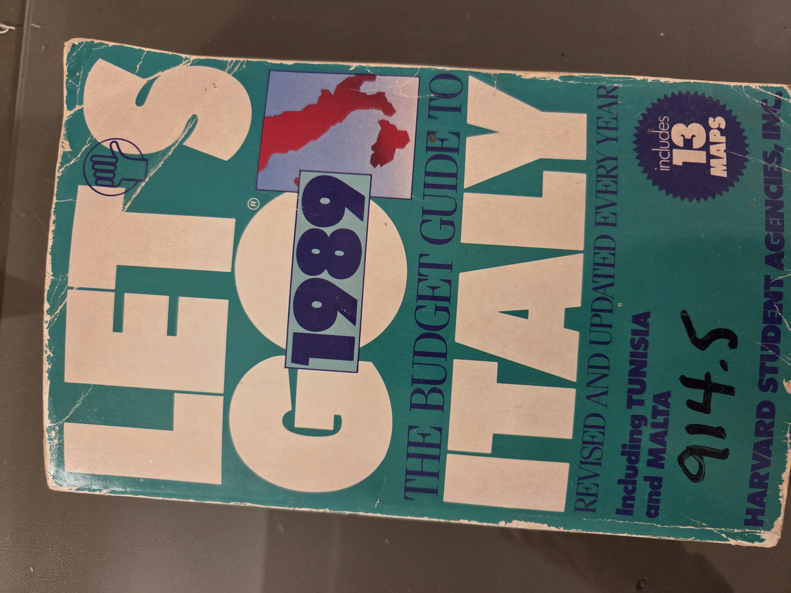
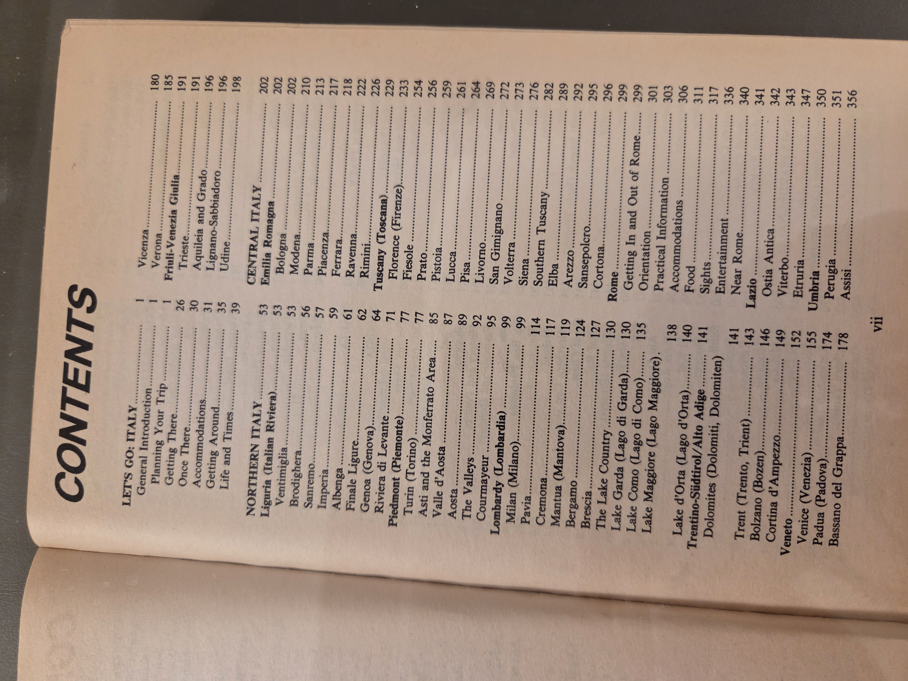
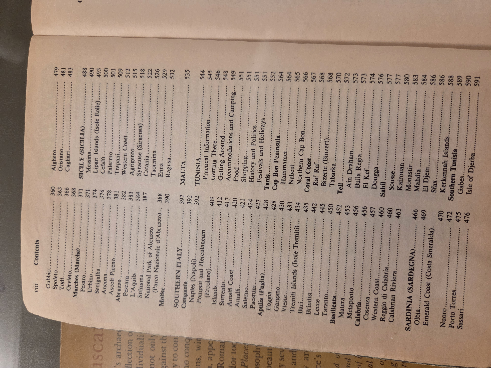
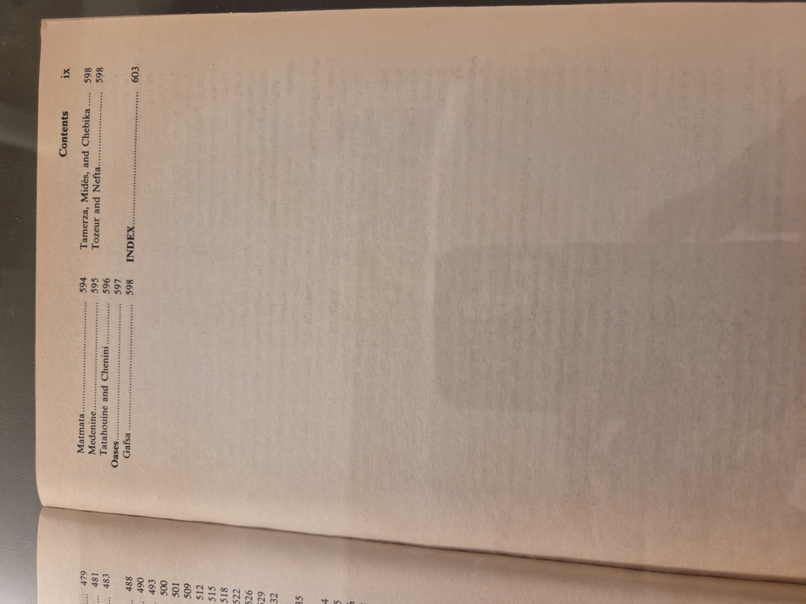
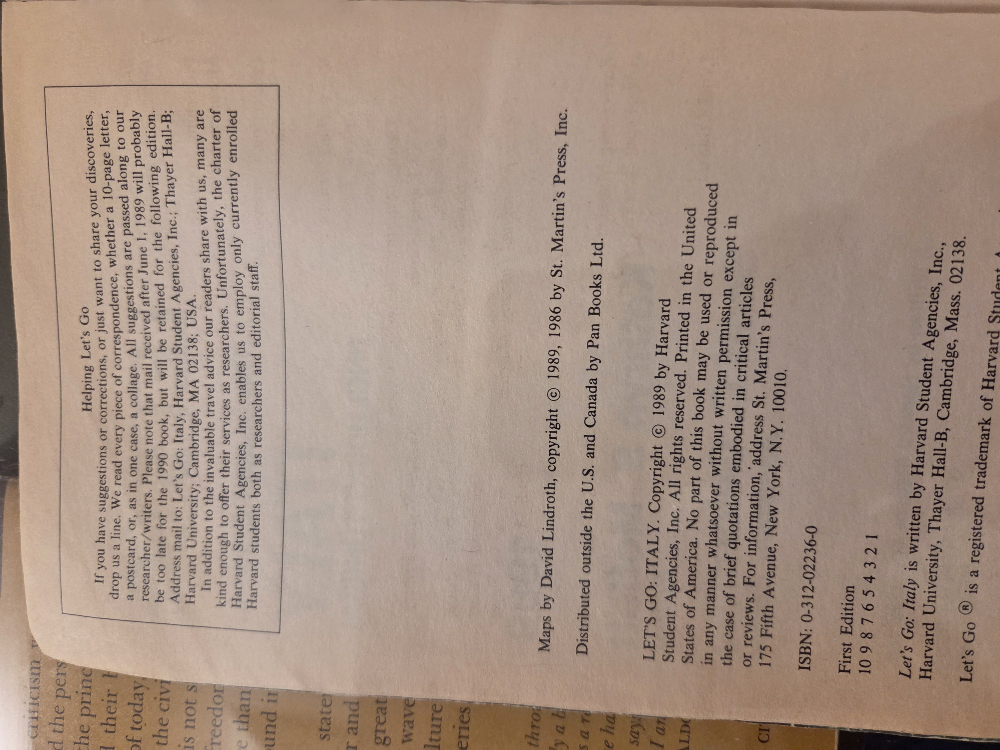

# Let’s Go: Italy 1989

**Subtitle:** The Budget Guide to Italy – Revised and Updated Every Year  
**Authoring Body:** Harvard Student Agencies, Inc.  
**Publisher:** St. Martin’s Press, New York  
**First Edition:** 1989  
**ISBN:** 0-312-02236-0

## Overview

A classic student-produced guidebook that shaped generations of backpackers’ travel across Italy, Malta, and Tunisia. Part of the larger “Let’s Go” series from Harvard Student Agencies, *Let’s Go: Italy 1989* reflects the energetic, no-nonsense, budget-conscious approach to travel that defined late 20th-century guidebooks. Created and edited by students, its blend of frugal tips, on-the-ground reporting, and sometimes cheeky commentary offered an accessible counterpoint to more formal travel guides.

## Significance

*Let’s Go: Italy 1989* was a cultural artifact of its time—pre-internet, heavy on personal experience and word-of-mouth. This edition stood out for its:

- Coverage of lesser-known locales, from Sardinian villages to inland Tunisian oases.
- Affordable travel hacks for students and backpackers.
- Candid tone that helped redefine guidebook voice—witty, irreverent, personal.
- Historical value for understanding how students viewed Italy (and the Mediterranean) in the 1980s.

## Table of Contents

  
  

Highlights include:

- **Rome**: Sights, Accommodations, Entertainment, and practical info for navigating the Eternal City.
- **Northern Italy**: Milan, Venice, Lake Districts, and Alpine towns.
- **Southern Italy**: Naples, Sicily, and rural destinations in Basilicata and Calabria.
- **Sardinia and Sicily**: Rare in-depth budget travel sections for these islands.
- **Malta and Tunisia**: Bonus chapters offering early indie-travel guidance beyond Europe.

## Credits and Copyright

Maps by David Lindroth.  
© 1989 Harvard Student Agencies, Inc.  
Published by St. Martin’s Press, New York.  
Distributed outside the U.S. and Canada by Pan Books Ltd.  
Printed in the United States of America.

---

