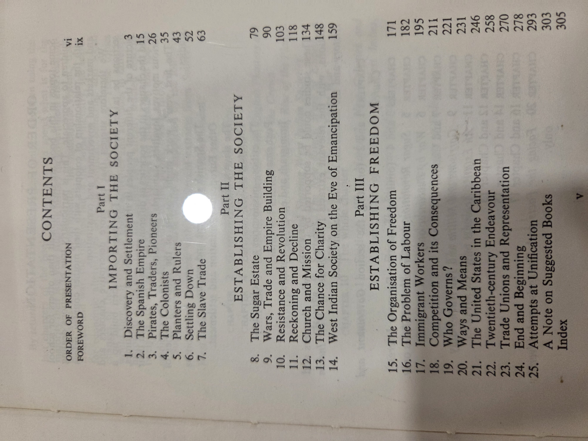

# *The Making of the West Indies* — F. R. Augier, S. C. Gordon, D. G. Hall, M. Reckord

### Table of contents (from this copy’s contents pages)
- Order of Presentation — vi  
- Foreword — ix

**Part I: Importing the Society**  
1. Discovery and Settlement — 3  
2. The Spanish Empire — 15  
3. Pirates, Traders, Pioneers — 26  
4. The Colonists — 35  
5. Planters and Rulers — 43  
6. Settling Down — 52  
7. The Slave Trade — 63

**Part II: Establishing the Society**  
8. The Sugar Estate — 79  
9. Wars, Trade and Empire Building — 90  
10. Resistance and Revolution — 103  
11. Reckoning and Decline — 116  
12. Church and Mission — 134  
13. The Chance for Charity — 148  
14. West Indian Society on the Eve of Emancipation — 159

**Part III: Establishing Freedom**  
15. The Organisation of Freedom — 171  
16. The Problem of Labour — 182  
17. Immigrant Workers — 195  
18. Competition and its Consequences — 211  
19. Who Governs? — 221  
20. Ways and Means — 231  
21. The United States in the Caribbean — 246  
22. Twentieth-century Endeavour — 258  
23. Trade Unions and Representation — 270  
24. End and Beginning — 278  
25. Attempts at Unification — 293  
- A Note on Suggested Books — 303  
- Index — 305

<strong>Show original TOC scans (optional)</strong>

### CIP notes
Longman Caribbean (Trinidad and Jamaica), reprinted 1990. Originally published 1960.  
ISBN: 0 582 76304 5

### Author & perspective
**F. R. Augier, S. C. Gordon, D. G. Hall, M. Reckord** were historians and educators shaping a mid-20th century regional narrative of the Caribbean. The book approaches West Indian history with an emphasis on systems—colonialism, slavery, and emancipation—designed for pedagogical clarity in Caribbean secondary schools.

### Reception & impact
This book was foundational in postcolonial Caribbean education, widely used in high schools and teacher training. It emphasized structural historical developments over individual biography or anecdote. While some terminology and framing now feel dated, it remains a valuable reference for understanding mid-century curriculum design and regional historiography.

### Scope & style
- **Scope:** From early European contact to late 20th-century political developments in the Caribbean.
- **Themes:** Colonization, slavery, plantation systems, immigration, labor, trade, governance, and regional identity.
- **Style:** Didactic, schematic, chronological. Includes interpretive framing geared toward student readers.

### UDC subject classification (searchable)
**UDC**: 972.9 — History of the Caribbean (West Indies)

### At-a-glance facts
- **First published:** 1960  
- **This edition:** 1990 reprint  
- **Publisher:** Longman Caribbean  
- **Pages:** Approx. 310  
- **Use:** High school and teacher-training textbook  
- **Language:** English

### Related volumes on this shelf
- *The Caribbean People* — Lennox Honychurch  
- *Caribbean Story* — William Claypole & John Robottom  
- *A History of the Caribbean* — Franklin W. Knight
