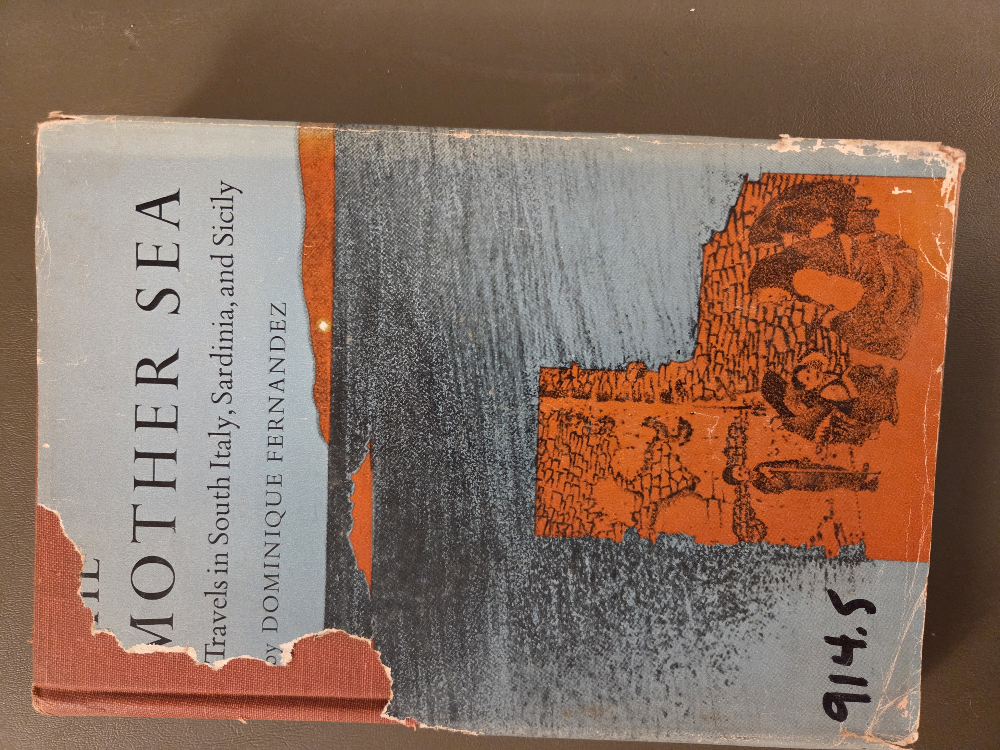
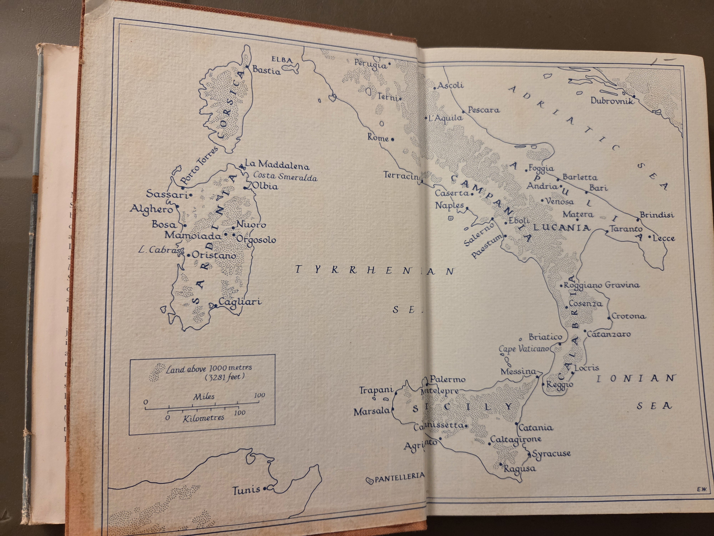

# The Mother Sea  
**Travels in South Italy, Sardinia, and Sicily**  
by Dominique Fernandez

**First American Edition: October 1967**  
Originally published in French as *Mère Méditerranée*  
English translation © 1967 by Martin Secker & Warburg Limited  
Published in the U.S. by Hill & Wang, Inc.  
Library of Congress Card No: 67-23521  
Manufactured in the United States of America  
ISBN: N/A

---

## Why Read *The Mother Sea*?

Dominique Fernandez’s *The Mother Sea* offers a lyrical, introspective journey through southern Italy, Sardinia, and Sicily—regions long romanticized and yet too often misunderstood. This travel memoir, originally written in French, unearths the layers of memory, decay, and dignity embedded in Mediterranean life and landscapes. Fernandez, a novelist and essayist with a keen eye for cultural nuance, blends political critique, aesthetic observation, and personal reflection to capture the spirit of the South beyond its clichés.

The work has influenced readers and writers interested in postwar Mediterranean identity, cultural memory, and the subtle tensions between North and South in Italy. Particularly resonant is Fernandez’s focus on marginalized locales and traditions—his portraits of southern towns, rituals, and people are richly detailed and deeply humanizing. If you are interested in regional identity, poetic travel writing, or the cultural depth of the Mediterranean, *The Mother Sea* is a compelling and historically grounded meditation.

---

## Contents

### Naples  
- Antiquity of memory – p.9  
- Fragility, atrophy, insecurity – p.10  
- Dilemma – p.15  
- Towns, women, children – p.19  
- Dilemma (continued) – p.29  
- Night and tremors – p.31  
- Vain history – p.35  

### South  
- The Southern Issue – p.45  
- Misfortune – p.54  
- A conquered General, a victorious sun-bather—and St. Joseph – p.63  
- Magna Graecia – p.69  
- The eagle and the eye – p.76  

### Sardinia  
- Angels – p.89  
- Dawn, courage, curves – p.93  
- Dead water, sacred water, running water, bitter water – p.96  
- The peculiar history of the Lake of Cabras – p.103  
- Mother Mediterranean – p.106  
- A short glossary of happiness in Sardinia – p.112  
- A book-seller, a philosopher and a potter – p.146  

### Sicily  
- Gentlemen versus The Rest – p.155  
- Religion in Palermo – p.160  
- Comforts and impostures – p.163  
- Agrigento – p.173  
- Honour – p.182  
- Catania – p.187  
- An honest man – p.196  
- A hero – p.206  
- Paladins, puppets, dwarfs – p.219  

---

