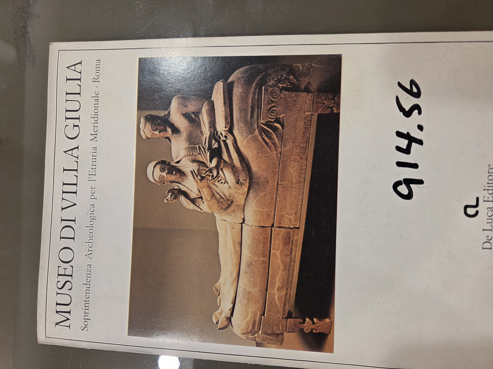
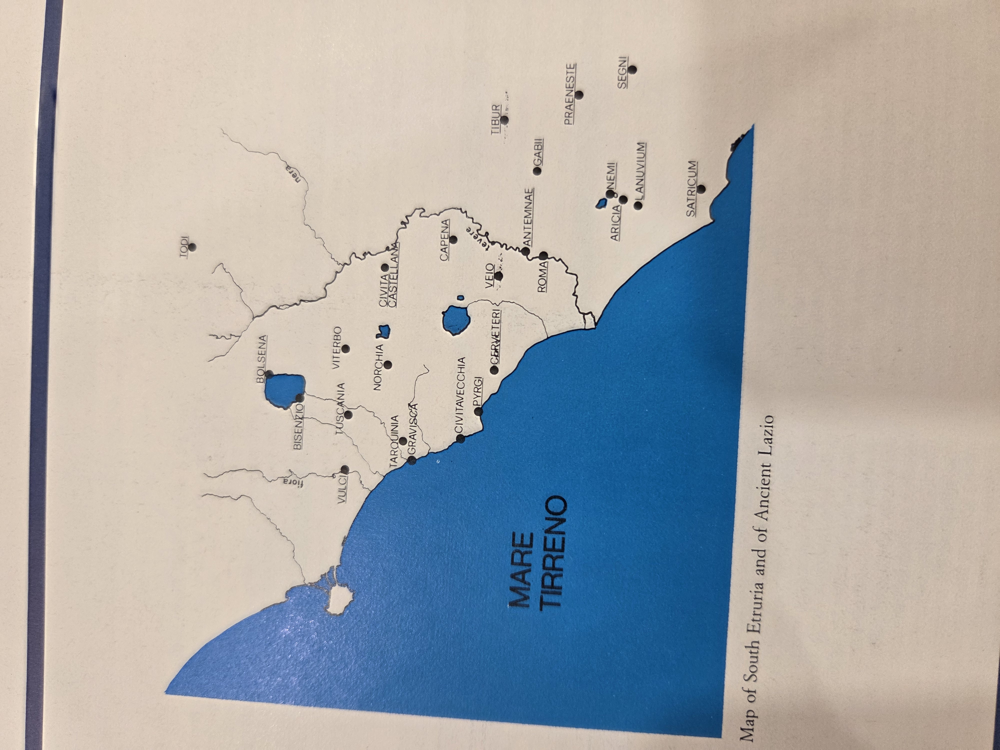
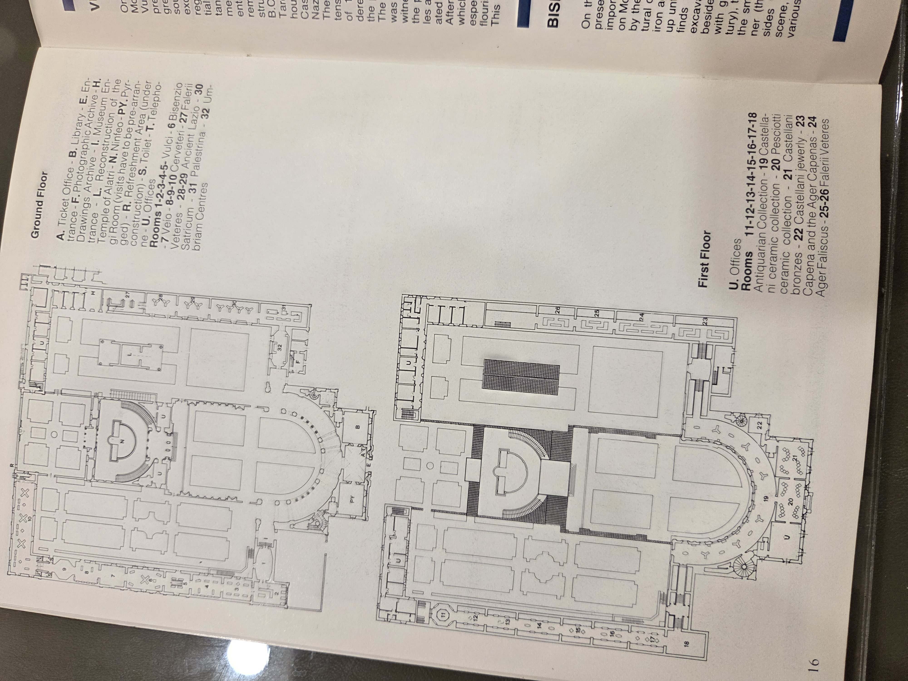

# Museo di Villa Giulia

**Publisher:** De Luca Editore S.r.l.  
**Coordination:** Francesca Boitani  
**Copyright:** ©1983 De Luca Editore S.r.l., Via di S. Anna, 16 – 00186 Roma  
**Photographs:** B. Fioravanti (Sopr. Arch. Etruria Meridionale); ed. Quasar, P. Rizzi (C.A.D.N.R.)  
**Translation:** M.S. Spurr and V. Scott (British School at Rome)  
**Printed in Italy**  
**Call Number:** 914.56

---

---

## Map of South Etruria and of Ancient Lazio

---

## Museum Floor Plan

### Ground Floor:
- **A**: Ticket Office  
- **B**: Library  
- **E**: Entrance  
- **F**: Photo Archive  
- **G**: Photographic Archive  
- **H**: Drawings Archive  
- **I**: Museum Entrance  
- **L**: Reconstruction Temple of Alatri  
- **N**: Nitreto of the Pyrgi Room (visit in progress)  
- **P**: Refreshment Area (under reconstruction)  
- **S**: Toilet  
- **T**: Telephone  
- **U**: Offices  

**Rooms:**  
1–6: Bisenzio, Vulci  
7: Veio  
8–10: Cerveteri  
27: Falerii  
28–29: Ancient Lazio  
30: Satricum  
31: Palestrina  
32: Umbrian Centres

### First Floor:
- **Rooms 11–18**: Antiquarian Collection  
- **19–20**: Castellani ceramic collections  
- **21**: Castellani bronzes  
- **22**: Castellani jewelry  
- **23–24**: Capena and the Ager Capenas  
- **25–26**: Falerii Veteres

---

## Visiting Hours

- **Weekdays:** 9am to 2pm  
- **Holidays and Sundays:** 9am to 1pm  
- **Special Winter Times (1/10–30/4):** Wednesday 9am–6:30pm  
- **Special Summer Times (2/5–30/9):** Wednesday 9am–2pm and 3pm–7:30pm  

The public is allowed to enter the museum until 30 minutes before closing. Closed Mondays (unless a Monday is a public holiday, then closed Tuesday).  
**Closed on:** New Year’s Day, 25 April, 1 May, first Sunday of June, 15 August, Christmas Day.

**Free Entrance:**  
- All Italian citizens under 20 and above 60  
- All visitors on the 1st and 3rd Saturday and the 2nd and 4th Sunday of every month  
- Schools requesting visits in advance

---

## Other Notable Museums in the Region

- Cerveteri  
- Pyrgi  
- Civitavecchia  
- Vulci  
- Civitacastellana  
- Viterbo  

**Tarquinia:** Home to Museo Nazionale in Palazzo Vitelleschi – displays Tarquinian Tombs wall paintings  
**Florence:** Archaeological Museum houses Northern Etruria and Tuscan materials

