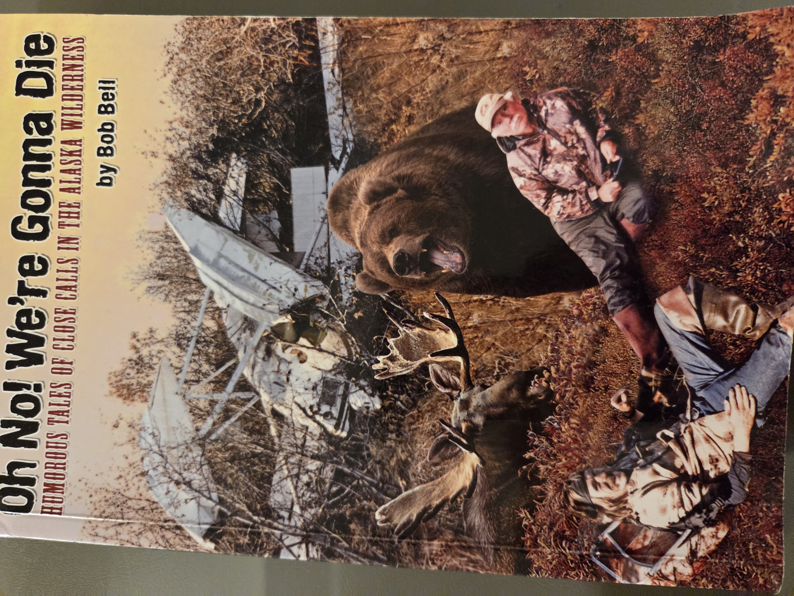
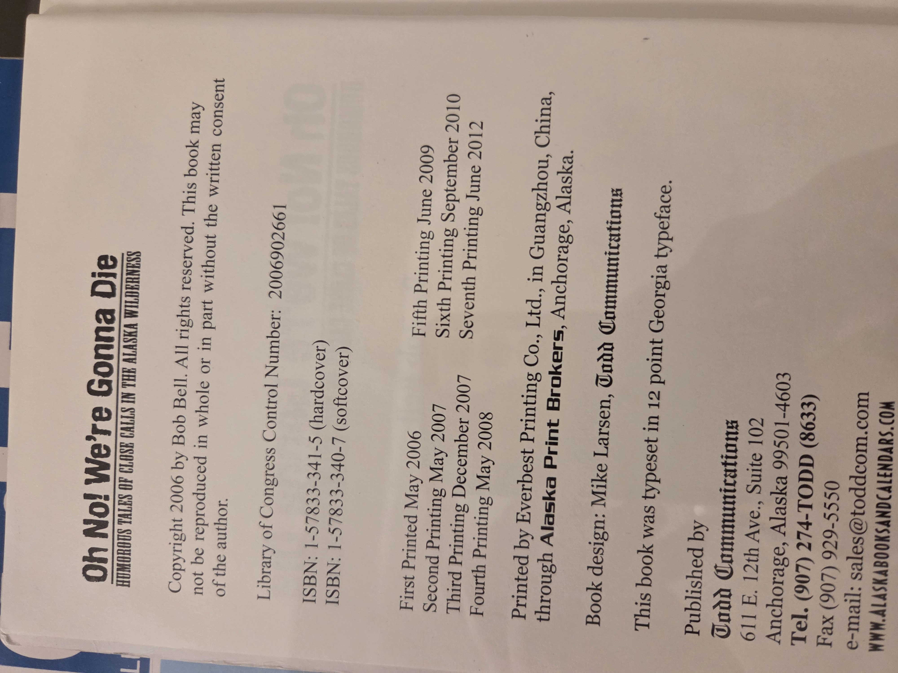
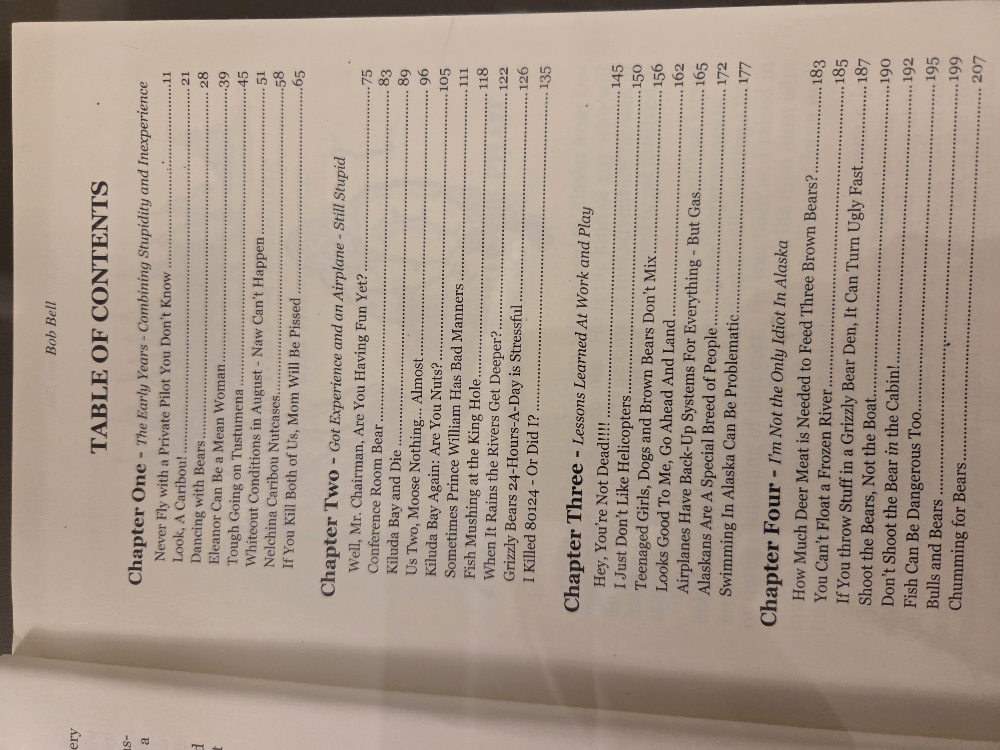

# Oh No! We're Gonna Die: Humorous Tales of Close Calls in the Alaska Wilderness

**Author**: Bob Bell
**Publisher**: Todd Communications, Anchorage, Alaska
**Copyright**: © 2006 by Bob Bell
**ISBN**:

* Hardcover: 1-57833-341-5
* Softcover: 1-57833-340-7
  **Library of Congress Control Number**: 2006902661
  **Printing History**:
* First Printing: May 2006
* Second Printing: May 2007
* Third Printing: December 2007
* Fourth Printing: May 2008
* Fifth Printing: June 2009
* Sixth Printing: September 2010
* Seventh Printing: June 2012
  **Book Design**: Mike Larsen, Todd Communications
  **Typeset**: 12 point Georgia typeface
  **Printer**: Everest Printing Co., Ltd., Guangzhou, China
  **Distributor**: Alaska Print Brokers, Anchorage, Alaska
  **UBC Classification**: 910.4 – Travel and Adventure Humor (Alaska)

---

## Cover

---

## Copyright Page

---

## Table of Contents

**Chapter One – The Early Years – Combining Stupidity and Inexperience**

* Never Fly with a Private Pilot You Don’t Know – p.11
* Look, A Caribou! – p.21
* Dancing with Bears – p.28
* Eleanor Can Be a Mean Woman – p.39
* Tough Going on Tustumena – p.45
* Whiteout Conditions in August – Naw Can’t Happen – p.51
* Nelchina Caribou Nutcases – p.58
* If You Kill Both of Us, Mom Will Be Pissed – p.65

**Chapter Two – Got Experience and an Airplane – Still Stupid**

* Well, Mr. Chairman, Are You Having Fun Yet? – p.75
* Conference Room Bear – p.83
* Kiluda Bay and Die – p.89
* Us Two, Moose Nothing… Almost – p.96
* Kiluda Bay Again: Are You Nuts? – p.103
* Sometimes Prince William Has Bad Manners – p.111
* Fish Mushing at the King Hole – p.118
* When It Rains the Rivers Get Deeper? – p.122
* Grizzly Bears 24-Hours-A-Day is Stressful – p.126
* I Killed 80124 – Or Did I? – p.135

**Chapter Three – Lessons Learned at Work and Play**

* Hey, You’re Not Dead!!!! – p.145
* I Just Don’t Like Helicopters – p.150
* Teenaged Girls, Dogs and Brown Bears Don’t Mix – p.156
* Looks Good To Me, Go Ahead And Land – p.160
* Airplanes Have Back-Up Systems For Everything – But Gas – p.165
* Alaskans Are a Special Breed of People – p.170
* Swimming In Alaska Can Be Problematic – p.177

**Chapter Four – I’m Not the Only Idiot In Alaska**

* How Much Deer Meat is Needed to Feed Three Brown Bears? – p.183
* You Can’t Float a Frozen River – p.184
* If You Throw Stuff in a Grizzly Bear Den, It Can Turn Ugly Fast – p.185
* Shoot the Bears, Not the Boat – p.187
* Don’t Shoot the Bear in the Cabin! – p.190
* Fish Can Be Dangerous Too… – p.192
* Bulls and Bears – p.195
* Chumming for Bears – p.199
