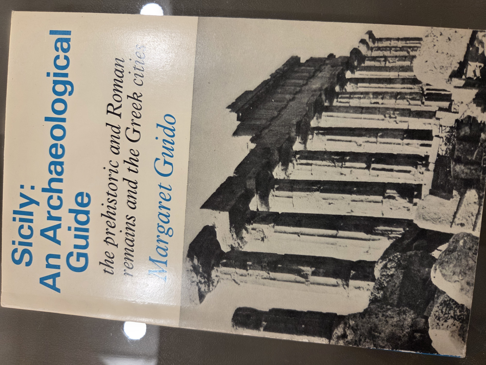
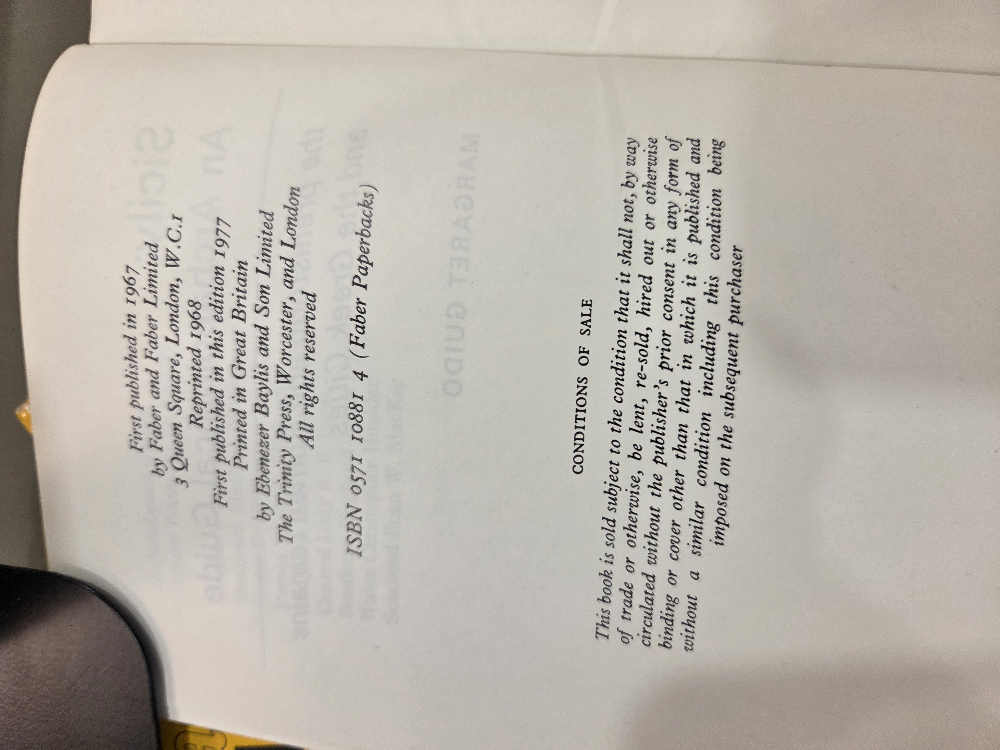
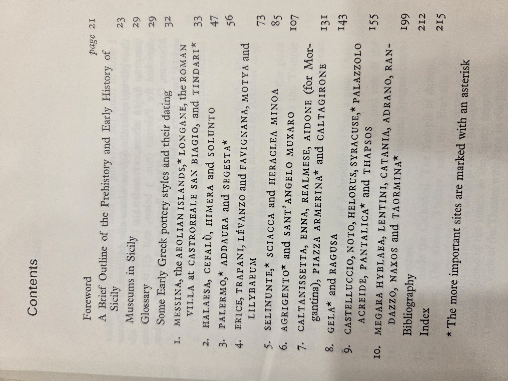

# Sicily: An Archaeological Guide  
*The prehistoric and Roman remains and the Greek cities*  
**Author:** Margaret Guido  
**Publisher:** Faber and Faber Limited  
**ISBN:** 0571 10881 4 (Faber Paperbacks)  
**First Published:** 1967; Reprinted 1968; This edition 1977  
**Printed by:** Ebenezer Baylis and Son Limited, The Trinity Press, Worcester, and London  

---

## Contents

- **Foreword**
- **A Brief Outline of the Prehistory and Early History of Sicily** – p.21  
- **Museums in Sicily** – p.23  
- **Glossary** – p.29  
- **Some Early Greek Pottery Styles and Their Dating** – p.32

### Main Sites and Sections

1. **Messina, the Aeolian Islands, Longane, the Roman Villa at Castroreale San Biagio, and Tindari** – p.33  
2. **Halaesa, Cefalù, Himera and Solunto** – p.47  
3. **Palermo, Addaura and Segesta** – p.56  
4. **Erice, Trapani, Levanzo and Favignana, Motya and Lilybaeum** – p.66  
5. **Selinunte, Sciacca and Heraclea Minoa** – p.73  
6. **Agrigento and Sant’Angelo Muxaro** – p.85  
7. **Caltanissetta, Enna, Realmese, Aidone (for Morgantina), Piazza Armerina and Caltagirone** – p.107  
8. **Gela and Ragusa** – p.143  
9. **Castelluccio, Noto, Helorus, Syracuse, Palazzolo Acreide, Pantalica and Thapsos** – p.155  
10. **Megara Hyblaea, Lentini, Catania, Adrano, Randazzo, Naxos and Taormina** – p.175

- **Bibliography** – p.199  
- **Index** – p.212  

**Note:** The more important sites are marked with an asterisk (*).

---

## Cover Image

---

## Copyright Page

---

## Table of Contents

