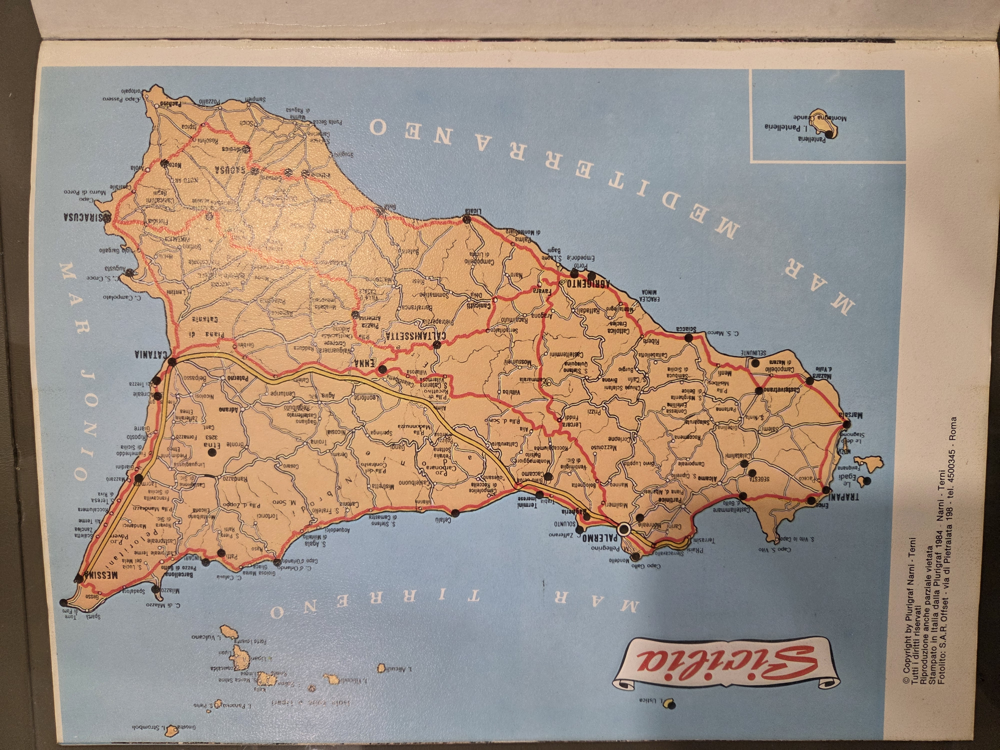

---

cover: SicilyArtTreasures_Cover.jpg
title: Sicily and Her Art Treasures
author: Not specified
pub_date: c. 1968
source: Plurigraf, Narni Terni, Italy
identifier: 914.58
------------------

## Provenance

Distributed by Ditta AR.CO, Palermo — original price stamped at 29,500 lire.

## Table of Contents

* Introduction (pp. 3–13)
* Messina (14–21)
* The National Museum (16–17)
* Sword-fish fishing (22–23)
* The Aeolian Islands:

  * Stromboli (24)
  * Alicudi (25)
  * Filicudi (26)
  * Lipari (27–29)
  * Salina (30–31)
  * Tindari (32)
* Cefalù (33–37)
* Imera (38)
* Solunto (38)
* Palermo (39–55)

  * National Gallery of Sicily (44–45)
  * National Archaeological Museum (50–51)
  * The Normans’ Palace (52–55)
* Monreale (56–65)
* Sanctuary of St. Rosalia (56–65)
* Mondello (66)
* Scopello (67)
* Castellammare del Golfo (68)
* Segesta (69)
* Trapani (70–71)

  * Pepoli National Museum (72)
* Selinunte (74–75)
* The Egadi Islands:

  * Favignana (76–79)
  * Marettimo (80)
  * Levanzo (81)
* The “Mattanza” or Tunny Fishing (82–83)
* Marsala (84–85)
* Sciacca (86–87)
* Agrigento (88–89)

  * National Archaeological Museum (90–97)
* Pantelleria (98–99)
* Linosa (100)
* Lampedusa (101)
* Piazza Armerina (102–103)
* Morgantina (104–111)
* Enna (112)
* Ragusa (113–115)
* Modica (116)
* Noto (117)
* Syracuse (118)

  * National Archaeological Museum (119–127)
* Catania (128)

  * The Ursino Castle (132–133)
* Gorges of the Alcantara (134–135)
* Etna (136–137)
* Taormina (138–142)
* Folklore (143)

## Notes

This visual and textual travel guide through Sicily presents archaeological, artistic, and cultural landmarks. The photography and cartography reinforce a regional identity emphasizing both coastal and inland treasures, and introduces readers to smaller islands, rural traditions like tunny fishing, and classical ruins.

---

## Map

